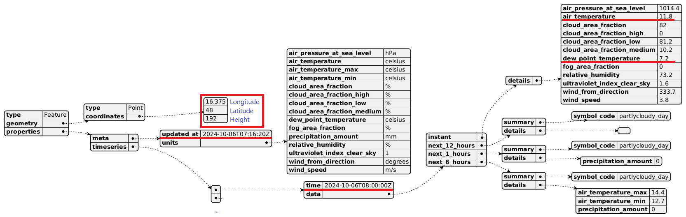

# Typescript Basics

TypeScript wurde 2012 von Microsoft entwickelt, um die Entwicklungsprozesse mit JavaScript zu verbessern. Die Hauptmotivation war, die Schwächen von JavaScript bei der Entwicklung großer, skalierbarer Anwendungen zu beheben. JavaScript, ursprünglich für kleine Skripte konzipiert, wurde zunehmend in großen Projekten verwendet, wo die fehlende Typensicherheit und schwache Tools zu Problemen führten. TypeScript führt statische Typisierung ein, was Entwicklern hilft, Fehler frühzeitig zu erkennen und die Codewartung zu erleichtern. Es ist vollständig kompatibel mit JavaScript, wodurch bestehender Code einfach migriert werden kann.

TypeScript ist kein Compiler im klassischen Sinne, da es den Code nicht direkt in maschinenlesbare Form (wie ein typischer Compiler) übersetzt. Stattdessen wandelt es TypeScript-Code in standardkonformes JavaScript um, das von jedem Browser und JavaScript-Laufzeitsystem verstanden wird. Diese Übersetzung hilft Entwicklern, moderne Features und Typensicherheit zu nutzen, während die resultierende Ausgabe weiterhin in jedem JavaScript-Umfeld lauffähig ist. TypeScript agiert also eher als „Transpiler“, der den Quellcode in eine andere Version der gleichen Sprache überführt.

### Die Versionen von Typescript

- **TypeScript 1.0 (2014)**: Die erste stabile Version mit grundlegender Typprüfung und Unterstützung für ES5.
- **TypeScript 2.0 (2016)**: Einführung von Nulltypen (null und undefined), Kontrollflussanalyse und verbesserter Unterstützung von Module Imports.
- **TypeScript 3.0 (2018)**: Tuple-Verbesserungen, Projektreferenzen und erweiterte Generics.
- **TypeScript 4.0 (2020)**: Variadic Tuple Types, Editor-Hilfen und verbesserte Kontrollflussanalyse.
- **TypeScript 5.0 (2023)**: Unterstützung für Dekoratoren und erweiterte ESM-Unterstützung.

## Unterschiede zwischen JavaScript und TypeScript

### JavaScript:
- JavaScript ist eine dynamisch typisierte Sprache, was bedeutet, dass Variablen zur Laufzeit jeden Datentyp annehmen können.
- Es gibt keine Überprüfung von Typen während der Entwicklung, was zu Laufzeitfehlern führen kann.
- Kein direkter Support für Interfaces, Typen oder Klassen während der Entwicklung (obwohl JavaScript ab ES6 Klassen unterstützt).

### TypeScript:
- TypeScript ist eine **statisch typisierte** Obermenge von JavaScript. Das bedeutet, dass der Datentyp von Variablen während der Entwicklungszeit explizit festgelegt wird.
- TypeScript bietet eine **Typüberprüfung** zur Kompilierzeit, um potenzielle Fehler bereits vor der Ausführung zu erkennen.
- Unterstützung für **Interfaces, Enums, Generics**, und andere Features, die die Strukturierung von Code verbessern.
- TypeScript muss in JavaScript transpiliert werden, bevor es in einer Laufzeitumgebung ausgeführt werden kann.

## Die Aufgabe des Transpilers

Ein **Transpiler** (in TypeScript meist der `tsc`, der TypeScript-Compiler) ist dafür zuständig, den TypeScript-Code in regulären JavaScript-Code umzuwandeln, da Browser und Laufzeitumgebungen wie Node.js nativ kein TypeScript ausführen können.

Der TypeScript-Compiler überprüft auch die Typen und gibt während der Kompilierung Hinweise, wenn Typinkonsistenzen oder Fehler gefunden werden. 

Nach der Transpilierung wird JavaScript generiert, das in jeder modernen JavaScript-Umgebung lauffähig ist.

## Datentypen in TypeScript

TypeScript bietet eine Vielzahl von Datentypen, die in verschiedenen Situationen verwendet werden können. Einige der wichtigsten sind:

- **`number`**: Repräsentiert sowohl Ganzzahlen als auch Gleitkommazahlen.
- **`string`**: Repräsentiert Textwerte.
- **`boolean`**: Repräsentiert Wahrheitswerte (true/false).
- **`array`**: Ein Array von Werten eines bestimmten Typs, definiert durch `T[]` oder `Array<T>`.
- **`tuple`**: Ein Array mit einer festen Anzahl und Typen von Elementen.
- **`enum`**: Eine Sammlung von benannten Konstanten.
- **`any`**: Ein Typ, der jede Art von Wert akzeptiert (vermeiden, wenn möglich).
- **`void`**: Wird verwendet, wenn eine Funktion keinen Wert zurückgibt.
- **`null` und `undefined`**: Repräsentieren nicht vorhandene oder undefinierte Werte.
- **`object`**: Repräsentiert nicht-primitive Typen.

```typescript
let age: number = 25;
let name: string = "Alice";
let isDone: boolean = true;
let scores: number[] = [90, 85, 80];
let person: [string, number] = ["John", 30];
enum Color {Red, Green, Blue};
let c: Color = Color.Green;

let randomValue: any = 10;
randomValue = "Hallo";

function logMessage(message: string): void {
    console.log(message);
}

let u: undefined = undefined;
let n: null = null;
let person: object = { name: "John", age: 30 };
```

## Datentypen in Funktionsargumenten und Rückgabetypen

In TypeScript kann man sowohl die **Argumente** als auch den **Rückgabewert** einer Funktion typisieren.

```typescript
function add(a: number, b: number): number {
    return a + b;
}
```

In diesem Beispiel:
- `a` und `b` sind Argumente vom Typ `number`.
- Der Rückgabewert der Funktion ist ebenfalls vom Typ `number`.

Wenn eine Funktion keinen Wert zurückgeben soll, wird der Rückgabetyp mit `void` markiert:

```typescript
function logMessage(message: string): void {
    console.log(message);
}
```

### Bedeutung von unknown und never

#### unknown

*unknown* ist der sicherste Typ in TypeScript, wenn man den Typ einer Variablen nicht kennt. Er zwingt dich dazu, den Typ vor der Verwendung zu überprüfen. Anders als bei any verhindert *unknown*, dass du eine Variable direkt verwendest, ohne vorherige Typprüfung.

```typescript
let value: unknown;

value = "Hello";
value = 42;

if (typeof value === "string") {
    console.log(value.toUpperCase());  // Typprüfung erforderlich
}
```

Hier wird value als unknown deklariert, und es ist notwendig, den Typ mit *typeof* zu überprüfen, bevor der Wert als String verwendet wird.

#### never

*never* ist ein Typ, der verwendet wird, wenn eine Funktion niemals einen Wert zurückgibt oder wenn etwas unmöglich ist. Er tritt auf, wenn eine Funktion entweder eine Endlosschleife ist oder immer einen Fehler wirft.

Beispiel:

```typescript
function throwError(message: string): never {
    throw new Error(message);  // Diese Funktion gibt niemals einen Wert zurück
}

function infiniteLoop(): never
```

### Das type keyword


Das *type*-Keyword in TypeScript wird verwendet, um Alias-Typen zu erstellen. Hier sind einige reale Anwendungsfälle:

**Primitive Typen gruppieren:**
```typescript
type ID = string | number;
let userId: ID = 123;
```

**Funktionssignaturen definieren:**
```typescript
type MathFunction = (a: number, b: number) => number;
const add: MathFunction = (x, y) => x + y;
```

**Unions und Intersections:**

```typescript
type Status = "success" | "error";
type AdminUser = User & { isAdmin: boolean };
```

### Variadic Tuple Types

Variadic Tuple Types in TypeScript, eingeführt mit Version 4.0, ermöglichen es, Tuples flexibler zu gestalten.
Sie erlauben es, eine beliebige Anzahl von Elementen am Ende eines Tuples hinzuzufügen oder zu verarbeiten.
Diese Funktion ist besonders nützlich bei der Arbeit mit Typen, die mehrere Argumente aufnehmen können.

```typescript
type Tuple = [string, ...number[]];
const example: Tuple = ["TypeScript", 1, 2, 3];
```

Hier kann das Tuple mit einem festen string starten, gefolgt von beliebig vielen number-Werten.
Das sorgt für mehr Flexibilität bei der Definition von Typen und Funktionen.

```typescript
function logValues<T extends unknown[]>(...args: [...T, string]) {
    console.log(args);
}

logValues(1, true, "last"); // Gültig
logValues("hello", "world", "last"); // Gültig
```

In diesem Beispiel verlangt die Funktion logValues, dass der letzte Parameter ein string ist, während vorher beliebig viele Werte beliebiger Typen kommen können.


## Typisierte JSON-Objekte mit Interfaces

TypeScript bietet die Möglichkeit, **Interfaces** zu definieren, die eine Struktur von Objekten beschreiben. Dies ist besonders nützlich, wenn man mit JSON-Daten arbeitet.

Beispiel für ein einfach typisiertes JSON-Objekt:

```typescript
interface Person {
    name: string;
    age: number;
    email?: string; // Das Fragezeichen bedeutet, dass dieses Feld optional ist
}

const personData: Person = {
    name: "John Doe",
    age: 30
};
```

> Hinweis: Wir können auch mit dem *type* keyword den Typ für Person erstellen.
> Da Person aber ideomatisch für ein Objekt steht, verwenden wir hier ein Interface, obwohl wir
> nicht davon ableiten und es erweitern.

### Verwendung von Mehrfachtypen (Union Types) im Interface

In TypeScript ist es möglich, dass ein Feld in einem Interface mehr als einen Typ haben kann. Dazu verwendet man das `|`-Symbol, das sogenannte **Union Types** erstellt. Damit kann ein Feld beispielsweise entweder vom Typ `string` oder `number` sein.

#### Beispiel:
```typescript
interface FlexiblePerson {
    id: string | number;  // Kann entweder eine ID als string oder number sein
    name: string;
    age: number | null;    // Alter kann entweder eine Zahl oder null sein
    active: boolean | string;  // Kann als boolean oder als string angegeben werden
}

const examplePerson: FlexiblePerson = {
    id: 12345,
    name: "Jane Doe",
    age: null,
    active: "yes"
};
```

In diesem Beispiel kann `id` sowohl ein `string` als auch eine `number` sein. `age` kann entweder eine Zahl oder `null` sein, und `active` kann entweder ein `boolean` oder ein `string` sein.

Diese Flexibilität ist nützlich, wenn man mit Daten arbeitet, die aus verschiedenen Quellen stammen oder unterschiedliche Formate haben könnten.

### Verschachtelte JSON-Objekte


Manchmal enthalten JSON-Objekte andere Objekte oder Arrays. Auch diese können mit Interfaces typisiert werden:

```typescript
interface Address {
    street: string;
    city: string;
}

interface PersonWithAddress {
    name: string;
    age: number;
    address: Address;  // Ein verschachteltes Objekt
}

/* Alternative in einem Interface:
interface PersonWithAddress {
    name: string;
    age: number;
    address: {
        street: string;
        city: string;
    };
}
*/

const personWithAddress: PersonWithAddress = {
    name: "John Doe",
    age: 30,
    address: {
        street: "123 Main St",
        city: "Springfield"
    }
};
```


### Funktionen, die Interfaces zurückgeben

Man kann in TypeScript auch Funktionen definieren, die ein bestimmtes Interface zurückgeben. Das ist besonders nützlich, wenn man sicherstellen möchte, dass das Rückgabeobjekt einer bestimmten Struktur entspricht.

Hier ist ein Beispiel, bei dem eine Funktion ein `Person`-Interface zurückgibt:

```typescript
interface Person {
    name: string;
    age: number;
    email?: string;
}

function createPerson(name: string, age: number): Person {
    return {
        name: name,
        age: age,
        email: undefined // Optionales Feld
    };
}

const newPerson = createPerson("John", 30);
```

In diesem Beispiel gibt die Funktion `createPerson` ein Objekt zurück, das der Struktur des `Person`-Interfaces entspricht. Dies stellt sicher, dass das zurückgegebene Objekt immer die Eigenschaften `name` und `age` enthält und optional `email`.

### Arrays in Interfaces


Man kann auch Arrays von Objekten in einem Interface typisieren:

```typescript
interface PersonWithHobbies {
    name: string;
    age: number;
    hobbies: string[];  // Ein Array von Strings
}

const personWithHobbies: PersonWithHobbies = {
    name: "Jane Doe",
    age: 25,
    hobbies: ["Reading", "Traveling", "Sports"]
};
```

Für komplexere Szenarien mit verschachtelten Arrays und Objekten:

```typescript
interface Company {
    name: string;
    employees: {
        name: string;
        age: number;
        address: {
            street: string;
            city: string;
        };
    }[];
}

const companyData: Company = {
    name: "Tech Corp",
    employees: [
        {
            name: "John Doe",
            age: 30,
            address: {
                street: "123 Main St",
                city: "Springfield"
            }
        },
        {
            name: "Jane Doe",
            age: 25,
            address: {
                street: "456 Elm St",
                city: "Shelbyville"
            }
        }
    ]
};
```

In diesem Beispiel enthält das `Company`-Interface ein Array von `PersonWithAddress`-Objekten, wodurch die Struktur des JSON-Datensatzes genau definiert ist.

## Lesen von Daten einer Web API mit Interfaces

In diesem Abschnitt wird gezeigt, wie man Daten von einer Web-API liest und sicherstellt, dass die Antwort der API dem erwarteten Interface entspricht. Dazu verwenden wir das Interface, um die Struktur der Daten zu beschreiben, die von der API bereitgestellt werden.

Angenommen, wir rufen Daten von der folgenden API auf: `https://localhost:5443/api/Categorie`. Diese API gibt eine Liste von Kategorien zurück, die beispielsweise wie folgt aussieht:

```json
[
  {
    "guid": "00000000-0000-0000-0000-000000000001",
    "name": "Work",
    "description": "Tasks related to your professional or business activities.",
    "isVisible": true,
    "priority": "High",
    "ownerName": "guest"
  },
  {
    "guid": "00000000-0000-0000-0000-000000000002",
    "name": "Personal",
    "description": "Tasks related to personal life, not connected to work.",
    "isVisible": true,
    "priority": "Medium",
    "ownerName": "guest"
  }
]
```

### Definition des Interfaces für die API-Daten

Zuerst definieren wir ein Interface, das die Struktur der Daten beschreibt:

```typescript

enum Priority {
    Low = "Low",
    Medium = "Medium",
    High = "High"
}

interface Category {

    guid: string;
    name: string;
    description: string;
    isVisible: boolean;
    priority: Priority;
    ownerName: string;
}
```


## Type Guards

In TypeScript gibt es sogenannte **Type Guards**, die verwendet werden, um sicherzustellen, dass ein Objekt oder eine Variable einen bestimmten Typ hat. Type Guards sind Funktionen oder Bedingungen, die TypeScript helfen, den Typ einer Variable während der Laufzeit zu bestimmen und den Code entsprechend zu analysieren.

### Benutzerdefinierte Type Guards

Ein besonders nützliches Feature in TypeScript sind benutzerdefinierte Type Guards. Diese Funktionen geben an, dass ein Objekt einem bestimmten Interface oder Typ entspricht, wenn bestimmte Bedingungen erfüllt sind.

Die Syntax `obj is Category` in der Funktion `isCategory(obj: any): obj is Category` definiert so eine Typ-Wache. Das bedeutet, dass die Funktion `isCategory` überprüft, ob das übergebene `obj` dem Interface `Category` entspricht.

### Beispiel: Type Guard mit `isCategory`

Hier ist ein Beispiel, wie Type Guards mit einem benutzerdefinierten Interface wie `Category` verwendet werden können:

```typescript

enum Priority {
    Low = "Low",
    Medium = "Medium",
    High = "High"
}

interface Category {

    guid: string;
    name: string;
    description: string;
    isVisible: boolean;
    priority: Priority;
    ownerName: string;
}

function isCategory(obj: any): obj is Category {
    return typeof obj.guid === 'string' &&
           typeof obj.name === 'string' &&
           typeof obj.description === 'string' &&
           typeof obj.isVisible === 'boolean' &&
           obj.priority === Priority.Low || obj.priority === Priority.Medium || obj.priority === Priority.High &&
           typeof obj.ownerName === 'string';
}
```

### Erklärung:
- **`obj: any`**: Das Argument `obj` kann beliebige Daten enthalten, typisiert als `any`.
- **`obj is Category`**: Der Rückgabewert `obj is Category` bedeutet, dass die Funktion prüft, ob `obj` dem Interface `Category` entspricht. Wenn die Funktion `true` zurückgibt, geht TypeScript davon aus, dass das Objekt `obj` den Typ `Category` hat.

### Verwendung eines Type Guards:

Nachdem die Type-Guard-Funktion definiert wurde, kann sie verwendet werden, um Objekte sicher zu prüfen und zu typisieren:

```typescript
const data: any = {
    guid: "00000000-0000-0000-0000-000000000001",
    name: "Work",
    description: "Tasks related to work",
    isVisible: true,
    priority: "High",
    ownerName: "guest"
};

if (isCategory(data)) {
    console.log(data.name);  // TypeScript weiß jetzt, dass 'data' ein 'Category' ist
} else {
    console.log("Data is not of type Category");
}
```

### Warum Type Guards verwenden?
Type Guards sind nützlich, weil sie die Typensicherheit verbessern und TypeScript helfen, Typen zur Laufzeit zu analysieren. Anstatt überall `any`-Typen zu verwenden, kann man mit Type Guards sicherstellen, dass Variablen und Objekte den erwarteten Typen entsprechen, bevor sie verwendet werden.

Dies erhöht die Sicherheit und Stabilität im Code und hilft, Laufzeitfehler zu vermeiden, indem der Code zur Entwicklungszeit besser überprüft wird.

## Beispielprojekt: Lesen von der WebAPI

Wir möchten nun von unserem Backend, das in [30_TodoApp/01_Backend.md](../30_TodoApp/01_Backend.md) beschrieben ist, Daten lesen.
Dafür ist es nötig, dass das Backend läuft und im Browser unter der Adresse *https://localhost:5443/swagger* erreichbar ist.

Nun legen wir wie bei ["Die erste Typescript App"](./10_FirstApp.md) ein Projekt mit dem Namen *todo_client* an.
Zusätzlich brauchen wir noch das Paket *node-fetch*, das wir im Verzeichnis *todo_client* mit folgendem Befehl installieren können:

```bash
npm install node-fetch
```

Der Source Code der Anwendung ist folgender:

**src/app.ts**
```typescript
import fetch from 'node-fetch';
import https from 'https';

enum Priority {
    Low = "Low",
    Medium = "Medium",
    High = "High"
}

interface Category {
    guid: string;
    name: string;
    description: string;
    isVisible: boolean;
    priority: Priority;
    ownerName: string;
}

const agent = new https.Agent({
    rejectUnauthorized: false  // Ignoriert das selbstsignierte Zertifikat
});

// Hilfsfunktion zur Typüberprüfung
function isCategory(obj: any): obj is Category {
    return typeof obj.guid === 'string' &&
        typeof obj.name === 'string' &&
        typeof obj.description === 'string' &&
        typeof obj.isVisible === 'boolean' &&
        (obj.priority === Priority.Low || obj.priority === Priority.Medium || obj.priority === Priority.High) &&
        typeof obj.ownerName === 'string';
}

async function fetchCategories(): Promise<Category[]> {
    const response = await fetch('https://localhost:5443/api/categories', { agent });
    if (!response.ok) {
        throw new Error('Fehler beim Abrufen der Daten');
    }
    const data = await response.json();
    // Überprüfen, ob die Antwort dem Category-Interface entspricht
    if (Array.isArray(data) && data.every(isCategory)) {
        return data;
    } else {
        throw new Error('Invalid data from server.');
    }
}

// Start fetching the categories
const categories = await fetchCategories();
for (const category of categories) {
    console.log(`Category ${category.name} with guid ${category.guid}`);
}

```

Das Projekt kann nun im Verzeichnis *todo_client* mit dem Startskript in der Konsole gestartet werden:

```bash
npm run start
```

```
Category Work with guid 00000000-0000-0000-0000-000000000001
Category Personal with guid 00000000-0000-0000-0000-000000000002
Category Health with guid 00000000-0000-0000-0000-000000000003
Category Home with guid 00000000-0000-0000-0000-000000000004
Category Finance with guid 00000000-0000-0000-0000-000000000005
```

## Übung

Du brauchst für diese Übung das Backend der Todo App wie auf [01_Backend.md](../30_TodoApp/01_Backend.md) beschrieben.
Stelle vorher sicher, dass die API unter *https://localhost:5443/swagger* erreichbar ist.

Erstelle ein Verzeichnis *todo_tasks* und initialisiere die App wie [bei der ersten App](./10_FirstApp.md) beschrieben.
Installiere mit *npm install node-fetch* das Paket *node-fetch*.

Die App soll die URL *https://localhost:5443/api/TodoItems* anfordern und die folgenden Daten aus der
Antwort ausgeben: *guid, title, description, categoryName, isCompleted und dueDate.*
Es sind nur die ersten 10 TodoItems auszugeben.

Rufe für jeden Datensatz in der Schleife die URL *https://localhost:5443/api/TodoItems/(guid)* mit *fetch* auf.
guid ist durch die gelesene GUID des TodoItems zu ersetzen.
Beim Detail Request bekommst du nochmals die Daten des TodoItems und ein Array mit den TodoTasks.
Gib alle *todoTasks* mit den Feldern *guid, title, isCompleted, dueDate* aus.

Beachte bei der Implementierung folgendes:
- Definiere ein Interface TodoItem für die Antwort von *https://localhost:5443/api/TodoItems*.
  Es sollen nur die Felder, die ausgegeben werden, berücksichtigt werden.
- Definiere ein Interface für die Todo Tasks für die Antwort von *https://localhost:5443/api/TodoItems/(guid)*.
  Beachte, dass von der Serverantwort nur der Key *todoTasks* verwendet werden soll.
- Schreibe für jedes Interface type guard Funktionen: *isTodoItem* und *isTodoTask*.
- Die Funktion *fetchTodoItems* liefert den Typ *Promise&lt;TodoItem[]&gt;*
- Die Funktion *fetchTodoTasks* bekommt die GUID des Tasks als Argument und liefert den Typ *Promise&lt;TodoTask[]&gt;*

### Ausgabe

```
Item 3b33199e-bc34-7895-eb67-338383c35c99: Voluptatem animi aspernatur voluptates quisquam.
Desc: Labore quam sunt quidem ab. Omnis facere aut aut distinctio. Qui tenetur voluptatem ut eos fugiat sint. Quia dicta deserunt est quam magni ex.
categoryName: Health, isCompleted: true, dueDate: 2024-10-16T13:37:17.4047389
Tasks:
Task In adipisci tenetur ducimus reprehenderit earum autem., dueDate: 2024-10-06T16:51:57.0615584, isCompleted: false
Task Ipsa et consectetur est ut tenetur vitae ipsam rerum dolor., dueDate: 2024-10-08T22:05:27.3495643, isCompleted: false
Task Delectus ea beatae et ducimus eum., dueDate: 2024-10-08T14:24:45.4590625, isCompleted: true
Task Atque a doloribus aut odio voluptas., dueDate: 2024-10-12T20:15:45.2241606, isCompleted: false
Task Corporis mollitia velit expedita fugit esse., dueDate: 2024-10-07T18:16:59.9695161, isCompleted: false
Task Mollitia incidunt exercitationem voluptas est et amet fugit., dueDate: 2024-10-12T18:28:02.964319, isCompleted: false
Task Earum aut neque., dueDate: 2024-10-15T03:43:41.6106425, isCompleted: true
Task Magni saepe ut., dueDate: 2024-10-07T07:32:45.7754386, isCompleted: false
Task Et ratione nihil numquam autem nihil., dueDate: 2024-10-08T02:23:18.0411732, isCompleted: false
Task Culpa veniam ut et repudiandae vel voluptas., dueDate: 2024-10-12T10:07:39.9861466, isCompleted: true

----------------------------------------------------------------------

Item 9c305ac4-1767-7d71-62bc-d64126f3eb7e: Repellat voluptas eum ex eum eum tenetur illum dignissimos sit.
Desc: Incidunt omnis voluptatem et sed facilis explicabo ipsa molestiae dignissimos. Iste repellat facere mollitia dolores culpa qui eius. Expedita qui explicabo eum et ea. Animi sint sed. Laudantium omnis eius nihil nemo et vitae.
categoryName: Health, isCompleted: false, dueDate: 2024-12-07T07:41:12.9607106
Tasks:
Task Et quia et sint ratione., dueDate: 2024-10-14T22:15:32.9751967, isCompleted: false
Task Cupiditate nobis ad recusandae cum et pariatur et necessitatibus tempore., dueDate: 2024-10-18T08:34:03.8705575, isCompleted: false
Task Dolor qui id dolor tempora., dueDate: 2024-10-22T06:13:02.5272692, isCompleted: true
Task Aspernatur laboriosam itaque., dueDate: 2024-11-07T15:51:10.5117808, isCompleted: true
Task Dolore tempora non tempora in., dueDate: 2024-10-06T04:44:57.9000666, isCompleted: false
Task Recusandae officiis reprehenderit rerum incidunt quas aut harum., dueDate: 2024-11-26T08:40:22.7599599, isCompleted: true
Task Sint tempora corporis., dueDate: null, isCompleted: false
Task Ipsum quisquam maxime ipsum sit., dueDate: null, isCompleted: false
Task Sint quas illo alias perferendis officiis et vero., dueDate: 2024-12-03T13:23:56.9589557, isCompleted: false
Task Eligendi tenetur qui voluptatem., dueDate: null, isCompleted: false
Task Facere itaque libero., dueDate: 2024-11-22T07:59:34.5142538, isCompleted: true
Task Veniam rerum id voluptas., dueDate: 2024-11-11T12:57:37.2365648, isCompleted: true
Task Minus architecto provident rerum qui omnis ad voluptates vel., dueDate: 2024-11-27T18:00:55.9370528, isCompleted: false
Task Accusamus illum voluptatum voluptatibus deleniti libero., dueDate: 2024-12-05T15:01:10.7619496, isCompleted: false
Task Dolorem modi hic eligendi possimus rem enim ut maxime., dueDate: 2024-12-03T23:02:33.1759242, isCompleted: false
Task Similique nisi et cum itaque dignissimos voluptatem., dueDate: null, isCompleted: true
Task Quas voluptates numquam reiciendis et., dueDate: 2024-11-18T13:53:13.9519122, isCompleted: false
Task Voluptatem officiis asperiores aut voluptatem ratione., dueDate: 2024-10-20T20:46:45.5658842, isCompleted: true

----------------------------------------------------------------------

Item 33e37ff0-296f-a384-1d4d-dadeaeadce92: Dolor et nihil suscipit perspiciatis quia aut eius corporis.
Desc: Officia molestias ut. Qui sunt et in harum quisquam. Vel et deserunt non tempore corporis excepturi quod voluptatibus alias. Explicabo voluptatem quo. Reprehenderit quo et vel libero vitae sapiente dolor dolorem.
categoryName: Health, isCompleted: true, dueDate: 2024-11-29T10:14:15.4579637
Tasks:
Task Consequatur voluptas corrupti eius., dueDate: 2024-11-28T19:13:52.1225342, isCompleted: true
Task Et labore aspernatur illum commodi maiores., dueDate: 2024-11-23T02:36:35.0158129, isCompleted: false
Task Placeat est enim nesciunt laborum et., dueDate: 2024-10-19T18:12:16.9788937, isCompleted: true
Task Excepturi sint in et doloremque consequatur dignissimos beatae dolores tempora., dueDate: 2024-10-07T00:49:59.377682, isCompleted: false
Task Neque magnam tempore consectetur saepe dolores itaque., dueDate: 2024-10-22T15:56:08.7883297, isCompleted: false
Task Temporibus et recusandae fugit totam optio est., dueDate: 2024-10-30T06:58:59.7739007, isCompleted: true
Task Minus qui nam perspiciatis ut., dueDate: 2024-11-20T05:37:13.5595283, isCompleted: true
Task Vel eligendi aliquid ut et., dueDate: 2024-10-07T05:40:58.8222482, isCompleted: true

----------------------------------------------------------------------

Item 6dc6bbf4-3273-2cc0-d4ab-ff13c3a6fd49: Itaque et earum modi similique veniam explicabo quo.
Desc: Excepturi tenetur unde quia quia beatae unde corporis. Eius fuga sit qui vel atque quis numquam dolore omnis. Suscipit doloremque quo quod aut velit velit impedit repudiandae. Ut fugit vitae perferendis veniam. Voluptas aspernatur voluptatibus voluptas aliquid dolore magni temporibus quae id.
categoryName: Finance, isCompleted: true, dueDate: 2025-08-30T06:16:12.4258956
Tasks:
Task Hic reprehenderit ipsum odit earum qui illum maiores vel., dueDate: 2025-03-07T10:15:08.7895919, isCompleted: false
Task Amet aliquid laborum illo perspiciatis dolorum., dueDate: 2025-04-05T23:35:11.8274432, isCompleted: true
Task Voluptatem voluptatem beatae., dueDate: 2025-01-09T15:37:31.5260258, isCompleted: true
Task Ipsum earum deleniti nobis corrupti., dueDate: 2025-01-18T10:54:26.6557333, isCompleted: false
Task Tempora qui voluptatem deleniti in at ipsum., dueDate: 2025-06-23T15:55:08.9144539, isCompleted: false
Task Qui ad nisi provident reiciendis ea et doloribus quia odio., dueDate: 2025-06-14T15:23:54.8370814, isCompleted: false

----------------------------------------------------------------------

Item 070db2a9-63a3-2575-5aca-528b522defb3: Commodi incidunt sunt maiores consequuntur eum qui cum ipsum earum.
Desc: Nemo sapiente molestiae enim. Et recusandae aut numquam minus quo qui sint. Eaque maxime ipsa. Veritatis dolor delectus quis vel. Minima qui fuga recusandae expedita tenetur dolores. Atque velit cupiditate facere molestias dolorum minus nihil.
categoryName: Finance, isCompleted: true, dueDate: null
Tasks:
Task Aliquam quo tempore ea quia dolores impedit., dueDate: 2024-10-28T22:28:54.9526071, isCompleted: true
Task Eligendi alias cum doloremque omnis nemo pariatur dolor nisi., dueDate: 2025-01-14T09:53:11.5576033, isCompleted: true
Task Sit ad at perspiciatis ullam assumenda sint., dueDate: 2025-09-14T02:25:55.8784539, isCompleted: true
Task Corrupti molestiae sed at totam officiis nostrum nulla dolore., dueDate: 2025-05-18T00:36:18.1618251, isCompleted: true
Task Deserunt ex qui ex minima., dueDate: 2025-03-07T05:46:29.7062705, isCompleted: true

----------------------------------------------------------------------

Item 41e291d6-55b4-9a89-8210-a281d32432c8: Odio nemo error ea.
Desc: Et ipsam aut quae culpa veniam reiciendis culpa. Recusandae sed eaque itaque commodi enim praesentium facere. Quia quia maiores aut est soluta voluptas consequuntur velit molestiae. Voluptas ullam consectetur. Voluptatum rem cumque.
categoryName: Finance, isCompleted: false, dueDate: 2025-02-18T06:29:17.5635797
Tasks:
Task Numquam distinctio odio quo animi., dueDate: null, isCompleted: true
Task Aut est possimus eius error aperiam consequatur non accusamus voluptatem., dueDate: 2025-02-14T16:59:12.3932583, isCompleted: false
Task Numquam aut id perspiciatis., dueDate: 2024-10-18T22:34:59.893592, isCompleted: true
Task Quaerat ullam ipsum rerum ipsa consequatur fugit exercitationem., dueDate: 2025-02-17T21:48:33.8592536, isCompleted: false
Task Nihil aperiam et quibusdam., dueDate: 2024-11-08T04:57:16.4441497, isCompleted: true
Task Dolores consequatur harum eaque totam quisquam., dueDate: 2025-01-27T21:52:11.5870886, isCompleted: false
Task Quos adipisci aut., dueDate: 2024-10-25T03:21:59.414981, isCompleted: false
Task Et tenetur consequuntur ea dolor aliquam ullam eum nemo., dueDate: 2025-01-27T12:14:16.6921268, isCompleted: true
Task Fuga a rerum vero repudiandae fugiat ipsum., dueDate: 2025-01-30T19:17:55.4439091, isCompleted: false
Task Vel rerum ad occaecati nulla asperiores., dueDate: 2024-11-26T00:05:16.4825273, isCompleted: false
Task Voluptas debitis fuga voluptatem minus., dueDate: 2024-12-30T23:55:05.7093409, isCompleted: true

----------------------------------------------------------------------

Item 2a8518b0-9bf5-5cd1-004e-a168d400fad3: Voluptas illum vitae esse sed consequuntur facere quos eum maxime.
Desc: Ut ratione ducimus nisi dolorem nesciunt. Mollitia quia suscipit. Harum voluptate corporis qui quae corrupti corrupti suscipit ea voluptas. Porro fuga maiores. Ut nesciunt velit. Quo eveniet quae nam velit velit soluta voluptas ea.
categoryName: Work, isCompleted: true, dueDate: 2025-04-15T09:39:24.2383309
Tasks:
Task Alias libero quasi consequuntur., dueDate: null, isCompleted: false
Task Aspernatur animi distinctio tenetur enim aut rerum repellendus in., dueDate: 2025-01-23T10:01:06.7803784, isCompleted: true
Task Quasi soluta placeat tenetur., dueDate: 2025-02-06T19:42:41.8847884, isCompleted: false
Task Velit a modi., dueDate: 2024-10-28T03:52:23.5079972, isCompleted: true
Task Aut qui qui expedita illo dolores dolorum., dueDate: 2025-03-05T04:15:28.0757038, isCompleted: false
Task Ut odit tenetur ut aut tenetur., dueDate: 2024-10-31T08:22:23.1374764, isCompleted: true
Task Esse et ipsam nesciunt., dueDate: 2024-11-08T20:56:58.675639, isCompleted: true
Task Error omnis minima., dueDate: 2024-12-22T19:44:57.4996056, isCompleted: true
Task Sed dolor rerum., dueDate: 2024-12-13T14:58:25.6673739, isCompleted: false
Task Reiciendis praesentium quisquam quod ab., dueDate: 2024-10-24T19:06:35.9710969, isCompleted: false
Task Autem et dicta ut modi illum rerum quibusdam similique quis., dueDate: 2024-12-30T23:57:33.5184027, isCompleted: true

----------------------------------------------------------------------

Item a83a6f4c-ce92-7e70-74a1-329dc357e7ca: Delectus voluptatem quis ut qui quas quia incidunt.
Desc: Voluptatem tempore sit adipisci. Sed quae ducimus voluptatibus facere et illum repellat aliquid omnis. Voluptas occaecati cupiditate consequatur fuga dolorem sunt. Necessitatibus dolore sit.
categoryName: Health, isCompleted: true, dueDate: null
Tasks:
Task Unde qui provident aspernatur id et ab rerum repellendus., dueDate: null, isCompleted: false
Task Sed dicta et quia et maxime., dueDate: 2025-08-09T03:01:50.4055503, isCompleted: false
Task Nihil sint non minima tempora numquam quasi fuga., dueDate: null, isCompleted: false
Task Fugit dolores eos., dueDate: 2025-06-03T10:10:33.2773589, isCompleted: true
Task Officia provident est., dueDate: 2025-02-11T07:58:50.0859138, isCompleted: true
Task Sit temporibus laudantium aut modi qui quasi quia voluptatum., dueDate: 2025-06-03T13:02:06.4275136, isCompleted: false
Task Consequatur odit ut occaecati incidunt., dueDate: 2025-02-03T02:43:52.920807, isCompleted: true
Task Voluptatem eveniet alias voluptas hic., dueDate: 2025-04-02T01:43:18.2163204, isCompleted: false
Task Placeat vitae facilis sint molestiae dolore optio quibusdam., dueDate: 2024-12-22T22:51:33.4963209, isCompleted: true
Task Architecto nihil provident., dueDate: 2025-07-24T13:22:52.7237847, isCompleted: true
Task Quia ut aspernatur ullam illo numquam natus at laudantium., dueDate: 2024-12-16T15:18:36.7476438, isCompleted: false

----------------------------------------------------------------------

Item 7fb6dcb9-09d4-811f-75e3-0408733aa380: Ut nesciunt dolore.
Desc: Eius quia aut non eum quisquam dolorum exercitationem. Maiores illo ullam totam fugiat qui dolorem magnam in pariatur. Sint in impedit laboriosam labore possimus aut voluptatem repellat molestias. Accusantium omnis voluptatem inventore. Est ipsum blanditiis asperiores possimus tempora voluptas nemo sunt. Doloremque enim omnis et.
categoryName: Work, isCompleted: false, dueDate: 2025-04-11T09:31:42.7207338
Tasks:
Task Voluptatem aut sed eum quasi et., dueDate: 2024-12-10T17:39:08.7132479, isCompleted: true
Task Laudantium consequatur nam cupiditate ipsa et perferendis quo., dueDate: 2024-10-25T14:17:33.1140496, isCompleted: true
Task Atque nihil ab amet rerum mollitia dolor., dueDate: 2024-11-23T16:20:02.3432858, isCompleted: true
Task Veritatis aut rerum numquam excepturi., dueDate: null, isCompleted: false
Task Fuga accusamus id sunt accusamus suscipit provident aut., dueDate: 2025-03-29T20:17:16.2327827, isCompleted: true
Task Quia iusto ipsa nemo delectus quasi natus occaecati vero., dueDate: 2024-11-19T16:28:17.7119994, isCompleted: true
Task At est molestiae sunt dolores ipsam velit., dueDate: 2024-10-31T17:25:33.3435243, isCompleted: true
Task Sed in molestiae nobis., dueDate: 2024-11-30T22:47:48.2492529, isCompleted: true
Task Nesciunt quaerat dolore nemo natus dolorem., dueDate: 2025-01-24T19:11:21.7696401, isCompleted: false
Task Itaque minima et in amet voluptas recusandae sapiente ex aperiam., dueDate: 2024-12-18T06:34:55.2983114, isCompleted: true
Task Adipisci saepe tempora non ipsum., dueDate: 2025-03-13T07:52:11.1760044, isCompleted: false

----------------------------------------------------------------------

Item 8341150d-8775-e50b-82ac-9c56558312ef: Aperiam ex deserunt.
Desc: Laborum aperiam enim et reprehenderit. Qui nam aut aut amet dicta facilis odio. Aut perferendis nostrum ut ex laboriosam recusandae laboriosam. Doloribus consequatur quas repudiandae ipsam nobis iste omnis ratione. Deserunt nihil ullam. Consequatur quibusdam ea occaecati ex quia aut praesentium dicta.
categoryName: Work, isCompleted: false, dueDate: 2025-04-23T00:10:53.705343
Tasks:
Task Et et suscipit odit est mollitia saepe est nemo quis., dueDate: 2025-01-12T21:50:11.7781324, isCompleted: false
Task Explicabo qui et minima eum officiis at illum nihil distinctio., dueDate: 2025-04-20T19:23:30.6630286, isCompleted: true
Task Deserunt distinctio consectetur illum., dueDate: 2025-04-14T22:56:51.2501036, isCompleted: true
Task Illum ipsum modi ad delectus veniam eos., dueDate: null, isCompleted: false
Task Cum qui dolor laborum labore blanditiis alias vel., dueDate: 2025-02-26T03:50:16.2306262, isCompleted: false
Task Qui voluptate ducimus labore possimus ipsam quis voluptas ut., dueDate: 2024-11-22T23:04:25.7005379, isCompleted: false
Task Veritatis aut ut cumque illo soluta., dueDate: 2025-03-17T16:14:24.2194172, isCompleted: true
Task Laudantium hic nisi deserunt., dueDate: 2025-04-13T11:03:33.5861024, isCompleted: true
Task Consectetur dolorem molestiae eos sit voluptas., dueDate: 2025-03-09T13:45:11.7131928, isCompleted: true
Task Aut unde aut., dueDate: 2025-01-04T03:40:54.5387032, isCompleted: false

----------------------------------------------------------------------

```


## Übung 2

Der norwegnische Wetterdienst bietet eine API an, mit der für einen bestimmten Punkt auf der Erde die Wettervorhersage abgerufen werden kann.
Auf *https://api.met.no/weatherapi/locationforecast/2.0/?lat=48&lon=16.375* wird z. B. die Vorhersage für 48° NB und 16.375° ÖL abgerufen.
Diese Antwort soll nun mit einem Programm eingelesen und dargestellt werden.

Wir brauchen aber nicht das ganze JSON, sondern wollen in ein Interface nur ein Teil der Antwort angeben.
Die rot unterstrichenen Felder zeigen die relevanten Teile.



Gehe dabei so vor:
- Erstelle ein Verzeichnis *weatherclient* und initialisiere die App wie [bei der ersten App](./10_FirstApp.md) beschrieben.
- Installiere mit *npm install node-fetch* das Paket *node-fetch*.
- Im Interface *ForecastItems* sollen die Felder *updated_at, longitude, latitude, height und timeseries* enthalten sein.
- *timeseries* ist ein Array von Objekten mit den Properties *time, air_temperature und dew_point_temperature*.
  Definiere sie gleich im Interface *ForecastItems*.
- Verwende den untenstehenden Code als Vorlage.
- Verwende in *getForecast()* Funktionen wie *map*, um aus den Originaldaten die Daten für *timeseries* zu extrahieren.
  

**src/app.ts**
```typescript
import fetch from 'node-fetch';

interface ForecastItems {
    // TODO: Write your interface
}

async function getForecast():Promise<ForecastItems> {
    const response = await fetch('https://api.met.no/weatherapi/locationforecast/2.0/?lat=48&lon=16.375', {
        headers: {
            'User-Agent': 'Weatherclient/1.0'
        }
    });
    if (!response.ok) {
        throw new Error(`Fehler beim Abrufen der Daten: ${response.status} ${response.statusText}`);
    }
    const data: any = await response.json();
    // TODO: Parse server response.
}

const forecastItems = await getForecast();
console.log(`Weatherforecast for LNG ${forecastItems.longitude}, LAT ${forecastItems.latitude}, HEIGHT ${forecastItems.height}`);
console.log(`Updated at ${forecastItems.updated_at}`);
console.table(forecastItems.timeseries);
```

**Ausgabe (Beispiel, wird natürlich abweichen):**
```
Weatherforecast for LNG 16.375, LAT 48, HEIGHT 192
Updated at 2024-10-06T08:20:13Z
┌─────────┬────────────────────────┬─────────────────┬───────────────────────┐
│ (index) │ time                   │ air_temperature │ dew_point_temperature │
├─────────┼────────────────────────┼─────────────────┼───────────────────────┤
│ 0       │ '2024-10-06T09:00:00Z' │ 12.7            │ 7.1                   │
│ 1       │ '2024-10-06T10:00:00Z' │ 13.4            │ 7.1                   │
│ 2       │ '2024-10-06T11:00:00Z' │ 14.1            │ 7.2                   │
│ 3       │ '2024-10-06T12:00:00Z' │ 14.3            │ 7                     │
│ 4       │ '2024-10-06T13:00:00Z' │ 14.4            │ 6.9                   │
│ 5       │ '2024-10-06T14:00:00Z' │ 14.4            │ 6.9                   │
│ 6       │ '2024-10-06T15:00:00Z' │ 14.1            │ 7                     │
│ 7       │ '2024-10-06T16:00:00Z' │ 12.3            │ 7.9                   │
│ 8       │ '2024-10-06T17:00:00Z' │ 10.7            │ 7.1                   │
│ 9       │ '2024-10-06T18:00:00Z' │ 9.4             │ 6.8                   │
│ 10      │ '2024-10-06T19:00:00Z' │ 8.2             │ 6.5                   │
│ 11      │ '2024-10-06T20:00:00Z' │ 7.4             │ 6.1                   │
│ 12      │ '2024-10-06T21:00:00Z' │ 7               │ 5.9                   │
│ 13      │ '2024-10-06T22:00:00Z' │ 7               │ 5.8                   │
│ 14      │ '2024-10-06T23:00:00Z' │ 6.5             │ 5.5                   │
│ 15      │ '2024-10-07T00:00:00Z' │ 7.4             │ 5.9                   │
│ 16      │ '2024-10-07T01:00:00Z' │ 7.1             │ 5.8                   │
│ 17      │ '2024-10-07T02:00:00Z' │ 6.3             │ 5.3                   │
│ 18      │ '2024-10-07T03:00:00Z' │ 5.3             │ 4.7                   │
│ 19      │ '2024-10-07T04:00:00Z' │ 4.7             │ 4.3                   │
│ 20      │ '2024-10-07T05:00:00Z' │ 4.6             │ 4.4                   │
│ 21      │ '2024-10-07T06:00:00Z' │ 5.2             │ 4.8                   │
│ 22      │ '2024-10-07T07:00:00Z' │ 7.6             │ 6.3                   │
│ 23      │ '2024-10-07T08:00:00Z' │ 9.8             │ 7.5                   │
│ 24      │ '2024-10-07T09:00:00Z' │ 11.9            │ 8.7                   │
│ 25      │ '2024-10-07T10:00:00Z' │ 14              │ 9.9                   │
│ 26      │ '2024-10-07T11:00:00Z' │ 15.6            │ 11                    │
│ 27      │ '2024-10-07T12:00:00Z' │ 16.9            │ 11.6                  │
│ 28      │ '2024-10-07T13:00:00Z' │ 17.7            │ 12.3                  │
│ 29      │ '2024-10-07T14:00:00Z' │ 18.1            │ 12.6                  │
│ 30      │ '2024-10-07T15:00:00Z' │ 17.7            │ 12.7                  │
│ 31      │ '2024-10-07T16:00:00Z' │ 15.9            │ 11.7                  │
│ 32      │ '2024-10-07T17:00:00Z' │ 14.6            │ 10.7                  │
│ 33      │ '2024-10-07T18:00:00Z' │ 13.6            │ 10.4                  │
│ 34      │ '2024-10-07T19:00:00Z' │ 12.7            │ 10.2                  │
│ 35      │ '2024-10-07T20:00:00Z' │ 11.9            │ 9.9                   │
│ 36      │ '2024-10-07T21:00:00Z' │ 11.3            │ 9.8                   │
│ 37      │ '2024-10-07T22:00:00Z' │ 10.7            │ 9.5                   │
│ 38      │ '2024-10-07T23:00:00Z' │ 10.1            │ 9.2                   │
│ 39      │ '2024-10-08T00:00:00Z' │ 9.9             │ 9.1                   │
│ 40      │ '2024-10-08T01:00:00Z' │ 10.2            │ 9.3                   │
│ 41      │ '2024-10-08T02:00:00Z' │ 9.6             │ 9                     │
│ 42      │ '2024-10-08T03:00:00Z' │ 9.2             │ 8.7                   │
│ 43      │ '2024-10-08T04:00:00Z' │ 8.5             │ 8.1                   │
│ 44      │ '2024-10-08T05:00:00Z' │ 7.3             │ 7.3                   │
│ 45      │ '2024-10-08T06:00:00Z' │ 8.6             │ 8.4                   │
│ 46      │ '2024-10-08T07:00:00Z' │ 10.1            │ 9.6                   │
│ 47      │ '2024-10-08T08:00:00Z' │ 12              │ 10.6                  │
│ 48      │ '2024-10-08T09:00:00Z' │ 14.1            │ 11.3                  │
│ 49      │ '2024-10-08T10:00:00Z' │ 16.5            │ 12.3                  │
│ 50      │ '2024-10-08T11:00:00Z' │ 19.3            │ 14.1                  │
│ 51      │ '2024-10-08T12:00:00Z' │ 22.1            │ 15.2                  │
│ 52      │ '2024-10-08T13:00:00Z' │ 23.1            │ 15.3                  │
│ 53      │ '2024-10-08T14:00:00Z' │ 23.2            │ 15.5                  │
│ 54      │ '2024-10-08T15:00:00Z' │ 22.3            │ 14.9                  │
│ 55      │ '2024-10-08T16:00:00Z' │ 21              │ 14                    │
│ 56      │ '2024-10-08T17:00:00Z' │ 20.4            │ 13.3                  │
│ 57      │ '2024-10-08T18:00:00Z' │ 19.6            │ 12.8                  │
│ 58      │ '2024-10-08T19:00:00Z' │ 19.1            │ 12.4                  │
│ 59      │ '2024-10-08T20:00:00Z' │ 18.8            │ 12.6                  │
│ 60      │ '2024-10-08T21:00:00Z' │ 18.6            │ 12.9                  │
│ 61      │ '2024-10-08T22:00:00Z' │ 18              │ 13.1                  │
│ 62      │ '2024-10-08T23:00:00Z' │ 17.4            │ 13.1                  │
│ 63      │ '2024-10-09T00:00:00Z' │ 17              │ 13                    │
│ 64      │ '2024-10-09T06:00:00Z' │ 15.5            │ 13.7                  │
│ 65      │ '2024-10-09T12:00:00Z' │ 20              │ 14.2                  │
│ 66      │ '2024-10-09T18:00:00Z' │ 15.7            │ 14                    │
│ 67      │ '2024-10-10T00:00:00Z' │ 12              │ 10.5                  │
│ 68      │ '2024-10-10T06:00:00Z' │ 14.2            │ 11.2                  │
│ 69      │ '2024-10-10T12:00:00Z' │ 24.8            │ 13.6                  │
│ 70      │ '2024-10-10T18:00:00Z' │ 16.8            │ 9.1                   │
│ 71      │ '2024-10-11T00:00:00Z' │ 15.1            │ 8.3                   │
│ 72      │ '2024-10-11T06:00:00Z' │ 13.2            │ 8.1                   │
│ 73      │ '2024-10-11T12:00:00Z' │ 18.3            │ 8.8                   │
│ 74      │ '2024-10-11T18:00:00Z' │ 12              │ 9.7                   │
│ 75      │ '2024-10-12T00:00:00Z' │ 11.3            │ 9.4                   │
│ 76      │ '2024-10-12T06:00:00Z' │ 12.2            │ 9.2                   │
│ 77      │ '2024-10-12T12:00:00Z' │ 19.1            │ 11.2                  │
│ 78      │ '2024-10-12T18:00:00Z' │ 14.5            │ 11.7                  │
│ 79      │ '2024-10-13T00:00:00Z' │ 13.6            │ 12                    │
│ 80      │ '2024-10-13T06:00:00Z' │ 11.6            │ 10.5                  │
│ 81      │ '2024-10-13T12:00:00Z' │ 20.7            │ 13.5                  │
│ 82      │ '2024-10-13T18:00:00Z' │ 17.2            │ 11.7                  │
│ 83      │ '2024-10-14T00:00:00Z' │ 13.6            │ 10.7                  │
│ 84      │ '2024-10-14T06:00:00Z' │ 11.7            │ 7.1                   │
│ 85      │ '2024-10-14T12:00:00Z' │ 14              │ 8.6                   │
│ 86      │ '2024-10-14T18:00:00Z' │ 12.8            │ 11.1                  │
│ 87      │ '2024-10-15T00:00:00Z' │ 13.6            │ 12.5                  │
│ 88      │ '2024-10-15T06:00:00Z' │ 14.8            │ 13.5                  │
│ 89      │ '2024-10-15T12:00:00Z' │ 21.2            │ 15.6                  │
└─────────┴────────────────────────┴─────────────────┴───────────────────────┘
```
