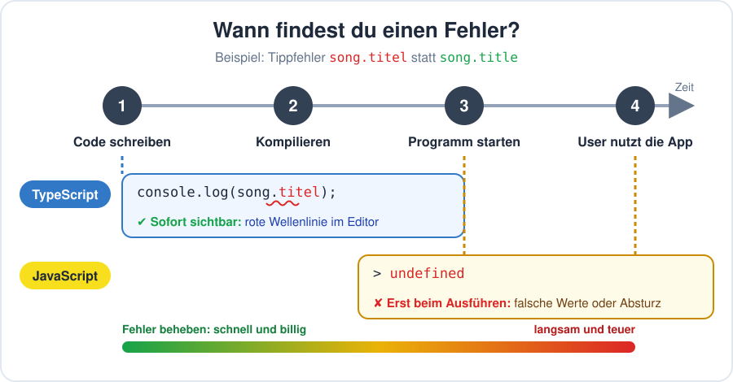
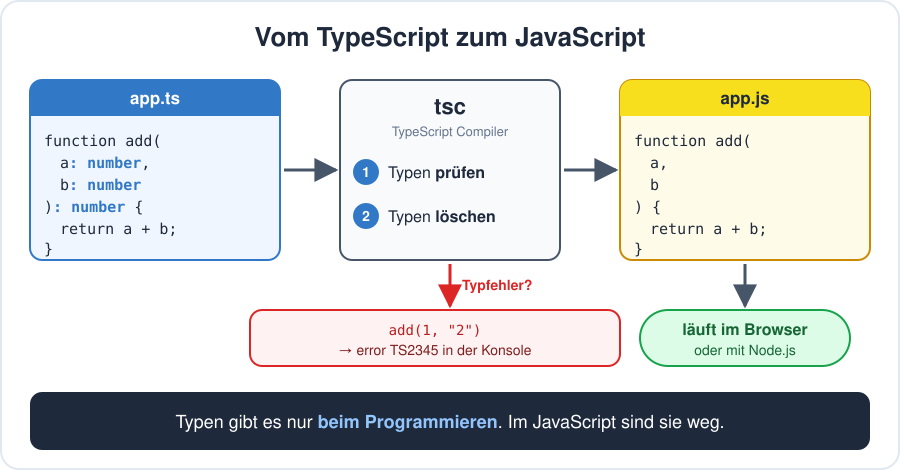
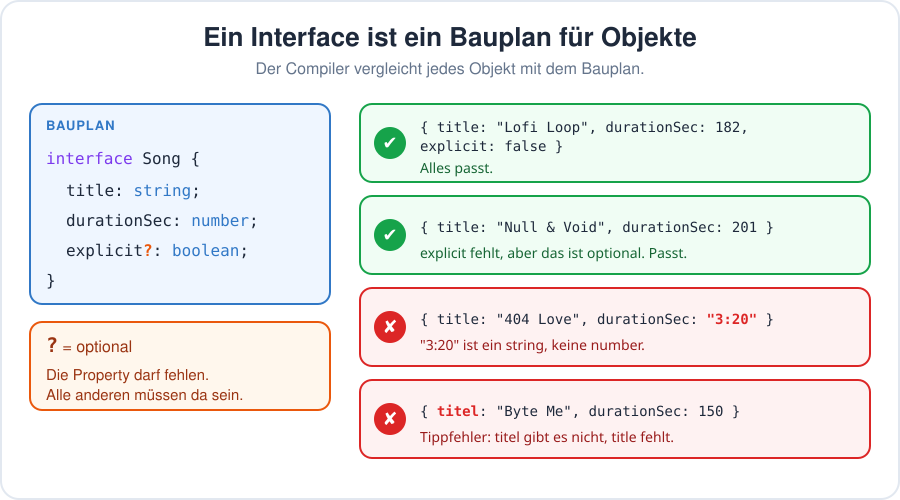
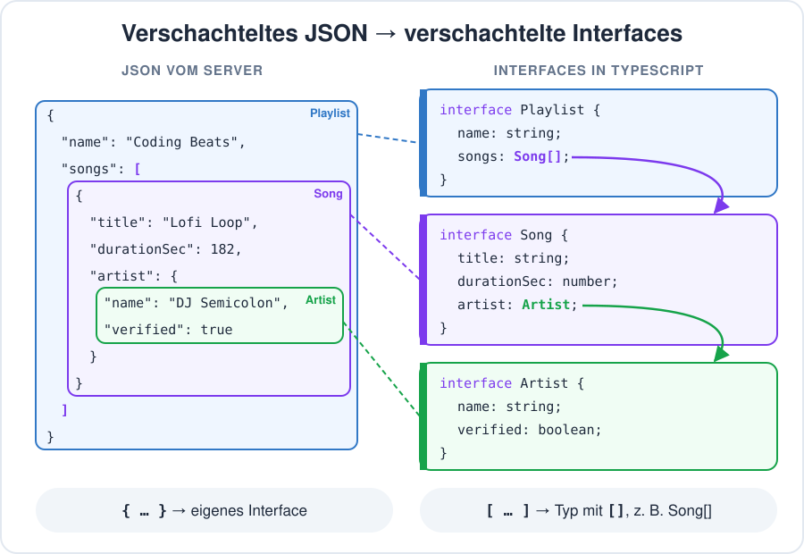
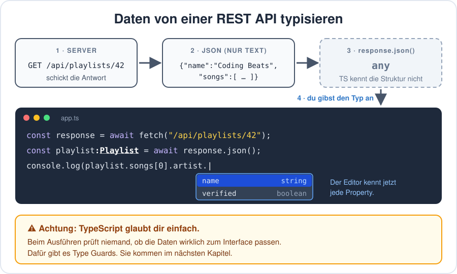

# TypeScript Basics

In diesem Kapitel lernst du:

- warum es TypeScript gibt und was der Compiler macht,
- die wichtigsten Datentypen,
- wie du mit **Interfaces** die Form von Objekten beschreibst,
- wie du **verschachtelte JSON-Daten** von einer REST API typisierst,
- wie dir der Compiler hilft, Fehler zu finden.

> [!TIP]
> **Wichtige Wörter in diesem Kapitel**
>
> | Wort | Bedeutung |
> | ---- | --------- |
> | **Typ** | Die Art eines Wertes, z. B. Zahl (`number`) oder Text (`string`). |
> | **Property** | Ein Feld in einem Objekt, z. B. `name` in `{ name: "Lena" }`. |
> | **Interface** | Ein Bauplan für Objekte. Es sagt, welche Properties ein Objekt hat. |
> | **Compiler** | Ein Programm, das deinen Code prüft und übersetzt. Bei TypeScript heißt es `tsc`. |
> | **Laufzeit** | Die Zeit, in der das Programm läuft (in Node.js oder im Browser). |
> | **optional** | Darf fehlen. |

## Warum TypeScript?

JavaScript wurde für kleine Skripte auf Webseiten erfunden.
Heute schreiben wir damit große Anwendungen.
Dabei gibt es ein Problem: JavaScript prüft die Typen erst, **wenn das Programm läuft**.
Ein Tippfehler wie `song.titel` statt `song.title` liefert einfach `undefined`.
Du merkst den Fehler oft erst viel später, oder ein User findet ihn für dich.

Microsoft hat deshalb 2012 **TypeScript** entwickelt.
TypeScript ist JavaScript **plus Typen**.
Jeder gültige JavaScript-Code ist auch gültiger TypeScript-Code.
Du kannst also bestehenden Code Schritt für Schritt umstellen.



### Die Versionen von TypeScript

| Version | Jahr | Was ist neu? |
| ------- | ---- | ------------ |
| 1.0 | 2014 | Erste stabile Version mit Typprüfung. |
| 2.0 | 2016 | `null` und `undefined` als eigene Typen. Der Compiler versteht `if`-Abfragen (Kontrollflussanalyse). |
| 3.0 | 2018 | Bessere Tuples und Generics. |
| 4.0 | 2020 | Variadic Tuple Types, bessere Hilfe im Editor. |
| 5.0 | 2023 | Dekoratoren, bessere Unterstützung für ES-Module. |
| 6.0 / 7.0 | 2026 | Der Compiler wird in Go neu geschrieben und ist dadurch viel schneller. |

## Unterschiede zwischen JavaScript und TypeScript

| | JavaScript | TypeScript |
| - | ---------- | ---------- |
| **Typen** | dynamisch: Eine Variable kann jeden Typ annehmen. | statisch: Du legst den Typ beim Programmieren fest. |
| **Typfehler findest du ...** | erst beim Ausführen. | schon im Editor und beim Kompilieren. |
| **Interfaces, Enums, Generics** | gibt es nicht. | gibt es. |
| **Ausführen** | direkt im Browser oder mit Node.js. | Zuerst muss der Compiler den Code in JavaScript übersetzen. |

## Die Aufgabe des Compilers

Browser und Node.js können kein TypeScript ausführen.
Deshalb übersetzt der **TypeScript Compiler** (`tsc`) deinen Code in normales JavaScript.
Dabei macht er zwei Dinge:

1. Er **prüft die Typen**. Findet er einen Fehler, bekommst du eine Fehlermeldung.
2. Er **löscht die Typen**. Übrig bleibt JavaScript, das überall läuft.



> [!NOTE]
> Weil `tsc` TypeScript in eine andere Form der *gleichen* Sprache übersetzt, nennt man ihn auch **Transpiler**.
> Ein klassischer Compiler übersetzt dagegen in Maschinencode.

> [!IMPORTANT]
> **Typen gibt es nur beim Programmieren.**
> Im fertigen JavaScript sind sie weg.
> Das heißt: TypeScript kann nur prüfen, was es beim Kompilieren sieht.
> Daten, die erst zur Laufzeit kommen (z. B. von einer API), prüft es **nicht**.
> Dazu mehr im Abschnitt [Interfaces für REST APIs](#interfaces-für-rest-apis).

## Datentypen in TypeScript

| Typ | Beispiel | Bedeutung |
| --- | -------- | --------- |
| `number` | `25`, `3.14` | Ganze Zahlen und Kommazahlen. |
| `string` | `"Hallo"` | Text. |
| `boolean` | `true`, `false` | Wahr oder falsch. |
| `number[]` oder `Array<number>` | `[90, 85, 80]` | Ein Array. Alle Elemente haben den gleichen Typ. |
| `[string, number]` | `["John", 30]` | Ein **Tuple**: ein Array mit fester Länge. Jede Position hat einen eigenen Typ. |
| `enum` | `Color.Green` | Eine Liste von benannten Konstanten. |
| `null`, `undefined` | `null` | „Kein Wert“. |
| `object` | `{ name: "John" }` | Alles, was kein einfacher Wert ist. |
| `void` | – | Eine Funktion gibt nichts zurück. |
| `any` | alles | Schaltet die Typprüfung aus. **Vermeide `any`!** |

```typescript
let age: number = 25;
let name: string = "Alice";
let isDone: boolean = true;
let scores: number[] = [90, 85, 80];
let person: [string, number] = ["John", 30];
enum Color { Red, Green, Blue }
let c: Color = Color.Green;

let randomValue: any = 10;
randomValue = "Hello";        // no error: any allows everything

let u: undefined = undefined;
let n: null = null;
let user: object = { name: "John", age: 30 };
```

### Typinferenz: Der Compiler denkt mit

Du musst nicht überall einen Typ hinschreiben.
Wenn du eine Variable sofort mit einem Wert anlegst, erkennt TypeScript den Typ selbst.
Das nennt man **Typinferenz**.

```typescript
let age = 25;     // TypeScript knows: age is a number
age = "old";      // error TS2322: Type 'string' is not assignable to type 'number'.
```

> [!TIP]
> Fahre in VS Code mit der Maus über eine Variable.
> Dann siehst du, welchen Typ TypeScript erkannt hat.

## Funktionen typisieren

Bei einer Funktion gibst du die Typen der **Parameter** und den Typ des **Rückgabewertes** an.

```typescript
//              parameter types        return type
function add(a: number, b: number): number {
    return a + b;
}

add(1, 2);      // OK
add(1, "2");    // error TS2345: Argument of type 'string' is not assignable to parameter of type 'number'.
```

Gibt eine Funktion nichts zurück, ist der Rückgabetyp `void`:

```typescript
function logMessage(message: string): void {
    console.log(message);
}
```

> [!TIP]
> Schreib den Rückgabetyp immer dazu.
> Dann prüft der Compiler, ob deine Funktion wirklich das zurückgibt, was du versprichst.
> Vergisst du ein `return`, bekommst du sofort einen Fehler.

### unknown und never

**`unknown`** verwendest du, wenn du den Typ eines Wertes noch nicht kennst.
Anders als bei `any` darfst du den Wert erst verwenden, wenn du den Typ geprüft hast.
`unknown` ist also die **sichere** Variante von `any`.

```typescript
let value: unknown;

value = "Hello";
value = 42;

value.toUpperCase();          // error: 'value' is of type 'unknown'.
if (typeof value === "string") {
    console.log(value.toUpperCase());   // OK: inside the if, value is a string
}
```

**`never`** bedeutet: „Das passiert nie.“
Eine Funktion mit dem Rückgabetyp `never` kommt nie zu einem Ende.
Sie wirft immer einen Fehler oder läuft endlos.

```typescript
function throwError(message: string): never {
    throw new Error(message);   // this function never returns a value
}
```

## Das type-Keyword

Mit `type` gibst du einem Typ einen eigenen Namen (ein **Alias**).

**Mehrere Typen erlauben (Union Type):** Das Zeichen `|` bedeutet „oder“.

```typescript
type ID = string | number;
let userId: ID = 123;
userId = "abc-123";      // also OK
```

**Nur bestimmte Werte erlauben (Literal Type):** Das ist besonders praktisch für Status-Felder aus einer API.

```typescript
type Mood = "chill" | "party" | "focus";
let mood: Mood = "chill";
mood = "sad";            // error TS2322: Type '"sad"' is not assignable to type 'Mood'.
```

**Funktionstypen:**

```typescript
type MathFunction = (a: number, b: number) => number;
const add: MathFunction = (x, y) => x + y;
```

**Typen kombinieren (Intersection Type):** Das Zeichen `&` bedeutet „und“.

```typescript
type AdminUser = User & { isAdmin: boolean };
```

## Interfaces: Baupläne für Objekte

Das ist der wichtigste Teil dieses Kapitels.
Fast alle Daten von einer REST API sind JSON-Objekte.
Mit einem **Interface** beschreibst du, welche Properties so ein Objekt hat und welchen Typ jede Property hat.

```typescript
interface Song {
    title: string;
    durationSec: number;
    explicit?: boolean;    // the ? means: this property is optional
}

const song: Song = {
    title: "Lofi Loop",
    durationSec: 182
};
```



### Was prüft der Compiler?

Der Compiler vergleicht jedes Objekt mit dem Interface.
Das sind die häufigsten Fehlermeldungen.
Lerne, sie zu lesen: Sie sagen dir genau, was falsch ist.

| Code | Fehlermeldung (gekürzt) | Was ist falsch? |
| ---- | ----------------------- | --------------- |
| `{ title: "404 Love", durationSec: "3:20" }` | `TS2322: Type 'string' is not assignable to type 'number'.` | Falscher Typ: `"3:20"` ist ein string. |
| `{ durationSec: 150 }` | `TS2741: Property 'title' is missing ...` | Eine Pflicht-Property fehlt. |
| `{ titel: "Byte Me", durationSec: 150 }` | `TS2561: ... 'titel' does not exist in type 'Song'. Did you mean to write 'title'?` | Tippfehler im Objekt. |
| `song.titel` | `TS2551: Property 'titel' does not exist on type 'Song'. Did you mean 'title'?` | Tippfehler beim Lesen. |
| `song.explicit.toString()` | `TS18048: 'song.explicit' is possibly 'undefined'.` | Die Property ist optional. Du musst zuerst prüfen, ob sie da ist. |

> [!NOTE]
> Für Objekte kannst du statt `interface` auch `type` verwenden:
> `type Song = { title: string; durationSec: number; }`.
> In diesem Kurs gilt: **Objekte beschreiben wir mit `interface`.**
> Für Unions wie `"chill" | "party"` verwenden wir `type`.

### Optionale Properties und null

Bei einer API fehlen manchmal Felder, oder sie haben den Wert `null`.
Das sind zwei verschiedene Dinge:

| Schreibweise | Bedeutung | Beispiel im JSON |
| ------------ | --------- | ---------------- |
| `explicit?: boolean` | Die Property kann **fehlen**. | `{ "title": "..." }` |
| `explicit: boolean \| null` | Die Property ist **immer da**, aber der Wert kann `null` sein. | `{ "title": "...", "explicit": null }` |

Wenn eine Property fehlen kann, zwingt dich der Compiler zu einer Prüfung.
Dafür gibt es drei Möglichkeiten:

```typescript
// 1. Check with if
if (song.explicit !== undefined) {
    console.log(song.explicit.toString());
}

// 2. Optional chaining ?. returns undefined instead of crashing
console.log(song.explicit?.toString());

// 3. Default value with ??
const isExplicit: boolean = song.explicit ?? false;
```

### Union Types und Literal Types in Interfaces

Eine Property kann mehrere Typen erlauben.
Sehr oft liefert eine API ein Status-Feld mit nur wenigen erlaubten Werten.
Dafür sind Literal Types perfekt.

```typescript
type Visibility = "public" | "private" | "friends";

interface User {
    id: string | number;          // the API sometimes sends a string, sometimes a number
    username: string;
    age: number | null;           // always there, but can be null
    visibility: Visibility;       // only these three values are allowed
}

const user: User = {
    id: 12345,
    username: "byteMe",
    age: null,
    visibility: "friends"
};
```

Schreibst du `if (user.visibility === "frinds")`, meldet der Compiler einen Fehler:
Der Vergleich kann nie `true` sein, weil es den Wert `"frinds"` nicht gibt.

### Arrays in Interfaces

Ein Array schreibst du mit `[]` hinter dem Typ.

```typescript
interface Artist {
    name: string;
    genres: string[];     // an array of strings
}

const artist: Artist = {
    name: "DJ Semicolon",
    genres: ["Lofi", "House", "Chiptune"]
};
```

### Verschachtelte Interfaces

JSON-Daten haben oft Objekte in Objekten und Arrays von Objekten.
Die Regel ist einfach:

- Jedes `{ ... }` im JSON wird ein **eigenes Interface**.
- Jedes `[ ... ]` im JSON wird ein **Array-Typ** wie `Song[]`.



Das JSON einer Playlist sieht so aus:

```json
{
    "name": "Coding Beats",
    "songs": [
        {
            "title": "Lofi Loop",
            "durationSec": 182,
            "artist": { "name": "DJ Semicolon", "verified": true }
        },
        {
            "title": "Null & Void",
            "durationSec": 201,
            "artist": { "name": "The Undefined", "verified": false }
        }
    ]
}
```

Die Interfaces dazu. Beginne **innen** mit dem kleinsten Objekt und arbeite dich nach außen:

```typescript
interface Artist {
    name: string;
    verified: boolean;
}

interface Song {
    title: string;
    durationSec: number;
    artist: Artist;       // an object inside an object
}

interface Playlist {
    name: string;
    songs: Song[];        // an array of objects
}
```

Jetzt kennt der Editor die ganze Struktur.
Tippst du `playlist.songs[0].artist.`, schlägt er dir `name` und `verified` vor.

> [!NOTE]
> Du kannst ein verschachteltes Objekt auch direkt im Interface schreiben, ohne eigenen Namen:
>
> ```typescript
> interface Song {
>     title: string;
>     artist: {
>         name: string;
>         verified: boolean;
>     };
> }
> ```
>
> Das ist für kleine Objekte in Ordnung.
> Ein eigenes Interface ist besser, wenn du den Typ öfter brauchst, z. B. als Parameter einer Funktion.

### Funktionen mit Interfaces

Interfaces kannst du als Parameter und als Rückgabetyp verwenden.
So weiß jeder sofort, welche Daten eine Funktion braucht und was sie liefert.

```typescript
function createSong(title: string, durationSec: number, artist: Artist): Song {
    return { title, durationSec, artist };
}

function totalDuration(playlist: Playlist): number {
    return playlist.songs.reduce((sum, song) => sum + song.durationSec, 0);
}

const playlist: Playlist = {
    name: "Coding Beats",
    songs: [createSong("Lofi Loop", 182, { name: "DJ Semicolon", verified: true })]
};
console.log(totalDuration(playlist));    // 182
```

Vergisst du in `createSong` eine Property, meldet der Compiler sofort einen Fehler.

## Interfaces für REST APIs

Hier kommt alles zusammen.
Eine REST API schickt JSON, also nur Text.
`response.json()` macht daraus ein Objekt, aber TypeScript kennt den Inhalt nicht.
Der Typ ist deshalb `any`.
Erst wenn **du** den Typ angibst, kann dir der Editor helfen.



```typescript
async function loadPlaylist(id: number): Promise<Playlist> {
    const response = await fetch(`https://example.com/api/playlists/${id}`);
    return await response.json();     // any becomes Playlist
}

const playlist = await loadPlaylist(42);
console.log(playlist.songs[0].artist.name);   // the editor knows every property
```

> [!TIP]
> **Tipps für API-Interfaces**
>
> - Typisiere nur die Properties, die du wirklich brauchst. Den Rest darfst du weglassen.
> - Schau dir **mehrere** Antworten der API an, nicht nur eine. Fehlt ein Feld manchmal? Dann ist es optional (`?`).
> - Lies die Dokumentation der API. Dort steht oft, welche Felder Pflicht sind.

> [!WARNING]
> **TypeScript glaubt dir einfach.**
> Wenn dein Interface nicht zu den echten Daten passt, merkt der Compiler das nicht.
> Dein Programm stürzt dann trotzdem zur Laufzeit ab.
> Wie du die Daten zur Laufzeit prüfst, lernst du mit den **Type Guards** in [Typescript und API](25_TypescriptWithApi.md).

## Zusammenfassung

| Das willst du ... | So schreibst du es |
| ----------------- | ------------------ |
| Form eines Objekts beschreiben | `interface Song { title: string; }` |
| Property darf fehlen | `explicit?: boolean` |
| Wert darf `null` sein | `age: number \| null` |
| Nur bestimmte Werte erlauben | `type Mood = "chill" \| "party"` |
| Array von Objekten | `songs: Song[]` |
| Objekt im Objekt | `artist: Artist` |
| Parameter und Rückgabewert | `function f(s: Song): number` |
| API-Antwort typisieren | `async function load(): Promise<Playlist>` |

## Übung: Bug-Jagd beim Klassenturnier (ohne KI)

Die Klassen 5AAIF und 5BAIF spielen ein Turnier im Spiel *Arena Clash*.
Jemand hat in JavaScript ein Programm für die Anzeigetafel geschrieben.
Leider gibt es seltsame Werte aus und stürzt dann ab.

Deine Aufgabe: Mach daraus ein TypeScript-Programm.
Dann findet der Compiler die Fehler für dich.

> [!IMPORTANT]
> **Keine KI in dieser Übung.**
> Du darfst die Unterlagen, die [TypeScript-Dokumentation](https://www.typescriptlang.org/docs/) und die Fehlermeldungen des Compilers verwenden.
> Fehlermeldungen lesen ist das Ziel der Übung.
> Genau das brauchst du später, wenn du Code von einer KI prüfst.

### Vorbereitung

Erstelle ein Verzeichnis *arena_clash*.
Lege darin wie in [Die erste TypeScript App](10_FirstApp.md) beschrieben eine leere TypeScript App an.
Lege dann die zwei Dateien unten an.

Die Datei *tournament.json* kommt direkt in das Verzeichnis *arena_clash* (**nicht** in *src*).
Stell dir vor, diese Daten kommen von der REST API `GET /api/tournaments/7`.

**tournament.json**
```json
{
    "id": 7,
    "name": "Spengi Cup",
    "game": "Arena Clash",
    "startsAt": "2026-11-14T09:00:00",
    "venue": {
        "school": "HTL Spengergasse",
        "room": "C3.07"
    },
    "teams": [
        {
            "tag": "5AAIF",
            "name": "Null Pointer Ninjas",
            "players": [
                {
                    "gamertag": "byteMe",
                    "realName": "Lena",
                    "role": "tank",
                    "stats": { "kills": 12, "deaths": 4, "assists": 9 },
                    "clan": { "tag": "NPN", "joinedAt": "2025-09-02" }
                },
                {
                    "gamertag": "segfault",
                    "role": "damage",
                    "stats": { "kills": 21, "deaths": 0, "assists": 3 }
                },
                {
                    "gamertag": "404brain",
                    "realName": "Jonas",
                    "role": "support",
                    "stats": { "kills": 2, "deaths": 7, "assists": 25 }
                }
            ]
        },
        {
            "tag": "5BAIF",
            "name": "Ctrl Alt Defeat",
            "players": [
                {
                    "gamertag": "sudo_sara",
                    "realName": "Sara",
                    "role": "damage",
                    "stats": { "kills": 17, "deaths": 9, "assists": 4 },
                    "clan": { "tag": "CAD", "joinedAt": "2024-11-20" }
                },
                {
                    "gamertag": "lagMaster",
                    "role": "tank",
                    "stats": { "kills": 6, "deaths": 11, "assists": 8 }
                },
                {
                    "gamertag": "pingu",
                    "realName": "Emre",
                    "role": "support",
                    "stats": { "kills": 3, "deaths": 5, "assists": 19 },
                    "clan": { "tag": "CAD", "joinedAt": "2025-01-15" }
                }
            ]
        }
    ],
    "matches": [
        {
            "id": 1,
            "round": 1,
            "teamA": "5AAIF",
            "teamB": "5BAIF",
            "status": "finished",
            "score": { "teamA": 13, "teamB": 9 },
            "mvp": "segfault"
        },
        {
            "id": 2,
            "round": 2,
            "teamA": "5BAIF",
            "teamB": "5AAIF",
            "status": "live",
            "score": { "teamA": 4, "teamB": 4 }
        },
        {
            "id": 3,
            "round": 3,
            "teamA": "5AAIF",
            "teamB": "5BAIF",
            "status": "scheduled",
            "score": null
        }
    ]
}
```

**src/app.js**
```javascript
import { readFileSync } from "node:fs";

// In a real app, this data comes from a REST API. Here we read it from a file.
const tournament = JSON.parse(readFileSync("tournament.json", "utf8"));

/**
 * Calculates the KDA value: (kills + assists) / deaths.
 * A player with 0 deaths counts as if they had 1 death.
 */
function calcKda(stats) {
    const deaths = Math.max(stats.deaths, 1);
    return (stats.kills + stats.assist) / deaths;
}

/** Adds up the kills of all players in a team. */
function totalKills(team) {
    return team.players.reduce((sum, player) => sum + player.stats.kills, "0");
}

/** Formats one player, e.g. "byteMe [NPN] tank, KDA 5.25". */
function formatPlayer(player) {
    return `${player.gamertag} [${player.clan.tag}] ${player.role}, KDA ${calcKda(player.stats).toFixed(2)}`;
}

/** Finds a team by its tag, e.g. "5AAIF". */
function findTeam(tag) {
    return tournament.teams.find(team => team.tag === tag);
}

/** Returns the tag of the team that won the match. */
function winner(match) {
    if (match.score.teamA > match.score.teamB) return match.teamA;
    if (match.score.teamB > match.score.teamA) return match.teamB;
}

/** Formats a match, e.g. "Round 1: Null Pointer Ninjas 13:9 Ctrl Alt Defeat". */
function formatMatch(match) {
    const nameA = findTeam(match.teamA).name;
    const nameB = findTeam(match.teamB).name;
    let line = `Round ${match.round}: ${nameA} ${match.score.teamA}:${match.score.teamB} ${nameB}`;
    if (match.status === "done") {
        line += ` -> winner: ${winner(match)}`;
    }
    return line;
}

/** Prints a team and all its players. */
function printTeam(team) {
    console.log(`${team.name} (${team.tag}), total kills: ${totalKills(team)}`);
    team.players.forEach(player => console.log("  " + formatPlayer(player)));
}

// A new player joins team 5BAIF.
const newPlayer = {
    gamertag: "noob42",
    role: "healer",
    stats: { kills: 0, deaths: 0 }
};
findTeam("5BAIF").players.push(newPlayer);

console.log(`=== ${tournament.name} in room ${tournament.venue.room} ===`);
tournament.teams.forEach(team => printTeam(team));
tournament.matches.forEach(match => console.log(formatMatch(match)));

const firstMatch = tournament.matches[0];
console.log(`MVP of round 1: ${formatPlayer(firstMatch.mvp)}`);
```

Lege außerdem eine Datei *PROTOKOLL.md* an.
Dort schreibst du deine Antworten auf.

### Schritt 1: Das JavaScript-Programm ausführen

Führe das Programm im Verzeichnis *arena_clash* aus:

```bash
node src/app.js
```

Beantworte im Protokoll:

1. Welche Werte in der Ausgabe sind falsch? Warum?
2. In welcher Zeile stürzt das Programm ab?

### Schritt 2: Interfaces schreiben

Erstelle *src/app.ts* und schreibe darin Interfaces für die Daten aus *tournament.json*.

Gehe so vor:

1. Schreibe für jedes `{ ... }` ein eigenes Interface.
   Du brauchst: `Tournament`, `Venue`, `Team`, `Player`, `Stats`, `Clan`, `Match` und `Score`.
2. **Vergleiche alle Spieler und alle Matches** miteinander.
   Fehlt ein Feld bei manchen? Dann ist es optional (`?`).
   Ist ein Wert manchmal `null`? Dann brauchst du `| null`.
3. Für `role` und `status` gibt es nur wenige erlaubte Werte.
   Lege dafür die Typen `Role` und `MatchStatus` als Literal Types an.

**So prüfst du deine Interfaces:**
Kopiere den Inhalt von *tournament.json* vorübergehend an das Ende von *app.ts*:

```typescript
const check: Tournament = { /* paste the content of tournament.json here */ };
```

Starte dann den Compiler mit `npx tsc --noEmit`.
Meldet er hier keinen Fehler, passen deine Interfaces zu den Daten.
Lösche den Check danach wieder.

> [!TIP]
> `--noEmit` bedeutet: Nur prüfen, keine *.js*-Datei erzeugen.
> Das ist schneller, wenn du nur Fehler suchst.

### Schritt 3: JavaScript wird TypeScript

Kopiere jetzt den Code aus *app.js* unter deine Interfaces in *app.ts*.
Ändere am Code noch **nichts**.
Ergänze nur die Typen in diesen Zeilen:

| Im JavaScript-Code | In TypeScript |
| ------------------ | ------------- |
| `const tournament = JSON.parse(...)` | `const tournament: Tournament = JSON.parse(...)` |
| `function calcKda(stats)` | `function calcKda(stats: Stats): number` |
| `function totalKills(team)` | `function totalKills(team: Team): number` |
| `function formatPlayer(player)` | `function formatPlayer(player: Player): string` |
| `function findTeam(tag)` | `function findTeam(tag: string): Team \| undefined` |
| `function winner(match)` | `function winner(match: Match): string` |
| `function formatMatch(match)` | `function formatMatch(match: Match): string` |
| `function printTeam(team)` | `function printTeam(team: Team): void` |
| `const newPlayer = {` | `const newPlayer: Player = {` |

Starte dann den Compiler:

```bash
npx tsc --noEmit
```

Du bekommst viele Fehlermeldungen. Manche gehören zum selben Problem.
Beantworte danach im Protokoll:

1. Wie viele Probleme hat der Compiler gefunden?
2. Welche Probleme hätte JavaScript **nie** gemeldet, nicht einmal mit einem Absturz?
3. Manche Fehler treten mit diesen Daten gar nicht auf (z. B. bei `findTeam`).
   Warum meldet der Compiler sie trotzdem?

> [!TIP]
> In VS Code siehst du alle Fehler auch im Fenster **Problems** (`Strg + Shift + M`).
> Ein Klick auf einen Fehler springt direkt in die richtige Zeile.

### Schritt 4: Fehler beheben

Behebe alle Fehler, bis `npx tsc --noEmit` keine Meldung mehr ausgibt.
Dabei gelten diese Regeln:

- **Kein `any`, kein `as`, kein `!` und kein `// @ts-ignore`.**
  Damit schaltest du den Compiler nur aus.
  Der Fehler ist dann nicht behoben, sondern nur versteckt.
- Ändere die Interfaces nicht, nur weil der Compiler meckert.
  Die Interfaces beschreiben die Daten. Der Code muss sich an die Daten halten.

Hinweise für die schwierigeren Fehler:

- **`findTeam`**: Wirf einen Fehler (`throw new Error(...)`), wenn es das Team nicht gibt.
  Dann kann der Rückgabetyp `Team` sein statt `Team | undefined`.
  Schau, wie viele Fehlermeldungen dadurch auf einmal verschwinden.
- **`score` ist `null`**: Das Match hat noch nicht begonnen. Gib statt des Ergebnisses `vs` aus.
- **`winner`**: Was gibt die Funktion bei einem Unentschieden zurück? Gib dann `"draw"` zurück.
- **MVP**: `mvp` ist nur der Gamertag, also ein string.
  Schreibe eine Funktion `findPlayer(gamertag: string): Player | undefined`, die den Spieler in allen Teams sucht.
- Spieler ohne Clan bekommen `[-]` statt des Clan-Tags.

Führe das Programm mit `npm run start` aus. Die Ausgabe muss so aussehen:

```
=== Spengi Cup in room C3.07 ===
Null Pointer Ninjas (5AAIF), total kills: 35
  byteMe [NPN] tank, KDA 5.25
  segfault [-] damage, KDA 24.00
  404brain [-] support, KDA 3.86
Ctrl Alt Defeat (5BAIF), total kills: 26
  sudo_sara [CAD] damage, KDA 2.33
  lagMaster [-] tank, KDA 1.27
  pingu [CAD] support, KDA 4.40
  noob42 [-] support, KDA 0.00
Round 1: Null Pointer Ninjas 13:9 Ctrl Alt Defeat -> winner: 5AAIF
Round 2: Ctrl Alt Defeat 4:4 Null Pointer Ninjas
Round 3: Null Pointer Ninjas vs Ctrl Alt Defeat
MVP of round 1: segfault [-] damage, KDA 24.00
```
