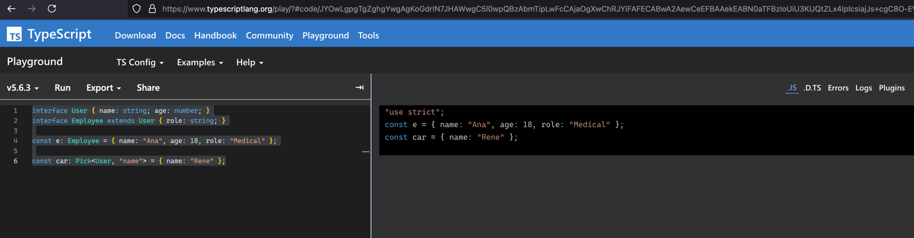
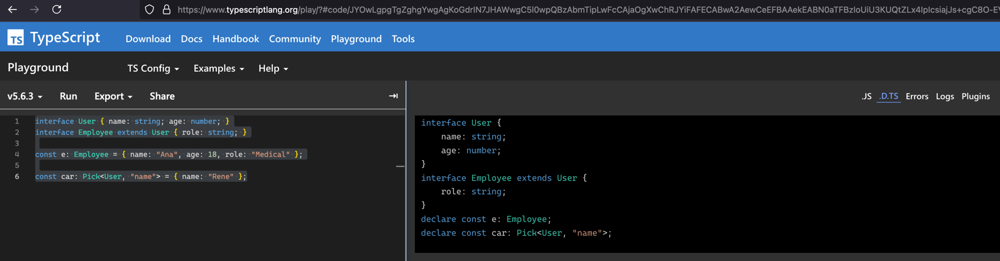
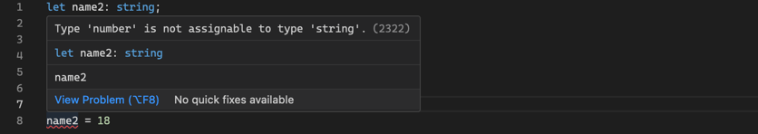
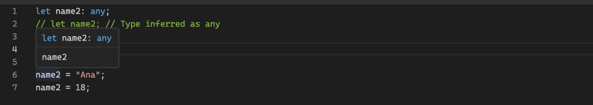
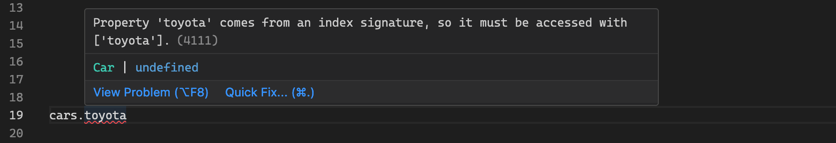

# TypeScript Language Overview


## 1. Introduction

### Overview
* **Link**: https://www.typescriptlang.org/
* **Purpose**: A statically typed superset of JavaScript providing type safety at compile time.
* **Developed By**: Microsoft


### Key Features
* **Statically Typed**: Provides type checking at compile time to catch errors during development and not runtime.
* **Structural Typed**: Is concerned with the shape of the data, rather than explicitly enforcing type names.
* **Type Inference**: Automatically determines types when they're not explicitly specified.
* **JavaScript Compatibility**: All valid JavaScript code is valid TypeScript code.


### Playground
- **Purpose**: An online editor to experiment with TypeScript code and see the JavaScript output.
- **Link**: https://www.typescriptlang.org/play


- The **.js** view shows the JavaScript output of the TypeScript code.

 

- The **.d.ts** view provides a type-only, showing declarations of interfaces, types, and constants without implementation details.



## 2. TypeScript Compiler

### Compiler vs Transpiler
- **Transpiler**: `tsc` converts TypeScript to JavaScript, which is considered transpilation since it translates from TypeScript to a compatible version of JavaScript.
- **Compiler**: `tsc` also performs type-checking, syntax checking, and enforces type constraints, which are typical of compilers. This is why `tsc` is often referred to as a compiler.


### What is a Type?
- **Type**: A classification that defines the possible values and allowed operations for a piece of data.

### What is a Type System?
- **Set of Rules**: Defines how types are assigned, combined, and used, ensuring type safety and catching errors early.

### How TypeScript Compiler Works?
1. **Analyzes** code and assigns types based on the context.
2. **Tracks** types across the code to ensure they match.
3. **Maintains** type consistency by validating expected usage.
4. **Reports** errors if something seems wrong to prevent runtime issues.
5. **Transpiles** TypeScript code to JavaScript for execution in the browser or Node.


## 3. TypeScript Compiler Insights

### Abstract Syntax Tree (AST)
- **Definition**: A tree representation of code that shows its structure, including relationships between variables, functions, and operators.
- **Purpose**: The AST is used by the TypeScript compiler to analyze, type-check, and transpile code.


### How TypeScript Uses the AST
1. **Lexical Analysis**: The code is broken down into tokens representing keywords, variables, and symbols.
2. **AST Generation**: Tokens are parsed into an AST that represents the structure of the code.
3. **Semantic Analysis**: TypeScript performs type checking and ensures variables are used correctly by analyzing the AST.
4. **AST Transformation**: Converts TypeScript features into JavaScript-compatible equivalents.
5. **Code Generation**: The AST is used to generate JavaScript code, making sure all TypeScript features are transpiled properly.

  
## 3. Basic Data Types

### Core Types
- TypeScript provides several basic types to represent data.
```typescript
const isDone: boolean = false;
const count: number = 42;
const name: string = "Rene";
const list: number[] = [1, 2, 3];
const tuple: [string, number] = ["hello", 10];
```


### Type Inferencing
- TypeScript automatically infers types based on the assigned values.
```typescript
const isDone = false; // Type inferred as boolean
const count = 18; // Type inferred as number
const name = "Ana"; // Type inferred as string
```


### Type Errors
- TypeScript catches type errors during compilation, hence preventing runtime errors.
```typescript
let name = "Ana"
name = 42; // ❌ Error: Type 'number' is not assignable to type 'string'.
```

  


### Any Type
- Using `any` is discouraged because it opts out of type checking and leads to unsafe code that breaks at runtime.
```typescript
let name2: any;
// let name2; // Type inferred as any

name2 = "Ana";
name2 = 18;
```



### Object Types
- Defines the shape of an object with properties and their types.
```typescript
interface User { name: string; age: number; }
type User = { name: string; age: number; }
```


### Object Types Extended
- Extending object types allows to build on existing object types.
```typescript
interface Employee extends User { role: string; }
type Employee = User & { role: string; }
```


### Array Types
- An array type can be written in two ways.
```typescript
let numbers: number[] = [1, 2, 3];
let numbers: Array<number> = [1, 2, 3];
```

### Function Types
- Defines the parameters and return type of function.
```typescript
function greet(user: User): string {
    return `Hello, ${user.name}!`;
}
```


### Enum Types
- **Auto-assigned Values**: Enum values are auto-assigned starting from 0.
```typescript
enum Color { Red, Green, Blue }

const myColor = Color.Red;
if (myColor === Color.Green) { /*..*/ }
```

- **Custom Values**: Enum values can be assigned custom values.
```typescript
enum Direction { Up = 1, Down = 2, Left = 3, Right = 4 }

const myMove = Direction.Up;
if (myMove === Direction.Down) { /*..*/ }
```


### Aliase Types
- Creates a new name for an existing type.
```typescript
// Alias for a string type
type Name = string;

// Alias for a function type
type NameResolver = (name: string) => string;

const myName: Name = "Alice";
const getName: NameResolver = (name: string) => `Greetings ${name}`;
```


### Literal Types
- A type that represents a single value.
```typescript
type Direction = "left" | "right" | "up" | "down";

function move(direction: Direction) {
    console.log(`Moving ${direction}`);
}
```


## 4. Intermediate Data Types


### Union Types (A ∪ B)
- **A | B**: A type that can be one of several types.
```typescript
type StringOrNumber = string | number;

function printId(id: StringOrNumber) {
    console.log(`Id: ${id}`);
}
```


### Union Types (A ∪ B) with a Discriminant Property
- **A | B**: A type that can be one of several types with a common property.
```typescript
interface Square { kind: "square"; size: number; }
interface Rectangle { kind: "rectangle"; width: number; height: number; }
type Shape = Square | Rectangle;

function getArea(shape: Shape): number {
    switch (shape.kind) {
        case "square":
            return shape.size * shape.size;
        case "rectangle":
            return shape.width * shape.height;
    }
}
```


### Intersection Types (A ∩ B)
- **A & B**: A type that combines multiple types.
```typescript
interface HasName { name: string; }
interface HasAge { age: number; }
type Person = HasName & HasAge;

function printPerson(person: Person) {
    console.log(`Name: ${person.name}, Age: ${person.age}`);
}
```


### Interface vs. Type - Which One to Use?
- **interface**: Use when defining object shapes, especially when extending.
- **type**: Use when unions, intersections, alias, or more complex type combinations are needed.
```typescript
// Interface for object shapes
interface Animal { name: string; }
interface Dog extends Animal { breed: string;}

// type for complex types
type ID = string | number;

// type for aliases
type CryptoKey = string;
```


### Type Guards
Type Guards are to narrow down the type of a variable within a conditional block to prevent type errors.

- **typeof**: Type guard for primitive types.
```typescript
function isNumber(value: unknown): value is number {
  return typeof value === "number";
}

// .. later in the code
if (isNumber(value)) {
    // TypeScript knows that `value` is a number and can safely call toFixed
    console.log(value.toFixed(2));
}
```

- **in**: Type guard for object properties.
```typescript
interface Animal { name: string; }
interface Dog extends Animal { breed: string;}

function isDog(animal: Animal): animal is Dog {
    return 'breed' in animal;
}

// .. later in the code
if (isDog(myAnimal)) {
    // TypeScript knows that `myAnimal` is a Dog and has a breed property
    console.log(myAnimal.breed);
}
```


### Type Assertions
Type assertions are a way to tell the TypeScript compiler that you know more about the type of a value than it does.

- **Subtype Relationship (S is a subtype of T):** Works and is type-safe.
```typescript 
interface Animal { name: string; }
interface Dog extends Animal { breed: string;}

let myDog: Dog = { name: "Rex", breed: "Labrador" };
let animal: Animal = myDog as Animal;
```

- **Supertype Relationship (T is a supertype of S):** Works, but it's not guaranteed to be safe.
```typescript
interface Animal { name: string; }
interface Dog extends Animal { breed: string;}

let animal: Animal = { name: "Max" };
let myDog = animal as Dog;
```


- **Unrelated Types**: Double assertion `..as unknown as` allows for any type conversion.
```typescript
function handler(event: Event) {
    // Neither 'Event' nor 'HTMLElement' is assignable to the other
    let element = event as unknown as HTMLElement;
}
```

### Special Types
Special types in TypeScript are designed for specific scenarios where standard types like `string`, `number`, or `boolean` are not adequate.

- **Never**: A type for functions that never return.
```typescript
function throwError(message: string): never {
    throw new Error(message);
}
```

- **Void**: A type for functions that don't return a value.
```typescript
function logError(message: string): void {
    console.error(message);
}
```

- **Any**: A type to opt out of type checking, giving complete flexibility but losing type safety.
```typescript
let value: any;
value = 42;

// This will compile but can cause runtime errors if `value` is not a string.
console.log(value.toUpperCase());
```

- **Unknown**: A type-safe counterpart to `any` that forces type-checking before usage.
```typescript
let value: unknown;
value = "Hello, World!";

// This will not compile without a type assertion or type guard.
if (typeof value === "string") {
    console.log(value.toUpperCase());
}
```


## 5. Advanced Data Types

### Utility Types

Utility types are built-in types that provide common type transformations.

- **Partial<Type>**: Create a new type by making all properties optional (opposite of `Required`).
```typescript
interface Car { make: string; model: string; year: number; }

function updateCar(car: Car, partialCar: Partial<Car>): Car {
    return { ...car, ...partialCar };
}

const car: Car = { make: "Toyota", model: "Corolla", year: 2020 };
updateCar(car, { model: "Camry" });
```

- **Pick<Type, Keys>**: Create a new type by selecting properties from an existing object type. (opposite of `Omit`)
```typescript
interface Car { make: string; model: string; year: number; }
const car: Pick<Car, "make" | "model"> = { make: "Toyota", model: "Corolla" };

car.make = "Honda"; // ✅ OK
car.model = "Civic"; // ✅ OK
car.year; // ❌ Error 
```

- **Omit<Type, Keys>**: Create a new type by excluding properties from an existing object type. (opposite of `Pick`)
```typescript
interface Car { make: string; model: string; year: number; }
const car: Omit<Car, "year"> = { make: "Toyota", model: "Corolla" };

car.make = "Honda"; // ✅ OK
car.model = "Civic"; // ✅ OK
car.year; // ❌ Error 
```

- **Record<Keys, Type>**: Create a new dictionary type with specified keys and value types.

```typescript
const cars: Record<string, Car> = {
    "toyota": { make: "Toyota", model: "Corolla", year: 2020 },
    "honda": { make: "Honda", model: "Civic", year: 2021 }
};

cars["toyota"].make; // ✅ OK
cars["tesla"].make; // ❌ Error
```


### Generic Types
- **\<T\>**: A type that can work with multiple data types.
```typescript
// T = dynamic type based on the input array
function map<T>(array: T[], mapFn: (elem: T) => T): T[] {
    return array.map(mapFn);
}

// [2, 4, 6]
const numbers = map([1, 2, 3], (x) => x * 2);

// ["A", "B", "C"]
const strings = map(["a", "b", "c"], (x) => x.toUpperCase());
```

### Generic Type Constraints
- ****\<T extends ...\>****: Constrains a generic type T to include all properties of a base type while allowing extra properties.
```typescript
interface Car { make: string; model: string; }

// T extends Car = dynamic type based on Car properties
function logCar<T extends Car>(car: T) {
    console.log(`Make: ${car.make}, Model: ${car.model}`);
}

// Inline object with extra properties
logCar({ make: "Tesla", model: "Model X", autopilot: true });
```

### Lookup Types
- **keyof**: Create a union type by extracting keys from an object type.
```typescript
// Creates a union type of all keys in Car ("make" | "model")
type CarKeys = keyof Car; 

// Creates a union type of all value types in Car (string | number)
type CarPropTypes = Car[keyof Car];
```


### Lookup Types & Generic Type Constraints
- **\<Key extends keof...\>**: Constrain a generic type to keys of an object type.
```typescript
interface Car { make: string; model: string; }

// Key extends keyof Car = Allows only keys of Car
function getCarProperty<Key extends keyof Car>(car: Car, key: Key): Car[Key] {
    return car[key];
}

const car = { make: "Toyota", model: "Corolla" };

// ✅ OK: Get the value of the "make" property
const make = getCarProperty(car, "make");

// ❌ Error: Property "year" does not exist on type "Car"
const year = getCarProperty(car, "year");
```


### Mapped Types
- **in**: Create a object type by mapping over the properties of an existing type.
```typescript
// Variant 1: Map over all `Car` properties and make them optional
type OptionalCar = { [Property in keyof Car]?: Car[Property]; };

// Vairant 2: Map over all `Type` properties and make them optional
type MyPartialType<Type> = { [Property in keyof Type]?: Type[Property]; };
type OptionalCar = MyPartialType<Car>;
// type OptionalUser = MyPartialType<User>;

// All properties are optional
const car: OptionalCar = { make: "Toyota" };
```


### Type Queries
- **typeof**: Extract the type of a variable or property.
```typescript
const prop = "make";

// CarMakeType = "string"
type CarMakeType = typeof prop;

// CarMakeType = "string"
type CarMakeType = Car["make"];

// CarMakeType = dynamic type based on prop
type CarMakeType = Car[typeof prop];
```


### Type Access Patterns Overview
| Syntax                      | Description                                      | Example Type Inference                      |
|-----------------------------|--------------------------------------------------|---------------------------------------------|
| `type T = Car["make"]`      | Get type of `"make"`                             | `string`                                    |
| `type T = typeof prop`      | Get type of the value `prop`                     | Based on `prop`                             |
| `type T = Car[typeof prop]` | Get type of the value the Car property `prop`    | Based on `prop`                             |
| `type T = keyof Car`        | Get all keys of `Car` as a union                 | `"make" \| "model" \| "year"`               |
| `type T = Car[keyof Car]`   | Get all value types of `Car` as a union          | `string \| number \| undefined`             |
| `<T extends keyof Car>`     | Constrain `T` to keys of `Car`                   | Flexible, depends on `Car`                  |
| `prop: T, value: Car[T]`    | Use `T` for both the key and value type in `Car` | Depends on `T`, e.g., `string` for `"make"` |


## 6. Advanced Type Concepts

### Structural Type Checking
TypeScript uses structural typing to determine if an object is compatible with a given type, meaning it only considers the shape or structure of the data.

- **Structural Typing via Variable Assignment**: TypeScript checks that the variable is compatible with the interface allowing extra properties.
```typescript
interface Car { make: string; model: string; }
function displayCarInfo(car: Car) { /*..*/ }

const car = { make: "Toyota", model: "Corolla" };
// ✅ OK: `car` variable has exact properties to fulfill the `Car` interface.
displayCarInfo(car);

const carWithExtras = { make: "Honda", model: "Civic", year: 2022 };
// ✅ OK: `carWithExtras` variable has extra properties beyond those in the `Car` interface.
displayCarInfo(carWithExtras);
```


- **Structural Typing via Inline Objects**: TypeScript checks that the object matches the interface exactly, disallowing any extra properties to prevent errors.
```typescript
interface Car { make: string; model: string; }
function displayCarInfo(car: Car) { /*..*/ }

// ✅ OK: `car` object has exact properties to fulfill the `Car` interface.
displayCarInfo({ make: "Toyota", model: "Corolla" });

// ❌ Error: `carWithExtras` object has extra properties that do not fulfill the `Car` interface.
displayCarInfo({ make: "Honda", model: "Civic", year: 2022 });
```

- **Inline Flexibility**: TypeScript allows with `<T extends Car>`  inline objects to have additional properties beyond those strictly defined in the Car interface.

```typescript
interface Car { make: string; model: string; }
function displayCarInfo<T extends Car>(car: T) { /*..*/}

// ✅ OK: Inline object has extra properties, allowed by `<T extends Car>` constraint
displayCarInfo({ make: "Honda", model: "Civic", year: 2022 });
```


### Records Type Checking

TypeScript provides specific configurations to ensure type safety, when working with dynamic data structures such as records.

- **noPropertyAccessFromIndexSignature** raises an error if using dot notation to access dynamic properties.
- ❗️Only use dot notation for known properties, and bracket notation for dynamic properties.  


  

```typescript
const cars: Record<string, Car> = { "toyota": { make: "Toyota", model: "Corolla" } };

// ❌ Error: if `noPropertyAccessFromIndexSignature` is true (set in tsconfig.json)
// ❗ Why: TypeScript warns that accessing dynamic properties like `toyota` via dot notation is unsafe.
const toyota = cars.toyota;

// ✅ OK: Use bracket notation to access dynamic properties
const toyota = cars["toyota"];
toyota.make = "blabla";
```

- **noUncheckedIndexedAccess** raises an error if access dynamic properties without handling if the property is undefined.
- ❗️Always check if dynamic properties exist before accessing them to prevent runtime errors.


  
```typescript
const cars: Record<string, Car> = { "toyota": { make: "Toyota", model: "Corolla" } };
const toyota = cars["toyota"];

// ❌ Error: if `noUncheckedIndexedAccess` is true (set in tsconfig.json)
// ❗ Why: TypeScript warns that `toyota` might be `undefined` and undefined.make is a runtime error.
toyota.make = "blabla";

// ✅ OK: Check if dynamic property `toyota` exists before accessing `make`
if (toyota) { toyota.make = "blabla"; }

// ✅ OK: Use non-null assertion operator, only if you are sure that the property exists
toyota!.make = "blabla";
```


## 7. Advanced Patterns

### Guarding Angel of Exhaustiveness Pattern: `assertNever(value: never): never`


- **Purpose**: When working with discriminated unions, TypeScript can help ensure all cases are handled.
- **Use**: The `assertNever` function to ensure all cases are handled, preventing runtime errors.

```typescript
interface Square { kind: "square"; size: number; }
interface Rectangle { kind: "rectangle"; width: number; height: number; }
type Shape = Square | Rectangle;

/**
 * The `assertNever` function is used to enforce exhaustiveness in type checking.
 * It expects a value of type `never`, which means that the function should never be called.
 */
function assertNever(value: never): never {
    throw new Error("Unexpected value received: " + value);
}

function getArea(shape: Shape): number {
    switch (shape.kind) {
        case "square":
            return shape.size * shape.size;
        case "rectangle":
            return shape.width * shape.height;
     default:
         // ❌ Error: Ensure all cases are handled at compile time to prevent runtime errors.
        return assertNever(shape); 
    }
}
```


### Double Assertion Pattern: `..as unknown as..`


- **Purpose**: Double assertion allows for type conversions that TypeScript might otherwise prevent due to type safety.  
 Typescript uses `as unknown as` to assert a value through `unknown` (or `any`) to a target type.

```typescript
function handleEvent(event: Event) {
    // ✅ OK: The `event` is a `MouseEvent`, so we can solve it with single assertion
    let mouseEvent = event as MouseEvent;
}

function handler(event: Event) {
    // ❌ Error: Neither 'Event' nor 'HTMLElement' is assignable to the other, so we need double assertion
    // let element = event as HTMLElement;
    
    // ✅ OK: Double assertion allows for type conversion
    let element = event as unknown as HTMLElement;
}
```
- **Single Assertion Rules**: TypeScript allows a type assertion `S as T` if either `S` is a subtype of `T` or `T` is a subtype of `S`.
- **Double Assertion Rules**: When single assertion is not allowed use `as unknown as` to bypass TypeScript's checks.
- **Use `unknown` vs `any`**: Both `as unknown as` and `as any as` can be used, but `unknown` is preferred for type safety.


### Definite Assignment Assertion Pattern: `variable!: type`


- **Purpose**: Is used to tell TypeScript that a variable will be **assigned** before it is accessed, even if TypeScript's cannot prove this.
- **Use `!`**: To declare a variable that will be initialized later, especially in situations involving conditional logic or initialization in a separate function.

```typescript
// No initialization: Use `!`
let userName!: string;

// Delayed initialization
initializeUser();
console.log(userName.toUpperCase());

// Initialize of the variable
function initializeUser() {
    userName = "Alice";
}
```


### Generic Type Constraints: `<T extends ...>`
- **Purpose**: Use `<T extends ...>` when creating reusable functions that need to accept/return subtypes of a given base type.

```typescript
interface Car { make: string; model: string; }
interface Van extends Car { fridge: boolean; }

// Input and output are of type `T`
function cloneCar<T extends Car>(car: T): T {
    return { ...car };
}

// Retains type safety for subtypes: Van in, Van out
const van: Van = { make: "Ford", model: "Transit", fridge: true };
const vanCloned: Van = cloneCarGeneric(van);
```


### Declare: `declare function ...`
- **Purpose**: Use to provide type information about variables, functions, or classes without needing to provide actual implementation.
```typescript
// `my-library.js` implements `greet` function
function greet(name: string): void { /*..*/ }

// `main.ts` declares  and uses `greet` function
declare function greet(name: string): void;
greet("Alice");
```


### Overload Signature Pattern: `function ...`
- **Purpose**: Use multiple function signatures to handle different types of input while maintaining type safety.
```typescript
// Overload Signature (must be followed by implementation signature)
function createDate(timestamp: number): Date;
function createDate(month: number, day: number, year: number): Date;

// Implementation Signature (must match the overload signatures)
function createDate(monthOrTimestamp: number, day?: number, year?: number): Date {
    return day === undefined || year === undefined
        ? new Date(monthOrTimestamp)
        : new Date(year, monthOrTimestamp, day);
}

// Usage
const date1 = createDate(1731839878000); // ✅ OK
const date2 = createDate(10, 31, 2022); // ✅ OK
const date3 = createDate(10, 31); // ❌ Error: No overload expects 2 arguments, ...
```

- **What is a Timestamp?**: Tracks time as a running total of seconds/milliseconds since the Unix Epoch (January 1, 1970) at UTC.
- **Timestamp to Date**: Use `new Date(timestamp)` to convert a timestamp to a Date object.
- **Example**: `new Date(1731839878000)` is `Sun Nov 17 2024 10:37:58 GMT+0000`


## 8. TypeScript Setup

### Installation
```sh
# Create a new project folder
mkdir my-typescript-project
cd my-typescript-project

# Initialize a new npm project
npm init

# Install Typescript locally in the project
npm install --save-dev typescript

# Initialize Typescript configuration (creates `tsconfig.json`)
npx tsc --init

# Create `src` and `test` folders
mkdir src
mkdir test
```

### Initial `package.json`
```json
{
  "name": "my-typescript-project",
  "version": "1.0.0",
  "description": "Typescript Demo Project",
  "type": "module",
  "main": "dist/main.js",
  "scripts": {
    "build": "tsc",
    "start": "npm run build && node dist/main.js"
  },
  "devDependencies": {
    "typescript": "^5.6.3"
  }
}
```

### Project Structure

```markdown
my-project/
├── node_modules/               # Dependencies
│   └── ...
├── dist/                       # Compiled output from Typescript compiler
│   └── ...
├── src/                        # Sources
│   ├── main.ts                 # Main Entry Point of the Application
│   └── ...
├── test/                       # Tests
│   ├── main.test.ts            # Jest Test
│   └── ...
├── package.json                # Project Config and Dependencies
├── tsconfig.json               # TypeScript Config
```

### Configuration (`tsconfig.json`)
- **Link**: https://www.typescriptlang.org/tsconfig

```json
{
 "compilerOptions": {
  /* Language */
  "target": "ES2020",                         // JavaScript version to use (e.g. ES2020)
  "module": "ESNext",                         // Module system to use (e.g. ESM)
  "moduleResolution": "node",                 // Module resolution strategy (e.g. Node.js)
  "lib": ["ES2020", "DOM", "DOM.Iterable"],   // Libraries to include (e.g. Browser APIs)

  /* Environment */
  "outDir": "./dist",                         // Output directory for compiled JavaScript files
  "rootDir": "./src",                         // Root directory for TypeScript source files

  /* Declaration Files */
  "skipLibCheck": true,                       // Skip type-checking of declaration files (.d.ts)

  /* Strict Type-Checking */
  "strict": true,                             // Enable all strict type-checking options for TypeScript

  /* Additional Type-Checking */
  "noUnusedLocals": true,
  "noUnusedParameters": true,
  "noImplicitReturns": true,
  "noFallthroughCasesInSwitch": true,
  "noUncheckedSideEffectImports": true,
  "noUncheckedIndexedAccess": true,
  "noPropertyAccessFromIndexSignature": true,

  /* Compatibility */
  "esModuleInterop": true,                    // Emit JavaScript for CommonJS compatibility (e.g. Jest)
  "useDefineForClassFields": true,            // Emit ECMAScript-standard-compliant class fields
  "forceConsistentCasingInFileNames": true,   // Ensure that casing is correct in imports

  /* Debugging */
  "sourceMap": true                           // Good for debugging, but not for production
 },
 "include": ["src/**/*.ts"]                   // Files to include in compilation
}
```


## 7. Typescript Path Aliases (`tsconfig.json`)

### Overview
- **Link**: [Path Aliases in TypeScript](https://www.typescriptlang.org/tsconfig#paths)
- **Purpose**: Path aliases provide cleaner, descriptive import paths, making code easier to read, maintain, and refactor.


### Considerations
- **Compiler Time**: At compile time, The Typescript compiler can resolve baseUrl and paths during development for type checking.
- **Runtime Time**: For runtime, we need a bundler like Vite or ESBuild to resolve the aliases, as JavaScript runtimes do not natively recognize these custom paths. 

### Configuration

- **Folder Structure**
```markdown
my-project/
├── src/
│   ├── components/
│   │   └── button.ts
│   ├── models/
│   │   └── user.ts
│   └── utils/
│       └── date.ts
```

- **tsconfig.json**
```json
{
  "compilerOptions": {
    "baseUrl": "./src",                     // Set the base directory for non-relative module names
    "paths": {
      "@components/*": ["components/*"],    // Map `@components/` to the models directory under src/
      "@models/*": ["models/*"],            // Map `@models/` to the models directory under src/
      "@utils/*": ["utils/*"]               // Map `@utils/` to the utils directory under src/
    }
  }
}
```


- **Import Statements**
```typescript
// Before
import { User } from "../../models/user";
import { formatDate } from "../../utils/date";
import { Button } from "../../components/button";

// After
import { User } from "@models/user";
import { formatDate } from "@utils/date";
import { Button } from "@components/button";
```


## 9. Typescript Type Definitions (`*.d.ts`)

### Overview
- **Link**: https://www.typescriptlang.org/docs/handbook/2/type-declarations.html
- **Purpose**: Type definitions provide type information for JavaScript libraries without TypeScript support.
- **Installation**: Type definitions are installed via `@types` packages.
- **Example**: `npm install --save-dev @types/react` installs type definitions for React.

<br>
<hr>