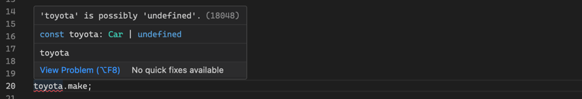

# TypeScript Language Overview


## Introduction

### Overview
* **Link**: https://www.typescriptlang.org/
* **Purpose**: A statically typed superset of JavaScript providing type safety at compile time.
* **Developed By**: Microsoft


### Key Features
* **Statically Typed**: Provides type checking at compile time to catch errors during development and not runtime.
* **Type Inference**: Automatically determines types when they're not explicitly specified.
* **JavaScript Compatibility**: All valid JavaScript code is valid TypeScript code.


### Compiler vs Transpiler
- **Transpiler**: `tsc` converts TypeScript to JavaScript, which is considered transpilation since it translates from TypeScript to a compatible version of JavaScript.
- **Compiler**: `tsc` also performs type-checking, syntax checking, and enforces type constraints, which are typical of compilers. This is why `tsc` is often referred to as a compiler.


### Playground
- **Purpose**: An online editor to experiment with TypeScript code and see the JavaScript output.
- **Link**: https://www.typescriptlang.org/play


- The **.js** view shows the JavaScript output of the TypeScript code.

 

- The **.d.ts** view provides a type-only, showing declarations of interfaces, types, and constants without implementation details.


<br>
<hr>

  
## Basic Data Types

### Core Types
- TypeScript provides several basic types to represent data.
```typescript
const isDone: boolean = false;
const count: number = 42;
const name: string = "Rene";
const list: number[] = [1, 2, 3];
const tuple: [string, number] = ["hello", 10];
```


### Type Inferencing
- TypeScript automatically infers types based on the assigned values.
```typescript
const isDone = false; // Type inferred as boolean
const count = 18; // Type inferred as number
const name = "Ana"; // Type inferred as string
```


### Type Errors
- TypeScript catches type errors during compilation, hence preventing runtime errors.
```typescript
let name = "Ana"
name = 42; // ❌ Error: Type 'number' is not assignable to type 'string'.
```

  


### Any Type
- Using `any` is discouraged because it opts out of type checking and leads to unsafe code that breaks at runtime.
```typescript
let name2: any;
// let name2; // Type inferred as any

name2 = "Ana";
name2 = 18;
```


### Object Types
- Defines the shape of an object.
```typescript
interface User { name: string; age: number; }
type User = { name: string; age: number; }
```


### Object Types Extended
- Extending object types allows to build on existing object types.
```typescript
interface Employee extends User { role: string; }
type Employee = User & { role: string; }
```


### Declaration Merging
- Allows adding properties to an existing interface. Useful for extending third-party libraries or global objects.
```typescript
interface Document { customProperty: string; }
document.customProperty = "My Custom Property";
```


### Array Types
- An array type can be written in two ways.
```typescript
let numbers: number[] = [1, 2, 3];
let numbers: Array<number> = [1, 2, 3];
```

### Function Types
- Defines the parameters and return type of function.
```typescript
function greet(user: User): string {
    return `Hello, ${user.name}!`;
}
```

### Declare Keyword
- Used to declare the type information for functions, variables, or classes without providing their implementation.
- Without both the type definition and implementation must be provided in the same file.
```typescript
// e.g., my-custom-library.d.ts
declare function greet(name: string): void;
declare let age: number;

// e.g., my-custom-library.js
function greet(name: string): void { /*..*/ }
let age: number = 18;
```


### Function Overloading
- Allows defining multiple function signatures for a single function.
```typescript
// my-custom-library.d.ts
declare function add(a: number, b: number): number;
declare function add(a: string, b: string): string;

// my-custom-library.js
function add(a: any, b: any): any { /*..*/ }
```


### Generic Types
- A type that can work with multiple data types.
```typescript
function map<T, U>(array: T[], mapFn: (elem: T) => U): U[] {
    return array.map(mapFn);
}

const numbers = map([1, 2, 3], (x) => x * 2);
const strings = map(["a", "b", "c"], (x) => x.toUpperCase());
```


### Enum Types
- **Auto-assigned Values**: Enum values are auto-assigned starting from 0.
```typescript
enum Color { Red, Green, Blue }

const myColor = Color.Red;
if (myColor === Color.Green) { /*..*/ }
```

- **Custom Values**: Enum values can be assigned custom values.
```typescript
enum Direction { Up = 1, Down = 2, Left = 3, Right = 4 }

const myMove = Direction.Up;
if (myMove === Direction.Down) { /*..*/ }
```


### Aliase Types
- Creates a new name for an existing type.
```typescript
type Name = string;
type NameResolver = () => string;

const myName: Name = "Alice";
```


### Literal Types
- A type that represents a single value.
```typescript
type Direction = "left" | "right" | "up" | "down";

function move(direction: Direction) {
    console.log(`Moving ${direction}`);
}
```

<br>
<hr>


## Advanced Data Types and Techniques

### Union Types (A ∪ B)
- **A | B**: A type that can be one of several types.
```typescript
type StringOrNumber = string | number;

function printId(id: StringOrNumber) {
    console.log(`Id: ${id}`);
}
```


### Union Types (A ∪ B) with a Discriminant Property
- **A | B**: A type that can be one of several types with a common property.
```typescript
interface Square { kind: "square"; size: number; }
interface Rectangle { kind: "rectangle"; width: number; height: number; }
type Shape = Square | Rectangle;

function getArea(shape: Shape): number {
    switch (shape.kind) {
        case "square":
            return shape.size * shape.size;
        case "rectangle":
            return shape.width * shape.height;
        // Potential error if new shape is added
    }
}
```


### Intersection Types (A ∩ B)
- **A & B**: A type that combines multiple types.
```typescript
interface HasName { name: string; }
interface HasAge { age: number; }
type Person = HasName & HasAge;

function printPerson(person: Person) {
    console.log(`Name: ${person.name}, Age: ${person.age}`);
}
```


### Interface vs. Type - Which One to Use?
- **interface**: Use when defining object shapes, especially when extending.
- **type**: Use when unions, intersections, alias, or more complex type combinations are needed.
```typescript
// Interface for object shapes
interface Animal { name: string; }
interface Dog extends Animal { breed: string;}

// type for complex types
type ID = string | number;

// type for aliases
type CryptoKey = string;
```


### Type Guards
- **is**: TypeGuards are runtime checks that determine if a value is of a specific type.
```typescript
function isNumber(value: unknown): value is number {
  return typeof value === "number";
}

function doubleValue(value: number | string) {
  if (isNumber(value)) {
    return value * 2;
  } else {
    return value + value;
  }
}

doubleValue(5); // 10
doubleValue("Hi"); // "HiHi"
```


### Type Assertions
- **Subtype Relationship (S is a subtype of T):** Works and is type-safe.
```typescript 
interface Animal { name: string; }
interface Dog extends Animal { breed: string;}

let myDog: Dog = { name: "Rex", breed: "Labrador" };
let animal: Animal = myDog as Animal;
```

- **Supertype Relationship (T is a supertype of S):** Works, but it's not guaranteed to be safe.
```typescript
let animal2: Animal = { name: "Max" };
let myDog2 = animal2 as Dog;
```

- **Structural Compatibility:** TypeScript checks the structure of the types, not the names.
```typescript
interface Car { make: string; model: string; }
interface Vehicle { make: string; model: string; wheels?: number; }

let myCar: Car = { make: "Toyota", model: "Corolla" };
let vehicle: Vehicle = myCar as Vehicle;
```

- **Unrelated Types**: Double assertion `..as unknown as` allows for any type conversion.
```typescript
function handler(event: Event) {
    // Neither 'Event' nor 'HTMLElement' is assignable to the other
    let element = event as unknown as HTMLElement;
}
```


### Special Types
- **Never**: A type for functions that never return.
```typescript
function throwError(message: string): never {
    throw new Error(message);
}
```

- **Void**: A type for functions that don't return a value.
```typescript
function logError(message: string): void {
    console.error(message);
}
```

- **Any**: A type to opt out of type checking, giving complete flexibility but losing type safety.
```typescript
let value: any;
value = 42;

// This will compile but can cause runtime errors if `value` is not a string.
console.log(value.toUpperCase());
```

- **Unknown**: A type-safe counterpart to `any` that forces type-checking before usage.
```typescript
let value: unknown;
value = "Hello, World!";

// This will not compile without a type assertion or type guard.
if (typeof value === "string") {
    console.log(value.toUpperCase());
}
```


### Utility Types
```typescript
interface Car { make: string; model: string; year?: number; }
```

- **Partial<Type>**: Create a new type by making all properties optional (opposite of `Required`).
```typescript
function updateCar(car: Car, partialCar: Partial<Car>): Car {
    return { ...car, ...partialCar };
}
```

- **Pick<Type, Keys>**: Create a new type by selecting properties from an existing object type. (opposite of `Omit`)
```typescript
const car: Pick<Car, "make" | "model"> = { make: "Toyota", model: "Corolla" };

car.make = "Honda"; // OK
car.model = "Civic"; // OK
car.year; // Error
```

- **Omit<Type, Keys>**: Create a new type by excluding properties from an existing object type. (opposite of `Pick`)
```typescript
const car: Omit<Car, "year"> = { make: "Toyota", model: "Corolla" };

car.make = "Honda"; // OK
car.model = "Civic"; // OK
car.year; // Error
```

- **Record<Keys, Type>**: Create a new dictionary type with specified keys and value types.

```typescript
const cars: Record<string, Car> = {
    "toyota": { make: "Toyota", model: "Corolla", year: 2020 },
    "honda": { make: "Honda", model: "Civic", year: 2021 }
};
```

- **noPropertyAccessFromIndexSignature** raises an error if using dot notation to access dynamic properties.  
❗️Only use dot notation for known properties, and bracket notation for dynamic properties.
  

```typescript
// ❌ Error: if `noPropertyAccessFromIndexSignature` is true (set in tsconfig.json)
// 🥲 TypeScript warns that accessing dynamic properties like `toyota` via dot notation is unsafe.
const toyota = cars.toyota;

// ✅ OK: Use bracket notation to access dynamic properties
const toyota = cars["toyota"];
toyota.make = "blabla";
```

- **noUncheckedIndexedAccess** raises an error if access dynamic properties without handling if the property is undefined.  
  ❗️Always check if dynamic properties exist before accessing them to prevent runtime errors.
  
```typescript
const toyota = cars["toyota"];

// ❌ Error: if `noUncheckedIndexedAccess` is true (set in tsconfig.json)
// 🥲 TypeScript warns that `toyota` might be `undefined` and undefined.make is a runtime error.
toyota.make = "blabla";

// ✅ OK: Check if dynamic property `toyota` exists before accessing `make`
if (toyota) { toyota.make = "blabla"; }

// ✅ OK: Use non-null assertion operator, only if you are sure that the property exists
toyota!.make = "blabla";
```


### Non-Null Assertation Operator
- **!**: Non-Null Assertion (!) tells TypeScript to ignore potential null or undefined values.

```typescript
const toyota = cars["toyota"]!;
toyota.make = "blabla";
```


### Generic Constraints
- **extends**: Creates a type of all the properties defined in the interface, plus additional properties.
```typescript
function logCar<T extends Car>(car: T) {
    console.log(car.make.length);
}

// ✅ OK: all required properties
logCar({ make: "Toyota", model: "Corolla" });

// ✅ OK: all required plus extra properties
logCar({ make: "Tesla", model: "Model X", autopilot: true });

// ❌ Error: Object literal may only specify known properties.
logCar({ cool: true }); 
```


### Lookup Types
- **keyof**: Create a union type by extracting keys from an object type.
```typescript
// CarKeys = "make" | "model" | "year"
type CarKeys = keyof Car; 

// CarPropTypes = string | number
type CarPropTypes = Car[keyof Car];
```


### Lookup Types & Generic Constraints
- **extends keof**: Constrain a generic type to keys of an object type.
```typescript
// Key extends keyof Car = dynamic type based on Car keys
function getCarProperty<Key extends keyof Car>(car: Car, key: Key): Car[Key] {
    return car[key];
}

// T extends keyof Type = dynamic type based on T keys
function getProperty<Key extends keyof T, T>(obj: T, key: Key): T[Key] {
    return obj[key];
}
```


### Mapped Types
- **in**: Create a object type by mapping over the properties of an existing type.
```typescript
// Make all properties optional
type OptionalCar = {
  [K in keyof Car]?: Car[K];
};

// Make all properties readonly
type ReadOnlyCar = {
  readonly [K in keyof Car]: Car[K];
};
```


### Type Queries
- **typeof**: Extract the type of a variable or property.
```typescript
const prop = "make";

// CarMakeType = "string"
type CarMakeType = typeof prop;

// CarMakeType = "string"
type CarMakeType = Car["make"];

// CarMakeType = dynamic type based on prop
type CarMakeType = Car[typeof prop];
```


### Type Access Patterns Overview
| Syntax                      | Description                                      | Example Type Inference                      |
|-----------------------------|--------------------------------------------------|---------------------------------------------|
| `type T = Car["make"]`      | Get type of `"make"`                             | `string`                                    |
| `type T = typeof prop`      | Get type of the value `prop`                     | Based on `prop`                             |
| `type T = Car[typeof prop]` | Get type of the value the Car property `prop`    | Based on `prop`                             |
| `type T = keyof Car`        | Get all keys of `Car` as a union                 | `"make" \| "model" \| "year"`               |
| `type T = Car[keyof Car]`   | Get all value types of `Car` as a union          | `string \| number \| undefined`             |
| `<T extends keyof Car>`     | Constrain `T` to keys of `Car`                   | Flexible, depends on `Car`                  |
| `prop: T, value: Car[T]`    | Use `T` for both the key and value type in `Car` | Depends on `T`, e.g., `string` for `"make"` |

<br>
<hr>


## Best Practices

### Guarding Angel of Exhaustive Trick: `assertNever(value: never): never`


- **Purpose**: When working with discriminated unions, TypeScript can help ensure all cases are handled.
- **Use**: The `assertNever` function to ensure all cases are handled, preventing runtime errors.

```typescript
interface Square { kind: "square"; size: number; }
interface Rectangle { kind: "rectangle"; width: number; height: number; }
type Shape = Square | Rectangle;

function assertNever(value: never): never {
    throw new Error("Unexpected value received: " + value);
}

function getArea(shape: Shape): number {
    switch (shape.kind) {
        case "square":
            return shape.size * shape.size;
        case "rectangle":
            return shape.width * shape.height;
        default:
            return assertNever(shape); 
    }
}
```


### Double Assertion Trick: `..as unknown as..`


- **Purpose**: Double assertion allows for type conversions that TypeScript might otherwise prevent due to type safety.  
 Typescript uses `as unknown as` to assert a value through `unknown` (or `any`) to a target type.

```typescript
function handleEvent(event: Event) {
    // Okay: The `event` is a `MouseEvent`, so we can solve it with single assertion
    let mouseEvent = event as MouseEvent;
}

function handler(event: Event) {
    // Error: Neither 'Event' nor 'HTMLElement' is assignable to the other, so we need double assertion
    // let element = event as HTMLElement;
    
    // Okay: Double assertion allows for type conversion
    let element = event as unknown as HTMLElement;
}
```
- **Single Assertion Rules**: TypeScript allows a type assertion `S as T` if either `S` is a subtype of `T` or `T` is a subtype of `S`.
- **Double Assertion Rules**: When single assertion is not allowed use `as unknown as` to bypass TypeScript's checks.
- **Use `unknown` vs `any`**: Both `as unknown as` and `as any as` can be used, but `unknown` is preferred for type safety.


### Definite Assignment Assertion Trick: `variable!: type`


- **Purpose**: Is used to tell TypeScript that a variable will be **assigned** before it is accessed, even if TypeScript's cannot prove this.
- **Use `!`**: To declare a variable that will be initialized later, especially in situations involving conditional logic or initialization in a separate function.

```typescript
// No initialization
let userName!: string;

// Delayed initialization
initializeUser();
console.log(userName.toUpperCase());

// Initialize of the variable
function initializeUser() {
    userName = "Alice";
}
```

<br>
<hr>


## TypeScript Setup

### Installation
```sh
# Create a new project folder
mkdir my-typescript-project
cd my-typescript-project

# Initialize a new npm project
npm init

# Install Typescript locally in the project
npm install --save-dev typescript

# Initialize Typescript configuration (creates `tsconfig.json`)
npx tsc --init

# Create `src` and `test` folders
mkdir src
mkdir test
```

### Initial `package.json`
```json
{
  "name": "my-typescript-project",
  "version": "1.0.0",
  "description": "Typescript Demo Project",
  "type": "module",
  "main": "dist/main.js",
  "scripts": {
    "build": "tsc",
    "start": "npm run build && node dist/main.js"
  },
  "devDependencies": {
    "typescript": "^5.6.3"
  }
}
```

### Project Structure

```markdown
my-project/
├── node_modules/               # Dependencies
│   └── ...
├── dist/                       # Compiled output from Typescript compiler
│   └── ...
├── src/                        # Sources
│   ├── main.ts                 # Main Entry Point of the Application
│   └── ...
├── test/                       # Tests
│   ├── main.test.ts            # Jest Test
│   └── ...
├── package.json                # Project Config and Dependencies
├── tsconfig.json               # TypeScript Config
```

### Configuration (`tsconfig.json`)
- **Link**: https://www.typescriptlang.org/tsconfig

```json
{
  "compilerOptions": {
    /* Language and Environment */
    "target": "ES2020",                         // Specify ECMAScript target version for the compiled JavaScript
    "module": "ESNext",                         // Specify module code generation (use the latest module system)
    "lib": ["ES2020", "DOM", "DOM.Iterable"],   // Include library files for ES2020, DOM APIs, and DOM Iterables (for browser)
    //"lib": ["ES2020],                         // Include library files for ES2020 (for Node)
    "outDir": "./dist",                         // Specify the output directory for compiled JavaScript files
    "rootDir": "./src",                         // Specify the root directory of TypeScript source files

    /* Enable Strict Type-Checking */
    "strict": true,                             // Enable all strict type-checking options for TypeScript

    /* Additional Error Checks */
    "noUnusedLocals": true,                     // Report errors for variables declared but not used within the code
    "noUnusedParameters": true,                 // Report errors for parameters defined but not used in functions
    "noImplicitReturns": true,                  // Report errors if not all code paths in a function have return statements
    "noFallthroughCasesInSwitch": true,         // Report errors for fall-through cases in switch statements without a break
    "noUncheckedSideEffectImports": true,       // Report errors on imports with side effects that are unused
    "noUncheckedIndexedAccess": true,           // Report errors when accessing dynamic properties without handling undefined
    "noPropertyAccessFromIndexSignature": true, // Report errors if using dot notation to access dynamic properties

    /* Paths and Module Aliases */
    "paths": {},                                // Configure path mapping for module imports

    /* Compatibility */
    // "types": ["node"],                       // Automatically include type definitions (for Node)
    "esModuleInterop": true,                    // Enable interop compatibility for importing CommonJS modules (e.g. Jest)
    "useDefineForClassFields": true,            // Emit class fields with `define` semantics
    "forceConsistentCasingInFileNames": true,   // Ensure consistent casing in module imports
    "skipLibCheck": true,                       // Skip type-checking of declaration files (.d.ts) for faster builds
    
    /* Debugging */
    "sourceMap": true                           // Generate source maps for debugging TypeScript in the browser or IDE
    
    /* Declaration Files */
    // "declaration": true,                     // Generate declaration files (.d.ts) for TypeScript code
    // "declarationDir": "dist/types",          // Output directory for declaration files
  },
  "include": ["src/**/*"],                      // Include all TypeScript source files in the src directory
  "exclude": ["node_modules"]                   // Exclude the node_modules directory from compilation
}
```

<br>
<hr>


## TypeScript Paths and Type Definitions

### Path Aliases `(tsconfig.json)`

- **Link**: [Path Aliases in TypeScript](https://www.typescriptlang.org/tsconfig#paths)
- **Purpose**: Path aliases provide cleaner, descriptive import paths, making code easier to read, maintain, and refactor.
- **Note**: Path aliases must be resolved by module bundlers like ESBuild since JavaScript does not support this natively.


- **Example Configuration**
```json
{
  "compilerOptions": {
    "paths": {
      "@components/*": ["components/*"],
      "@models/*": ["models/*"],
      "@utils/*": ["utils/*"]
    }
  }
}
```

- **Example Usage**
```typescript
// Before
import { User } from "../../models/user";
import { formatDate } from "../../utils/date";
import { Button } from "../../components/button";

// After
import { User } from "@models/user";
import { formatDate } from "@utils/date";
import { Button } from "@components/button";
```


### Type Definitions (`*.d.ts`)
- **Link**: https://www.typescriptlang.org/docs/handbook/2/type-declarations.html
- **Purpose**: Type definitions provide type information for JavaScript libraries without TypeScript support.
- **Installation**: Type definitions are installed via `@types` packages.
- **Example**: `npm install --save-dev @types/react` installs type definitions for React.

<br>
<hr>