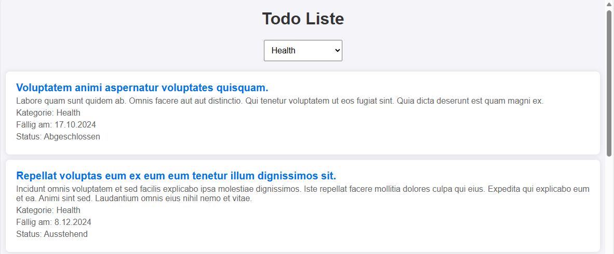

# Erstellen einer Todo-App mit Next.js und TypeScript



Im Kapitel Typescript haben wir bereits auf unser [Backend](01_Backend.md) zugegriffen, um Daten zu laden.
Stelle daher sicher, dass es läuft.
Nun wollen wir die erste SPA (single page app) schreiben, die die Ausgabe in den Browser bringt.

## Was ist Next.js und React?

*React* wurde 2013 von Facebook (jetzt Meta) veröffentlicht, ursprünglich entwickelt, um die wachsenden Anforderungen an interaktive und dynamische Benutzeroberflächen in ihren Anwendungen wie Facebook und Instagram zu bewältigen. React brachte mit der Einführung des virtuellen DOM und des komponentenbasierten Ansatzes eine Revolution in der Art und Weise, wie Entwickler UIs erstellen. Es ermöglichte effizientes Rendern von Änderungen und erleichterte die Wartung großer Anwendungen. Mit der Zeit entwickelte sich React zu einem der beliebtesten JavaScript-Frameworks für die Frontend-Entwicklung und bildet heute die Basis für viele moderne Webanwendungen weltweit.

*Next.js* wurde 2016 von Vercel (früher ZEIT) entwickelt und veröffentlicht, um das Arbeiten mit React zu vereinfachen und zu erweitern. Es wurde geschaffen, um die Lücken in React zu schließen, indem es serverseitiges Rendering (SSR) und statische Seitengenerierung (SSG) "out of the box" bietet. Next.js hat schnell an Beliebtheit gewonnen, weil es die Entwicklung von performanten und SEO-freundlichen Webanwendungen erleichtert, ohne dass Entwickler zusätzliche Konfigurationen für Routing oder Rendering vornehmen müssen. Seit seiner Veröffentlichung hat Next.js zahlreiche neue Funktionen hinzugefügt, darunter API-Routen, Bildoptimierung und integrierte Unterstützung für TypeScript, was es zu einem der führenden React-Frameworks für moderne Webanwendungen gemacht hat.

## Erstellen eine neuen Next.js App

Erstelle mit dem folgendem Befehl in der Konsole ein neues Next.js Projekt mit TypeScript.
Es wird automatisch ein Ordner *todo-app* erstellt, d. h. du führst den Befehl in der Konsole im Verzeichnis darüber aus.

Um das Skript *create-next-app* zur Verfügung zu haben, muss einmalig das Paket global installiert werden:

```
npm install -g create-next-app
```

Danach kann im Zielordner mit der Erstellung der ersten App begonnen werden.

```bash
npx create-next-app@latest todo-app --typescript
```

Beantworte die Fragen zur Einrichtung wie folgt.
Wir wollen nicht den App Router, sondern den Router von Next.js verwenden.
Deswegen beantworten wir die Frage mit *No*.

```
npx create-next-app@latest todo-app --typescript
√ Would you like to use ESLint? ...                               No / Yes <-- YES
√ Would you like to use Tailwind CSS? ...                         No / Yes <-- YES
√ Would you like to use *src/* directory? ...                     No / Yes <-- YES
√ Would you like to use App Router? (recommended) ...             No / Yes <-- NO
√ Would you like to use Turbopack for next dev? ...               No / Yes <-- NO
√ Would you like to customize the default import alias (@/*)? ... No / Yes <-- YES
```

### Überblick über das Next.js Projekt

Nach der Initialisierung findest du die folgenden Dateien und Ordner:

- **pages/**: Hier befinden sich alle Seiten deiner App. Jede Datei in diesem Ordner wird zu einer Route. Zum Beispiel wird *index.tsx* zur Startseite (*/*).
- **public/**: Statische Dateien wie Bilder, Icons oder andere Ressourcen werden hier abgelegt.
- **styles/**: Dieser Ordner enthält CSS-Dateien für die Styles deiner App.
- **next.config.js**: Diese Datei enthält die Konfiguration von Next.js. Hier kannst du spezifische Einstellungen für dein Projekt anpassen.
- **tsconfig.json**: Hier werden die TypeScript-Konfigurationen festgelegt.
- **package.json**: Diese Datei listet alle Abhängigkeiten des Projekts sowie Skripte zum Bauen, Starten und Entwickeln.

> Lösche nach der Erstellung alle Dateien aus dem Ordner *pages*.
> Wir werden sie nach und nach anlegen, um ihre Bedeutung zu erfahren.

### Installieren der notwendigen Pakete

Installiere *axios*, um HTTP-Anfragen an das Backend zu stellen:

```bash
npm install axios
```

## Erstellen der TypeScript Interfaces

Erstelle im Ordner *src/types* eine Datei *TodoItem.ts* für die Todo-Items:

**src/types/TodoItem.ts**
```typescript
export interface TodoItem {
  guid: string;
  title: string;
  description: string;
  categoryName: string;
  categoryPriority: string;
  categoryIsVisible: boolean;
  isCompleted: boolean;
  dueDate: string;
  createdAt: string;
  updatedAt: string;
}

export function isTodoItem(item: any): item is TodoItem {
  return (
    typeof item === "object" &&
    "guid" in item &&
    "title" in item &&
    "description" in item &&
    "categoryName" in item &&
    "categoryPriority" in item &&
    "categoryIsVisible" in item &&
    "isCompleted" in item &&
    "dueDate" in item &&
    "createdAt" in item &&
    "updatedAt" in item
  );
}
```

Erstelle eine weitere Datei *Category.ts* für die Kategorien:

**src/types/Category.ts**
```typescript
export interface Category {
  guid: string;
  name: string;
  description: string;
  isVisible: boolean;
  priority: string;
  ownerName: string;
}

export function isCategory(item: any): item is Category {
  return (
    typeof item === "object" &&
    "guid" in item &&
    "name" in item &&
    "description" in item &&
    "isVisible" in item &&
    "priority" in item &&
    "ownerName" in item
  );
}
```

### Erklärung des TypeScript Codes

- **TodoItem Interface**: Dieses Interface definiert die Struktur eines Todo-Items, die wir vom Backend erhalten.
- **isTodoItem Type Guard**: Dies ist ein sogenannter "Type Guard", der sicherstellt, dass ein Objekt den Typ *TodoItem* hat.
- **Category Interface**: Dieses Interface beschreibt die Struktur einer Kategorie. Auch hier nutzen wir einen "Type Guard" mit *isCategory*.

## Erstellen der Datei _app.tsx

Die Datei *_app.tsx* in einem Next.js-Projekt ist eine spezielle Komponente, die als "Custom App" bezeichnet wird.
Sie ermöglicht es dir, das Standardverhalten von Next.js anzupassen und globale Layouts oder Stile auf alle Seiten der Anwendung anzuwenden.
Hier ist eine detaillierte Erklärung, was _app.tsx macht und warum sie wichtig ist:

### Zweck von _app.tsx

- **Globale Layouts und Stile:** _app.tsx ist der ideale Ort, um globale Layouts oder Stile zu definieren, die auf jeder Seite der Anwendung erscheinen sollen. Wenn du z. B. ein Navigationsmenü oder eine Fußzeile hast, die auf jeder Seite sichtbar sein soll, kannst du es hier einfügen. Ebenso ist es üblich, globale CSS-Dateien wie globals.css hier zu importieren.
- **Initialisierung von Seiten:** Jedes Mal, wenn eine Seite in Next.js geladen wird, wird sie über _app.tsx gerendert. Das bedeutet, dass jede Seite durch die Komponente, die in _app.tsx definiert ist, gerendert wird.
- **Zustandsverwaltung und Bibliotheken:** Wenn du externe Bibliotheken wie Zustandsspeicher (z.B. Redux, Zustand), Authentifizierung oder andere Logik auf globaler Ebene hinzufügen möchtest, kannst du dies in _app.tsx tun. Diese Konfiguration wird dann in der gesamten Anwendung verfügbar sein.
- **Client-seitige Navigation:** In einer Next.js-App wird die client-seitige Navigation, d.h. das Wechseln zwischen den Seiten ohne vollständiges Neuladen, über _app.tsx gesteuert. Es ist also ein zentraler Punkt für die Handhabung von Navigationen und Seitenwechseln.

**src/pages/_app.tsx**
```typescript
import type { AppProps } from 'next/app';
import '../styles/globals.css';  // Importiere die globale CSS-Datei

function TodoApp({ Component, pageProps }: AppProps) {
  return <Component {...pageProps} />;
}

export default TodoApp;
```

## Erstellen der Hauptkomponente der App

Öffne *src/pages/index.tsx* und füge den folgenden Code ein:

**src/pages/index.tsx**
```typescript
import { useEffect, useState } from "react";
import axios from "axios";
import { TodoItem, isTodoItem } from "../types/TodoItem";
import { Category, isCategory } from "../types/Category";

export default function Home() {
  const [todoItems, setTodoItems] = useState<TodoItem[]>([]);
  const [categories, setCategories] = useState<Category[]>([]);
  const [selectedCategory, setSelectedCategory] = useState<string>("");

  useEffect(() => {
    // Todo Items abrufen
    axios.get("https://localhost:5443/api/TodoItems")
      .then(response => {
        const filteredTodos = response.data.filter(isTodoItem);
        setTodoItems(filteredTodos);
      })
      .catch(error => console.error(error));

    // Kategorien abrufen
    axios.get("https://localhost:5443/api/Categories")
      .then(response => {
        const filteredCategories = response.data.filter(isCategory);
        setCategories(filteredCategories);
      })
      .catch(error => console.error(error));
  }, []);

  const handleCategoryChange = (event: React.ChangeEvent<HTMLSelectElement>) => {
    setSelectedCategory(event.target.value);
  };

  const filteredTodoItems = selectedCategory
    ? todoItems.filter(item => item.categoryName === selectedCategory)
    : todoItems;

  return (
    <div>
      <h1>Todo Liste</h1>
      <select onChange={handleCategoryChange}>
        <option value="">Alle Kategorien</option>
        {categories.map(category => (
          <option key={category.guid} value={category.name}>
            {category.name}
          </option>
        ))}
      </select>

      <ul>
        {filteredTodoItems.map(item => (
          <li key={item.guid}>
            <h2>{item.title}</h2>
            <p>{item.description}</p>
            <p>Kategorie: {item.categoryName}</p>
            <p>Fällig am: {new Date(item.dueDate).toLocaleDateString()}</p>
            <p>Status: {item.isCompleted ? "Abgeschlossen" : "Ausstehend"}</p>
          </li>
        ))}
      </ul>
    </div>
  );
}
```

### Erläuterung des Codes

- **useState**: Mit diesem Hook erstellen wir lokale State-Variablen. *todoItems* speichert die Liste der Todo-Items, *categories* die Kategorien und *selectedCategory* speichert die aktuell ausgewählte Kategorie.
- **useEffect**: Dieser Hook führt seiteneffektreiche Aktionen aus, wie z.B. das Abrufen von Daten. Beim Laden der Seite ruft *useEffect* die Daten von den beiden API-Endpunkten ab und speichert sie im State.
- **axios.get()**: Hiermit werden HTTP GET-Anfragen an die API gesendet. Die Antworten werden in den jeweiligen State-Variablen gespeichert.
- **handleCategoryChange**: Diese Funktion wird aufgerufen, wenn der Benutzer eine Kategorie aus dem Dropdown-Menü auswählt. Die ausgewählte Kategorie wird im State gespeichert und die Liste der Todo-Items wird entsprechend gefiltert.
- **isTodoItem & isCategory**: Diese Type Guards stellen sicher, dass die vom Backend erhaltenen Daten die erwarteten Strukturen haben, bevor sie in den State gespeichert werden.

#### Wie funktioniert useState<TodoItem[]>([])?

Der React-Hook useState wird verwendet, um den internen State einer Komponente zu verwalten. Wenn wir *useState<TodoItem[]>([])* verwenden, initialisieren wir den State als ein leeres Array, das vom Typ *TodoItem[]* ist – also ein Array von TodoItem-Objekten.

```typescript
const [todoItems, setTodoItems] = useState<TodoItem[]>([]);
```

- **todoItems:** Dies ist die State-Variable, die die Todo-Items enthält.
- **setTodoItems:** Diese Funktion wird verwendet, um den Wert von todoItems zu aktualisieren.

Der Hook erwartet den Typ der State-Variable, also ein Array von TodoItem. Der Startwert ist ein leeres Array *[]*.
Durch die Verwendung des Typs *TodoItem[]* weiß TypeScript, dass wir in der todoItems-Variable eine Liste von TodoItem-Objekten speichern.
Dies stellt sicher, dass wir später sicher auf die Eigenschaften dieser Objekte zugreifen können, z.B. item.title oder item.description.

#### Was macht useEffect genau?

Der Hook useEffect wird in React verwendet, um Nebenwirkungen (engl. "side effects") in funktionalen Komponenten zu behandeln, wie z.B. das Abrufen von Daten, das Abonnieren von Ereignissen oder das direkte Manipulieren des DOMs, die nicht innerhalb der normalen Ausführung des Renderings stattfinden sollten.


```typescript
useEffect(() => {
  // Abrufen von Todo Items und Kategorien
}, []);
```

#### Wann wird useEffect aufgerufen?

useEffect wird immer dann aufgerufen, wenn die Komponente gerendert wird. In unserem Fall haben wir ein leeres Abhängigkeitsarray [] als zweiten Parameter angegeben, was bedeutet, dass der Effekt nur einmal beim ersten Rendern der Komponente ausgeführt wird.
Wenn wir bestimmte Variablen in das Abhängigkeitsarray aufnehmen (z.B. *[selectedCategory]*), würde useEffect bei jeder Änderung dieser Variablen erneut ausgeführt.
Wofür wird useEffect in unserem Fall genutzt?

Es wird verwendet, um die Todo-Items und Kategorien von der API zu laden, wenn die Seite das erste Mal gerendert wird. Die Daten werden dann im State der Komponente gespeichert.

## CSS Layout für die App

Um das Layout der App zu verbessern, erstellen wir eine einfache CSS-Datei. Gehe zu src/styles/global.css und füge das folgende CSS hinzu:

```css
body {
  font-family: Arial, sans-serif;
  margin: 0;
  padding: 0;
  background-color: #f4f4f9;
}

h1 {
  text-align: center;
  color: #333;
}

select {
  display: block;
  margin: 20px auto;
  padding: 10px;
  font-size: 16px;
}

ul {
  list-style-type: none;
  padding: 0;
}

li {
  background-color: #fff;
  margin: 10px;
  padding: 20px;
  border-radius: 8px;
  box-shadow: 0 0 10px rgba(0, 0, 0, 0.1);
}

li h2 {
  margin: 0;
  font-size: 20px;
  color: #0070f3;
}

li p {
  margin: 5px 0;
  color: #666;
}

```
## 8. Starte den Entwicklungsserver

Führe den folgenden Befehl aus, um den Entwicklungsserver zu starten:

```bash
npm run dev
```

Öffne deinen Browser und gehe zu *http://localhost:3000*. Du solltest nun eine Todo-Liste sehen, die Daten vom Backend abruft und eine Filterfunktion nach Kategorien bietet.

