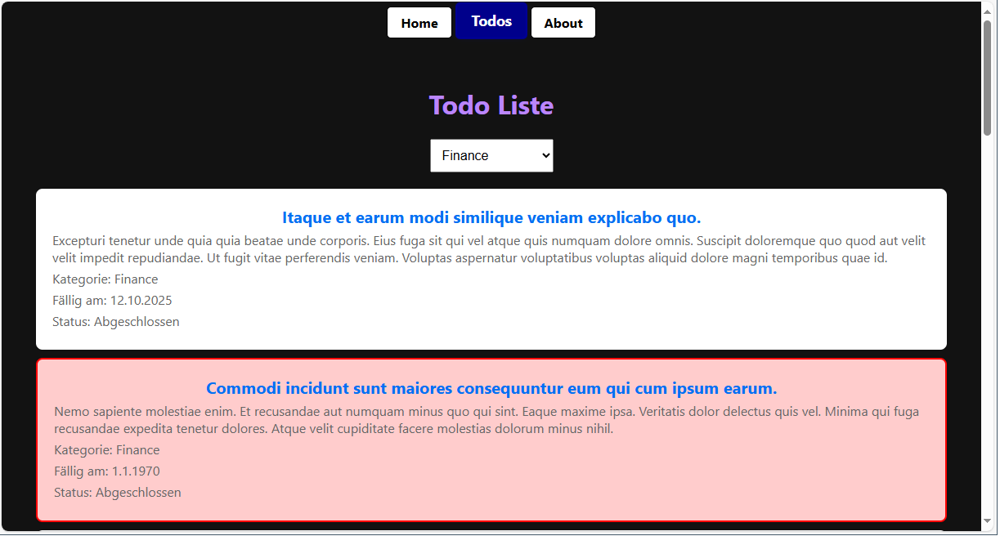

# Layout, Komponenten und Routen




> Link zum Programm: [Laout_Routing20241118.zip](Laout_Routing20241118.zip), im Repo unter *30_TodoApp/Laout_Routing*.  
> Wichtig: Diese Informationen beziehen sich auf das Routingsystem in Next.js 15.
> Es wurde in der Version 13 angepasst, kontrolliere daher in Tutorials immer die Version!

Im vorigen Beispiel haben wir in der Datei *src/pages/index.tsx* unsere gesamte Applikation gepackt.
Das CSS wurde in *src/styles/global.css* hinterlegt.
Bei größeren Projekten führt uns dieser Ansatz zu großen Problemen:
- Wir brauchen ein zentrales Layout mit einer Navbar, und die verschiedenen Pages sollen z. B. im main Bereich dargestellt werden.
- Wir wollen den CSS Code aufteilen.
- Wir wollen mehrere Pages erstellen, die unter unterschiedlichen Adressen erreicht werden sollen.

Deswegen ist eines der Kernzonzepte jedes SPA Frameworks das *Routingsystem*.

## Definition eines zentralen Layouts

Zuerst erstellen wir einen Ordner *src/app*. Der *app* Ordner ist von zentraler Bedeutung.
Hier legen wir eine Datei *layout.tsx* mit folgendem Inhalt an:

**src/app/layout.tsx**
```tsx
import Navbar from "@/app/components/Navbar";
import './globals.css'; // Importiere die globale CSS-Datei

export default function RootLayout({
    children,
}: {
    children: React.ReactNode;
}) {
    return (
        <html lang="en">
            <head>
                {/* Favicon als Base64-encoded SVG */}
                <link
                    rel="icon"
                    href="data:image/svg+xml;base64,PHN2ZyB4bWxucz0iaHR0cDovL3d3dy53My5vcmcvMjAwMC9zdmciIHZpZXdCb3g9IjAgMCAyNCAyNCIgZmlsbD0ibm9uZSIgc3Ryb2tlPSIjMDAwMDAwIiBzdHJva2Utd2lkdGg9IjIuNSIgc3Ryb2tlLWxpbmVjYXA9InJvdW5kIj48cGF0aCBkPSJNNCAxMmw0IDQgOC04IiAvPjwvc3ZnPg=="
                    type="image/svg+xml"
                />
                <title>To-Do App</title>
            </head>
            <body>
                <div className="container">
                    <Navbar />
                    <main className="content">{children}</main>
                </div>
            </body>
        </html>
    );
}
```

Dies exportiert die Funktion *RootLayout*.
Sie bildet den Startpunkt der HTML Darstellung.
Deswegen wird auch im TSX Code ein vollständiges HTML Gerüst zurückgeliefert.
2 Dinge sind neu:

- Es wird *{children}* verwendet.
  Hier werden dann die Unterseiten "hineingesetzt".
- Mit *Navbar* verwenden wir die erste eigene Komponente.
  Komponenten sind Puzzlesteine, die von Next.js an diese Stelle gesetzt werden.

## Die Komponente Navbar

Wie sieht so eine Komponente aus?
Sie ist vom Aufbau her ident mit unserer ersten Page.
Den Unterschied macht aber die Verwendung: Solche Komponenten werden in Pages eingebettet und nicht direkt "angewählt".
Next.js rendert standardmäßig die Komponenten am Server und sendet den HTML Code an den Browser.
Da wir aber clientseitige Aktionen wie das Abfragen der Adressleiste (mit *usePathname*) machen müssen, müssen wir mit *use client* sagen, dass diese Komponente im Browser mit JavaScript gerendert wird.

Danach werden die Styles eingebunden.
Dafür wird eine Datei *Laout_Routing/src/app/components/Navbar.module.css* mit [diesem CSS](./Laout_Routing/src/app/components/Navbar.module.css) angelegt. Dies nennt sich *CSS Modules* in Next.js.

> Wichtig: Du musst im TSX den Klassennamen mit className zuweisen und davor den Style mit *import* einbinden.


**src/app/components/Navbar.tsx**
```tsx
'use client'  // Da wir usePathname vom Router verwenden.

import styles from './Navbar.module.css';
import Link from 'next/link';
import { usePathname } from 'next/navigation';

export default function Navbar() {
    const pathname = usePathname(); // Aktuellen Pfad abrufen

    return (
        <nav className={styles.nav}>
            <Link
                href="/"
                className={pathname === '/' ? styles.active : ''}
            >
                Home
            </Link>
            <Link
                href="/todos"
                className={pathname === '/todos' ? styles.active : ''}
            >
                Todos
            </Link>
            <Link
                href="/about"
                className={pathname === '/about' ? styles.active : ''}
            >
                About
            </Link>
        </nav>
    );
}
```

## Die Startpage

Wenn wir mit der Root Adresse (/) auf die App zugreifen, wird die Home Page geladen.
Dafür legen wir im *src/app* Ordner eine Datei *page.tsx* an.

**src/app/page.tsx**

```tsx
export default function Home() {
    return (
        <div className="home">
        <h1>Welcome to todo-app</h1>
        <p>
            Dies ist die Datei page.tsx. Sie wird geladen, wenn keine Route angegeben wird.
            Klicke auf einen Punkt im Menü.
        </p>
        </div>
    )
}
```

## Routing in Next.js (ab 13)

Wir wollen nun auf die Adressen */about* und */todos* reagieren.

### Anlegen der about Page

Wir legen im Ordner *src/app* ein Verzeichnis *about* an.
Darin legen wir die Datei *page.tsx* an.
Sie wird automatisch geladen, wenn die Adresse */about* angefordert wird:

**src/app/about/page.tsx**
```tsx
export default function AboutPage() {
    return (
        <div className="about">
            <h1>About</h1>
            <p>
                Dies ist ein Frontend für das Todo Backend.
                Es zeigt den Einsatz von Next.js 15 im WMC Unterricht.
            </p>
        </div>
    )
}
```

### Anlegen der todos Page

In dieser Page wollen wir auch ein eigenes CSS einbinden.
Dieser Code war vorher im globalen Stylesheet, nun wollen wir es nur für die todos Page verwenden.
Deswegen wird in *todos/style.module.css* ein CSS Module mit [diesem CSS Code](./Laout_Routing/src/app/todos/style.module.css) erstellt.

#### Server- und clientseitig gerenderte Komponenten treffen aufeinander

Die todos Page holt sich Daten von der API mit *axios*.
Dieser Aufruf ist asynchron.
Davor haben wir ein *Promise* verwendet, um keine *async* Methode definieren zu müssen.

Damit wir *async* und *await* verwenden können, müssen wir wissen, dass es *servergerenderte* und *clientgerenderte* Komponenten gibt.
Beim Laden von einer API ist es best practice, die Daten in einer *serverseitigen* Komponente zu laden.
Erst wenn die Daten vorhanden sind, werden sie über Parameter einer *clientseitigen* Komponente übergeben.

> Das Darstellen einer clientseitigen Komponente sollte möglichst schnell durchgeführt werden können.
> Deswegen sollten keine API Aufrufe dort statt finden.

Um das zu erreichen, legen wir zuerst in der Datei *page.tsx* den *serverseitigen* Teil an.

**src/app/todos/page.tsx**

```tsx
import axios from "axios";
import https from "https";
import TodosClient from "./TodosClient";
import { isTodoItem } from "../types/TodoItem";
import { isCategory } from "../types/Category";

export default async function TodosPage() {
  const agent = new https.Agent({
    rejectUnauthorized: false
  });

  // Categories laden, um das Dropdown befüllen zu können.
  const categoriesResponse = await axios.get("https://localhost:5443/api/Categories", { httpsAgent: agent });
  const categories = categoriesResponse.data.filter(isCategory);

  // TodoItems laden, um die Items anzeigen zu können
  const todoItemsResponse = await axios.get("https://localhost:5443/api/TodoItems", { httpsAgent: agent });
  const todoItems = todoItemsResponse.data.filter(isTodoItem);


  return <TodosClient todoItems={todoItems} categories={categories} />;
}
```

Beachte den Aufruf von *TodosClient*. Es werden 2 *Parameter (Props)* übergeben.

Nun erstellen wir in *TodosClient.tsx* die clientseitige Komponente.
Im Prototypen von *TodosClient* werden die übergebenen Parameter geschrieben.
Nun können wir mit den fertigen Daten die Komponente *clientseitig* rendern.

**src/app/todos/TodosClient.tsx**
```tsx
'use client';

import { useState } from "react";
import { TodoItem } from "../types/TodoItem";
import { Category } from "../types/Category";
import styles from "./style.module.css";

type Props = {
    todoItems: TodoItem[];
    categories: Category[];
};

export default function TodosClient({ todoItems, categories }: Props) {
    const [selectedCategory, setSelectedCategory] = useState<string>("");

    const handleCategoryChange = (event: React.ChangeEvent<HTMLSelectElement>) => {
        setSelectedCategory(event.target.value);
    };

    const filteredTodoItems = selectedCategory
        ? todoItems.filter(item => item.categoryName === selectedCategory)
        : todoItems;

    return (
        <div className={styles.categories}>
            <h1>Todo Liste</h1>
            <select onChange={handleCategoryChange}>
                <option value="">Alle Kategorien</option>
                {categories.map(category => (
                    <option key={category.guid} value={category.name}>
                        {category.name}
                    </option>
                ))}
            </select>

            <ul>
                {filteredTodoItems.map(item => (
                    <li
                        key={item.guid}
                        className={
                            new Date(item.dueDate) < new Date() ? styles.overdue : styles.onTime
                        }
                    >
                        <h2>{item.title}</h2>
                        <p>{item.description}</p>
                        <p>Kategorie: {item.categoryName}</p>
                        <p>Fällig am: {new Date(item.dueDate).toLocaleDateString()}</p>
                        <p>Status: {item.isCompleted ? "Abgeschlossen" : "Ausstehend"}</p>
                    </li>
                ))}
            </ul>
        </div>
    );
}
```

## Dateiübersicht der Muster App

```
Layout_Routing
  + .eslintrc.json
  + next.config.ts
  + package.json
  + postcss.config.mjs
  + public
  + src
  |  + app
  |  |  + about
  |  |  |  + page.tsx
  |  |  + components
  |  |  |  + Navbar.module.css
  |  |  |  + Navbar.tsx
  |  |  + globals.css
  |  |  + layout.tsx
  |  |  + page.tsx
  |  |  + todos
  |  |  |  + page.tsx
  |  |  |  + style.module.css
  |  |  |  + TodosClient.tsx
  |  |  + types
  |  |  |  + Category.ts
  |  |  |  + TodoItem.ts
  + tailwind.config.ts
  + tsconfig.json
```

## Übung

Beim Klick auf die Überschrift eines Todo Items in der Page *todos* soll eine Seite geöffnet werden, die alle *Todo Tasks* dieses Todo Items darstellt.
Dafür brauchst du *dynamisches Routing*.
Es ist in der Doku von Next.js unter [Dynamic Routes](https://nextjs.org/docs/app/building-your-application/routing/dynamic-routes) erklärt.
Du musst also in *src/app/todos* einen ordner *[id]* anlegen.
In diesem Ordner erstellst du eine *page.tsx* Datei, die den Parameter *id* ausliest.
Dort steht die GUID des TodoItems.
Mit *https://localhost:5443/api/TodoItems/(id)* kannst du von der API die Detailinfos zum Todo Item vom Server laden.
Es beinhaltet ein Array *todoTasks*, das alle Tasks anbietet.
Stelle diese Tasks in einer clientseitigen Component dar.

Gehe dabei so vor:
- Lade als Basisimplementierung die Datei [Laout_Routing20241118.zip](Laout_Routing20241118.zip) aus dem Repo.
- Definiere ein Interface *TodoItemDetail* in *src/app/types*.
  Es soll die Antwort, die z. B. von https://localhost:5443/api/TodoItems/3b33199e-bc34-7895-eb67-338383c35c99 kommt, aufnehmen.
  Vergiss nicht auf den Typeguard.
- Lege in *src/app/todos* die entsprechenden Dateien und Verzeichnisse für das dynamische Routing an.
- In der Component *src/app/todos/[id]/page.tsx* wird der API Request vom Server geladen.
  Dann wird die clientseitige Component eingebunden. Es wird ein Array von *TodoItemDetail* Instanzen übergeben.

