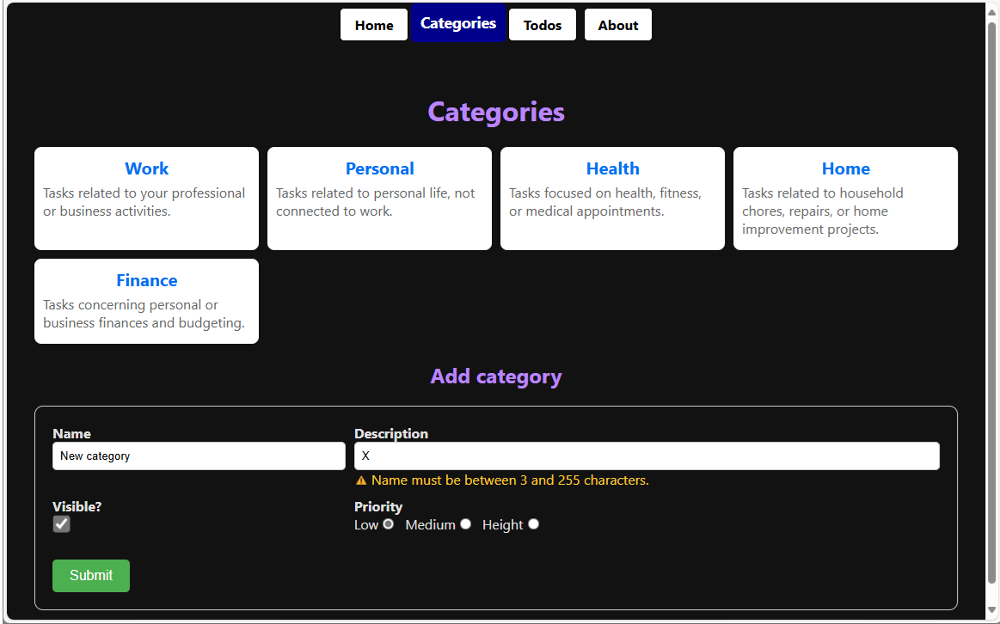
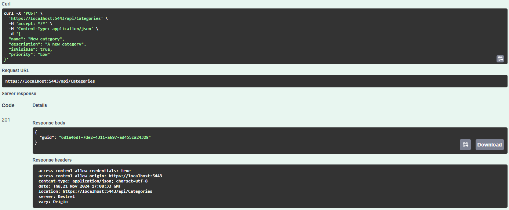
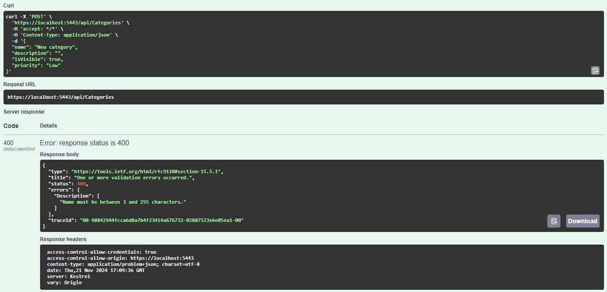
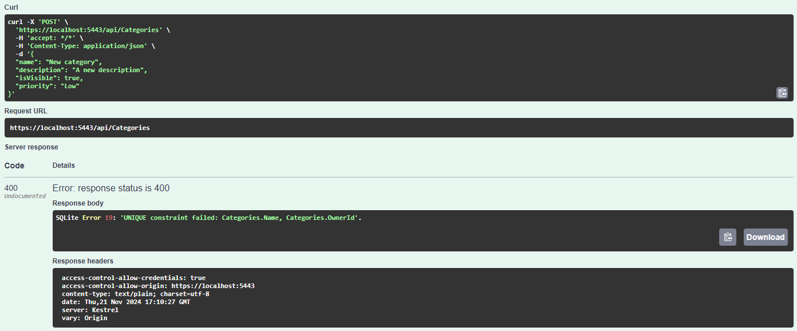

# Formulare und POST Requests: Daten einfügen



> Link zum Programm: [Add_Form20241212.zip](./Add_Form20241212.zip), im Repo unter *30_TodoApp/Add_Form*.  
 
## Daten an die API senden: der POST Request

Wenn wir die API des Todo Backends starten, können wir Swagger auf *https://localhost:5443/swagger/index.html* abrufen.
Bis jetzt haben wir nur von der API mit einem *GET* Request gelesen.
Möchten wir neue Daten einfügen, so müssen wir einen *POST* Request absetzen.
Dies können wir auch in Swagger, indem wir auf *POST /api/Categories* klicken.

Zusätzlich müssen wir Daten an die API senden, schließlich muss sie ja wissen, was wir eintragen möchten.
Die Daten werden im JSON Format angegeben.
Um eine neue Kategorie zu erstellen, können wir z. B. folgende Daten senden:

```json
{
  "name": "New category",
  "description": "A new category",
  "isVisible": true,
  "priority": "Low"
}
```

Die API nimmt diese Daten entgegen und schickt uns als Ergebnis *201 Created*.
Es ist ein Success Code, alles hat funktioniert.



Was aber, wenn unsere Daten falsch sind?
Wenn wir einen Datensatz mit leerer Beschreibung senden, wird die API mit *400 bad request* die Anfrage ablehnen.
Codes, die mit 4 beginnen bedeuten, dass der Fehler bei den Clientdaten liegt und wir den Request nicht unverändert wiederholen sollen.

```json
{
  "name": "New category",
  "description": "",
  "isVisible": true,
  "priority": "Low"
}
```



Sehen wir uns die Antwort genauer an.
ASP.NET Core sendet im Property *errors* ein Objekt.
Darin ist jedes fehlerhafte Property als Key eingetragen, in diesem Fall *Description*.
Ein Array gibt die genauere Validierungsmeldung aus.
Dies brauchen wir dann, um dem User das Problem zurück zu melden.

Senden wir nun offensichtlich korrekte Daten nochmals an die API:

```json
{
  "name": "New category",
  "description": "A new category",
  "isVisible": true,
  "priority": "Low"
}
```



Die API reagiert erneut mit *400 bad request*.
Dies entsteht, da ein Kategorienname nur 1x vergeben werden darf.
Die Antwort ist allerdings anders aufgebaut, es ist nur eine Textmeldung.

> Unsere API liefert bei Validierungsfehlern ein *errors* object.
> Bei allgemeinen Fehlern liefert sie nur Text.
> Wir müssen dies am Client berücksichtigen.

## Eine Hilfsdatei für API Requests

Bis jetzt wurde direkt in der Page die Daten von der API angefordert.

```typescript
export default async function TodosPage() {
  const agent = new https.Agent({
    rejectUnauthorized: false
  });

  // Categories laden, um das Dropdown befüllen zu können.
  const categoriesResponse = await axios.get("https://localhost:5443/api/Categories", { httpsAgent: agent });
  const categories = categoriesResponse.data.filter(isCategory);
  // ...
  return <TodosClient todoItems={todoItems} categories={categories} />;
}
```

Bei größeren Projekten ergeben sich jedoch Nachteile:
- Es wird die absolute URL des Devservers (localhost) verwendet.
  Wollen wir sie ändern, müssen wir jede Komponente durchsehen.
- Konfigurationen wie das Setzen des Agents werden jedes mal wiederholt.
- Es wird keine Fehlerbehandlung durchgeführt.
  Falls die API nicht erreichbar ist, entsteht ein Laufzeitfehler.

Wir brauchen daher eine zentrale Datei, mit der wir eine Instanz von axios zentral konfigurieren.
Eine solche Datei legen wir in *src/app/utils/apiClient.ts* an.

**Quellcode: [src/app/utils/apiClient.ts](./Add_Form/src/app/utils/apiClient.ts)**

Zuerst wird ein Objekt *axiosInstance* exportiert.
Es wird mit der gewünschten Konfiguration zentral erstellt.
Somit müssen wir nur an dieser Stelle etwas ändern, falls sich die URL, etc. ändern sollte.

Falls ein API Aufruf fehlerhaft ist, was vor allem bei POST Requests aufgrund falsch übermittelter Daten sein kann, definieren wir einen eigenen type für die Antwort der API:

```typescript
export type ErrorResponse = {
    status: number;
    message: string;
    validations: Record<string, string>;
};
```

Er bildet die Antwort der API, die oben in den Screenshots gezeigt wurde, ab.

Die Funktion *createErrorResponse* hat folgende Aufgabe:
ASP.NET Core sendet wie beschrieben ein Objekt, das die Validierungsfehler beinhaltet.
Diese Funktion prüft die Antwort des Servers:
- Liefert der Server gar keine Rückmeldung, wird *Der Server ist nicht erreichbar.* als Nachricht geschrieben.
  Das ist dann der Fall, wenn der Server netzwerkmäßig nicht erreichbar ist.
- Liefert der Server einen Statuscode, aber keine genaueren Daten, wird die Meldung *Der Server lieferte HTTP xx.* geschrieben.
  Das ist dann der Fall, wenn ein z. B. *internal Server Error (500)* auftritt.
- Liefert der Server einen einfachen Text zurück, wird dieser in *message* geschrieben.
  Das ist dann der Fall, wenn unsere API einen nicht spezifischen Fehler der übergebenen Daten meldet.
- Liefert der Server ein *errors* Objekt, wird dieses mit kleingeschriebenen Properties in *validations* geschrieben.

## Bündeln aller Requests in einem TS File

Nun wollen wir die Struktur weiter optimieren.
Wir legen eine Datei */src/app/categories/categoryApiClient.ts* an.
Diese Datei beinhaltet die Funktionen, die von den Komponenten in diesem Ordner zur Kommunikation mit der API benötigt werden.

**Quellcode: [src/app/categories/categoryApiClient.ts](./Add_Form/src/app/categories/categoryApiClient.ts)**

*getCategories* liest über unser vorkonfiguriertes *axiosInstance* Objekt von der API.
Wir geben daher nur den Teil nach *localhost:5443/api* an, also *categories*.
Die Funktion liefert ein Promise vom Typ *Category[]* oder *ErrorResponse* zurück, je nach dem, ob die Anfrage erfolgreich war oder nicht.

Um das HTML Formular an die API zu übermitteln, benötigen wir die Funktion *addCategory*.
Sie bekommt die Formulardaten und erzeugt ein JSON Objekt für den Transfer an den Server.
Damit der neue Datensatz auch sichtbar wird, brauchen wir *revalidatePath*.
Sonst müsste der Benutzer händisch neu laden, um die Liste der Kategorien zu aktualisieren.


## Erstellen des Eingabeformulares für neue Kategorien

Um eine neue Kategorie zu erfassen, benötigen wir ein HTML Eingabeformular für die Felder *name*, *description*, *isValid* und *priority*.
Da *isValid* eim boolean Wert ist, wird eine Checkbox für die Darstellung verwendet.
Für die Darstellung der 3 Werte für Priority verwenden wir Radio Buttons.

**Quellcode: [src/app/categories/CategoryAdd.tsx](./Add_Form/src/app/categories/CategoryAdd.tsx)**

In diesem Beispiel ist die Verarbeitung von Formularen in Next.js gut dargestellt.
- Das *form* Element besitzt ein Attribut *onSubmit*.
  Es ruft die Funktion *handleSubmit* auf.
  Damit diese Funktion die Fehlermeldungen und Validierungen setzen kann, geben wir *setError* als Argument mit.
  Die *formRef* ist eine Referenz auf das Formular.
  Sie wird benötigt, um das Formular zu leeren, wenn der Request erfolgreich war.
- Die *input* Felder haben einen Namen, der über *formData.get()* in *addCategory* abgerufen werden kann.
- Wenn für das Formularfeld ein validation error vom Server zurückgegeben wird, zeigen wir diesen Fehler an entsprechender Stelle an.
  Der && operator erlaubt "bedingtes Anzeigen".
  Nur wenn der entsprechende Key gesetzt ist, wird das *span* Element mit der Fehlermeldung geschrieben.
- Damit wir für die einzelnen Priorities nicht händisch *name* und *id* vergeben müssen, verwenden wir ein Array und map.

Das CSS ist in **[src/app/categories/CategoryAdd.module.css](./Add_Form/src/app/categories/CategoryAdd.module.css)** zu finden.

## Anzeigen der Page mit Kategorieliste und Form

Wird nun die App mit der URL */categories* aufgerufen, lädt die *page.tsx* die Komponenten.
Wenn der Server einen Fehler liefert, wird eine Box mit der Fehlermeldung angezeigt.

**src/app/categories/CategoryList.tsx**

```tsx
import { Category } from "../types/Category";
import styles from "./CategoryList.module.css";

export default function CategoryList({categories}: {categories: Category[]}) {
    return (
        <div className={styles.categories}>
            <ul>
                {categories.map(item => (
                    <li
                        key={item.guid}
                    >
                        <h2>{item.name}</h2>
                        <p>{item.description}</p>
                    </li>
                ))}
            </ul>
        </div>
    );
}
```

**src/app/categories/page.tsx**

```tsx
import CategoryList from "./CategoryList";
import CategoryAdd from "./CategoryAdd";
import { getCategories } from "./categoryApiClient";
import { isErrorResponse } from "../utils/apiClient";

export default async function CategoryPage() {
  const response = await getCategories();

  return (
    <div>
      <h1>Categories</h1>
      {!isErrorResponse(response) ? (
        <div>
          <CategoryList categories={response} />
          <h2>Add category</h2>
          <CategoryAdd />
        </div>
      )
        : <div className="errorbox">{response.message}</div>}

    </div>
  );
}
```

Die Errorbox ist global in **[src/app/globals.css](./Add_Form/src/app/globals.css)** definiert.

## Übung

Lade dir als Basis für die Implementierung die Datei [Add_Form20241212.zip](./Add_Form20241212.zip) und entpacke sie.
Vergiss nicht, `npm install` auszuführen, damit die Dependencies geladen werden.
Führe danach die folgende Ergänzung durch.

### API Test

Teste zuerst auf *https://localhost:5443/swagger/index.html* einen POST Request für */api/TodoItems* abzusetzen.
Folgende Daten im Request Body legen ein Todo Item in der Kategorie *Work* (GUID 00000000-0000-0000-0000-000000000001) an:

```json
{
  "title": "A new Item",
  "description": "Created now",
  "categoryGuid": "00000000-0000-0000-0000-000000000001",
  "dueDate": "2030-01-15"
}
```

Die API antwortet mit HTTP 201 Created und schickt die GUID des neuen Todo Items zurück.

Versuche nun, mit folgenden Daten erneut ein Todo Item mit dem selben Titel in der selben Kategorie anzulegen:

```json
{
  "title": "A new Item",
  "description": "Should throw an error.",
  "categoryGuid": "00000000-0000-0000-0000-000000000001",
  "dueDate": "2030-01-15"
}
```

Die API antwortet mit HTTP 400 Bad request und dem Text *SQLite Error 19: 'UNIQUE constraint failed: TodoItems.Title, TodoItems.CategoryId'.*.

Wenn ein Property ungültig ist, sendet die API ein error Object mit der Fehlerbeschreibung.

```json
{
  "title": "A new Item 2",
  "description": "Should throw an error.",
  "categoryGuid": "00000000-0000-0000-0000-000000000001",
  "dueDate": "2024-01-15"
}
```

führt zu folgender Antwort:

```json
{
  "type": "https://tools.ietf.org/html/rfc9110#section-15.5.1",
  "title": "One or more validation errors occurred.",
  "status": 400,
  "errors": {
    "DueDate": [
      "Due date must be in the future."
    ]
  },
  "traceId": "00-df1f4899e7fa6d389419729246fa00f6-bba39ef9800a7463-00"
}
```

### Implementierung mit Next.js

Erstelle eine Add Page für Todo Items unter *src/app/todos/add*.
Die Add Page soll folgende Formularfelder beinhalten:

- Ein Dropdown Menü mit allen Kategorien.
  Um das Menü aufzubauen, von der API vorher die Kategorien zu laden.
  Beim Anlegen des neuen Todo Items muss der gewählte GUID Wert der Kategorie im Feld `CategoryGuid` übertragen werden.
- Ein Textfeld für das Property `Title`.
  Der Titel ist erforderlich und muss zwischen 1 und 255 Stellen lang sein.
- Ein Textfeld für `Description`.
  Die Description ist erforderlich und muss zwischen 1 und 255 Stellen lang sein.
- Ein Feld vom Typ "date" für `DueDate`.
  Das *DueDate* ist optional.
  Wenn es angegeben wurde, dann muss es in der Zukunft liegen.
- Verlinke in der Page *src/app/todos/TodosClient.tsx* auf die Add Page.

Führe die Implementierung so durch:

- Erstelle eine Datei *src/app/todos/todosApiClient.ts*.
  Sie soll eine Methode `addTodoItem` beinhalten, die die Formulardaten an die API sendet.
- Erstelle eine Page in *src/app/todos/add/page.tsx*.
  Sie beinhaltet das Formular und ruft bei `onSubmit` die Methode `addTodoItem` auf.
- Verwende den API Client in *src/app/utils/apiClient.ts*.
  Er liefert dir im Fehlerfall ein Objekt vom Typ `ErrorResponse`.
  Ordne property bezogene Fehler den entsprechenden Formularfeldern zu.
  Allgemeine Fehler sollen mit *alert* ausgegeben werden.
  Teste auch, wie sich die Applikation verhält, wenn die API nicht erreichbar ist.

> [!IMPORTANT]
> Der API Client wandelt alle Keys für die Validierung in Kleinbuchstaben um.
> Die Validierung für das Feld `dueDate` ist unter `error.validations.duedate` abrufbar.
