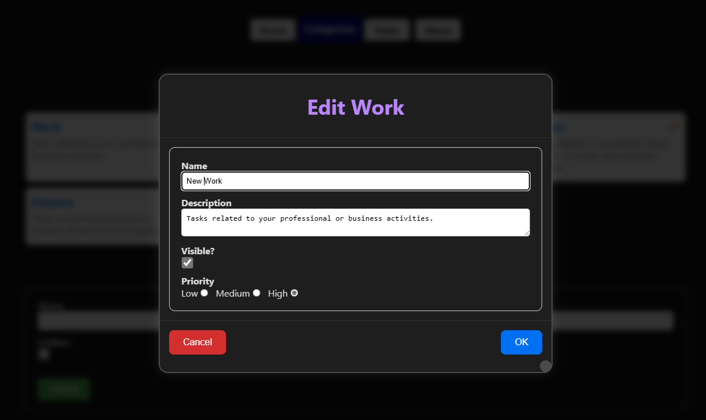

= Daten editieren und Komponentenkommunikation
:source-highlighter: rouge
:app-path: Edit_Form/src/app
ifndef::env-github[:icons: font]
ifdef::env-github[]
:caution-caption: :fire:
:important-caption: :exclamation:
:note-caption: :paperclip:
:tip-caption: :bulb:
:warning-caption: :warning:
endif::[]

[.lead]
_Link zum Programm: link:./Edit_Form20241212.zip[Edit_Form20241212.zip], im Repo unter 30_TodoApp/Edit_Form._

== Die Komponente `ModalDialog`

Oft benötigt man eine Komponente, die einen modalen Dialog anzeigt.
Er soll über der Seite angezeigt werden und nette Animationen besitzen.
Anstatt in jeder Page und Komponente den Dialog neu zu implementieren, ist es sinnvoll, eine eigene Komponente zu erstellen.

[source,jsx,linenums]
----
<ModalDialog 
    title="A nice title"
    onOk={() => doSomething()} onCancel={() => doSomething()}>
    
Some content

</ModalDialog>
----

Der Dialog wird -- wie das Beispiel zeigt -- mit Parametern konfiguriert.
Die `onOk` und `onCancel` Funktionen werden aufgerufen, wenn der Benutzer auf den entsprechenden Button klickt.
Der Titel und der Inhalt des Dialogs werden ebenfalls übergeben.
Der Inhalt steht zwischen den Tags der Komponente.

Wie können wir nun auf diese Informationen zugreifen?
React gibt die Argumente der Komponente als Objekt an die Funktion weiter.
Um typsicher arbeiten zu können, definieren wir einen Type, der die Argumente beschreibt.
Die Funktionen haben den Typ `() => void`, da sie keine Argumente erwarten und keinen Wert zurückgeben.
Der Inhalt des Dialogs kann beliebig sein, daher verwenden wir den Typ `ReactNode` für `children`.

.src/app/components/ModalDialog.tsx
[source,jsx,linenums]
----
import { ReactNode } from "react";
import styles from "./ModalDialog.module.css";

type ModalDialogProps = {
  title: string;
  onOk?: () => void;
  onCancel?: () => void;
  children: ReactNode;
}

export default function ModalDialog({ title, onOk, onCancel, children }: ModalDialogProps) {
  return (
    

      

        

          <h2>{title}</h2>
        

        

          {children}
        

        

          <button className={styles.cancelButton} onClick={onCancel}>
            Cancel
          </button>
          <button className={styles.okButton} onClick={onOk}>
            OK
          </button>
        

      

    

  );
}
----

=== Source files in der Edit Form App

⧉ link:{app-path}/components/ModalDialog.tsx[ModalDialog.tsx] +
⧉ link:{app-path}/components/ModalDialog.module.css[ModalDialog.module.css]

=== Verwendung der `ModalDialog` Komponente für das Edit Formular

Nachdem wir die `ModalDialog` Komponente erstellt haben, können wir sie in der `CategoryList` Komponente verwenden.
Wir wollen das Bearbeiten einer Kategorie in einem Dialog anzeigen.
Dafür geben wir eine neu zu schreibende Komponente `CategoryEdit` als Content der `ModalDialog` Komponente weiter.
Dies sieht dann so aus:

.src/app/categories/CategoryList.tsx
[source,jsx,linenums]
----
"use client";
// Some imports

export default function CategoryList({ categories }: { categories: Category[] }) {
  const [selectedCategory, setSelectedCategory] = useState<Category | null>(null);
  const categoryEditRef = useRef<CategoryEditRef>(null);

  return (
    

      <ul>
        {categories.map(category => (
          { /* ... */ }
               setSelectedCategory(category)}>
                ✏️
              
          { /* ... */ }
        ))}
      </ul>

      {selectedCategory && (
        <ModalDialog
          title={`Edit ${selectedCategory.name}`}
          onOk={() => categoryEditRef.current?.startSubmit()}
          onCancel={() => setSelectedCategory(null)}>

            <CategoryEdit
              category={selectedCategory} ref={categoryEditRef}
              onSubmitted={() => setSelectedCategory(null)} />

        </ModalDialog>
      )}
    

  );
}
----

Zuerst wird bei jeder Kategorie ein Edit-Icon angezeigt.
Beim Klicken wird mit dem State `selectedCategory` die ausgewählte Kategorie gespeichert.
Wenn eine Kategorie ausgewählt wurde, wird der Dialog angezeigt.
Die Anweisung `selectedCategory && ...` sorgt dafür, dass der Dialog nur angezeigt wird, wenn eine Kategorie ausgewählt wurde.
Die Handler `onCancel` setzt die ausgewählte Kategorie zurück und "schließt" den Dialog, indem `selectedCategpry` auf `null` gesetzt wird.
Die Komponente `CategoryEdit` besitzt auch ein Event: `onSubmitted`.
Dieses wird aufgerufen, wenn die Daten erfolgreich an die API gesendet wurden.

Der Handler für `onOk` liest sich etwas seltsam.
Wir haben nämlich ein Problem: In einem Formular gibt es üblicherweise einen Submit-Button, der das Formular abschickt.
Der OK Button wird allerdings im Dialog angezeigt, und nicht im Formular.
Wir müssen daher das Senden der Formulardaten über JavaScript auslösen.
Daher muss die Komponente `CategoryEdit` eine Methode `startSubmit` besitzen, die das Senden der Daten auslöst und die wir in der `CategoryList` Komponente aufrufen können.

=== Source files in der Edit Form App

⧉ link:{app-path}/categories/CategoryList.tsx[CategoryList.tsx] +
⧉ link:{app-path}/categories/CategoryList.module.css[CategoryList.module.css]

== Die Komponente `CategoryEdit`

=== Erweitern der API

In der Datei `categoryApiClient.ts` haben wir bereits Funktionen, die mit der API kommunizieren.
Hier fügen wir die Funktion `editCategory` hinzu, die den PUT-Request an die API sendet.
Der Aufbau ist wie bei den anderen Funktionen: Es wird ein `FormData` Objekt übergeben, das die Daten der Kategorie enthält.
Beachte, dass die GUID auch aus dem Formular extrahiert wird.
Es wird mit dem Typ `hidden` in einem `input` Element im Formular gespeichert.
Danach wird der PUT Request an `/api/categories/{guid}` gesendet.
Im Fehlerfall wird ein `ErrorResponse` Objekt zurückgegeben, damit das Formular - wie beim Hinzufügen von Katagorien - den Fehler anzeigen kann.

.src/app/categories/categoryApiClient.ts
[source,jsx,linenums]
----
export async function editCategory(formData: FormData): Promise<ErrorResponse | undefined> {
    // Extrahiere Daten aus dem Formular
    const guid = formData.get("guid");
    if (!guid) {
        return createErrorResponse(new Error("Invalid guid"));
    }
    const data = {
        guid: guid,
        name: formData.get("name"),
        description: formData.get("description"),
        isVisible: !!formData.get("isVisible"),     // converts null to false.
        priority: formData.get("priority"),
    };

    try {
        // Sende einen PUT-Request an die API
        await axiosInstance.put(`categories/${guid}`, data);
        revalidatePath("/categories");
    } catch (e) {
        return createErrorResponse(e);
    }
}
----

⧉ Source code: link:{app-path}/categories/categoryApiClient.ts[categoryApiClient.ts]

=== Erstellen der `CategoryEdit` Komponente

Die Komponente `CategoryEdit` ähnelt der `CategoryAdd` Komponente.
Im Formular müssen wir aber Werte vorbelegen, die bereits in der Kategorie gespeichert sind.
Dies geschieht mit `defaultValue` bzw. `defaultChecked` bei den `input` Elementen.
Wenn wir das Attribut `value` setzen, aber keinen `onChange`-Handler definieren, entsteht ein Fehler.
Daher brauchen wir diese speziellen Attribute, um die Werte zu setzen.

==== refs als Parameter

NOTE: Dieses Feature gibt es ab React 18.
In React 17 und darunter benötigt man die Funktion `forwardRef`, um Refs an Komponenten weiterzugeben.footnote:[https://react.dev/reference/react/forwardRef]

Damit wir in der parent Komponente `CategoryList` die Methode `startSubmit` aufrufen können, benötigen wir ein _ref_ auf die `CategoryEdit` Komponente.
Zusätzlich müssen wir die Methode `startSubmit` in der `CategoryEdit` Komponente implementieren und bereitstellen, welche die parent Komponente an geeigneter Stelle aufrufen kann.
Zuerst erstellen wir Typen für die Props und Refs:

[source,typescript,linenums]
----
export type CategoryEditRef = {
  startSubmit: () => void;
}

type CategoryEditProps = {
  category: Category;
  onSubmitted: () => void;
  ref?: React.Ref<CategoryEditRef>;
}

----

Der erste Typ ist wichtig, damit wir bei `useRef` in `CategoryList` den Typ angeben können.
Deswegen wird er auch mit `export` exportiert.
Der zweite Typ beschreibt die Props der Komponente.
Damit wir die Funktion `startSubmit` im ref zurückgeben können, benötigen wir die Funktion `useImperativeHandle`. Es erlaubt uns, eigene Funktionen des Refs zu definieren.footnote:[https://react.dev/reference/react/useImperativeHandle]

[source,typescript,linenums]
----
useImperativeHandle(ref, () => ({
  startSubmit: () => {
    formRef.current?.requestSubmit();
  },
}));
----

Unsere Komponente sieht nun so aus:

./src/app/categories/CategoryEdit.tsx
[source,jsx,linenums]
----
// Imports
export type CategoryEditRef = {
  startSubmit: () => void;
}

type CategoryEditProps = {
  category: Category;
  onSubmitted: () => void;
  ref?: React.Ref<CategoryEditRef>; // Ref as prop
}

async function handleSubmit(
  event: FormEvent,
  setError: Dispatch<SetStateAction<ErrorResponse>>,
  onSubmitted: () => void
) {
  event.preventDefault();
  const response = await editCategory(new FormData(event.target as HTMLFormElement));
  if (isErrorResponse(response)) {
    setError(response);
  } else {
    onSubmitted();
  }
}

export default function CategoryEdit(props: CategoryEditProps) {
  const { category, onSubmitted, ref } = props;
  const formRef = useRef<HTMLFormElement>(null);
  const [error, setError] = useState<ErrorResponse>(createEmptyErrorResponse());

  // UseImperativeHandle for custom methods exposed to the parent
  useImperativeHandle(ref, () => ({
    startSubmit: () => {
      formRef.current?.requestSubmit();
    },
  }));

  useEffect(() => {
    if (error.message) {
      alert(error.message);
    }
  }, [error]);

  return (
    

      <form
        onSubmit={(e) => handleSubmit(e, setError, onSubmitted)}
        ref={formRef}
        className={styles.categoryEdit}
      >
        <input type="hidden" name="guid" value={category.guid} />
        

          
Name

          

            <input type="text" name="name" defaultValue={category.name} required />
          

          

            {error.validations.name && (
              {error.validations.name}
            )}
          

        

        { /* ... */ }
      </form>
    

  );
}

----

==== `CategoryEdit` Komponente ohne `useImperativeHandle`

NOTE: `useImperativeHandle` soll nur wenn nötig verwendet werden.
Es gibt auch Alternativen. So kann man z. B. die `formRef` in der parent Komponente erstellen und als Parameter übergeben. Dies bindet aber die Komponenten stärker aneinander.
Oft ist es auch ausreichend, den State als Parameter zu übergeben.
Dies nennt sich _lifting state up_ und ist ein gängiges Muster in React.
Mehr Informationen sind in der React Doku unter https://react.dev/learn/sharing-state-between-components[Sharing State Between Components] abrufbar.

Wenn wir eine `formRef` in der parent Komponente erstellen, können wir sie als Parameter übergeben.
Mit `formRef.current?.requestSubmit()` können wir das Formular abschicken.
Nachteil: Die parent Komponente muss wissen, dass die `CategoryEdit` Komponente ein Formular enthält.
Das ist eine stärkere Kopplung zwischen den Komponenten.

Konkret würde die Version ohne `useImperativeHandle` so aussehen:

.CategoryList.tsx (with form ref as parameter)
[source,jsx,linenums]
----
"use client";
export default function CategoryList({ categories }: { categories: Category[] }) {
  // Reference to the form element in CategoryEdit component
  const formRef = useRef<HTMLFormElement>(null); 
  return (
      { /* ... */ }
        <ModalDialog
          onOk={() => formRef.current?.requestSubmit()}>
          
          <CategoryEdit category={selectedCategory} 
            formRef={formRef}
            onSubmitted={() => setSelectedCategory(null)} />
        </ModalDialog>
  );
}
----

.CategoryEdit.tsx (without useImperativeHandle)
[source,jsx,linenums]
----
type CategoryEditProps = {
  category: Category;
  onSubmitted: () => void;
  formRef?: React.Ref<HTMLFormElement>;
}

export default function CategoryEdit(props: CategoryEditProps) {
  const { category, onSubmitted, formRef, ref } = props;
  // ...
    return (
      { /* ... */ }
      <form ref={formRef} onSubmit={handleSubmit}>
      { /* ... */ }
    )
}
----

=== Source files in der Edit Form App

⧉ link:{app-path}/categories/CategoryEdit.tsx[CategoryEdit.tsx] +
⧉ link:{app-path}/categories/CategoryEdit.module.css[CategoryEdit.module.css]

== Übung

Das ist ein nettes, schweres Übungsbeispiel.