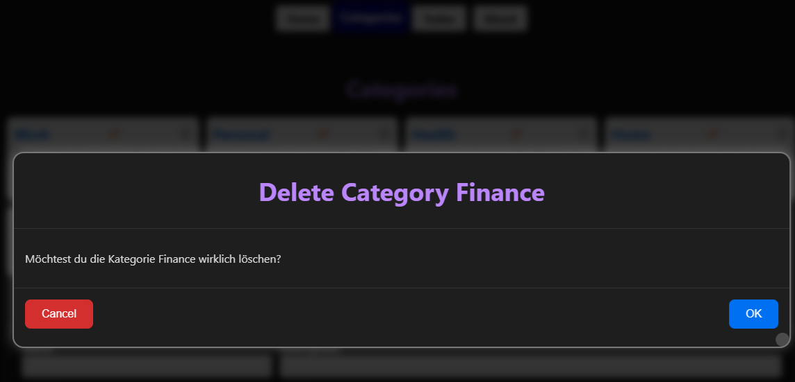

= Daten löschen, reducer in React
:source-highlighter: rouge
:app-path: Edit_Form/src/app
ifndef::env-github[:icons: font]
ifdef::env-github[]
:caution-caption: :fire:
:important-caption: :exclamation:
:note-caption: :paperclip:
:tip-caption: :bulb:
:warning-caption: :warning:
endif::[]

[.lead]
_Link zum Programm: link:./Delete20250123.zip[Delete20250123.zip], im Repo unter 30_TodoApp/Delete._

=== Der DELETE Request in der API

Um Daten zu löschen, wird in der API ein DELETE Request verwendet.
Unser Backend stellt einen Endpunkt _DELETE /api/categories/{guid}_ zur Verfügung, um eine Kategorie zu löschen.
Er erwartet keine Parameter, da mit der GUID die Kategorie eindeutig identifiziert wird.
Als Antwort wird im Erfolgsfall HTTP 204 No Content zurückgegeben.
Hat eine Kategorie Todo Items, wird HTTP 400 Bad Request zurückgegeben.
Um den Endpunkt aufzurufen, erweitern wir zuerst die Datei _categoryApiClient_:

.src/app/categories/categoryApiClient.ts
[source,typescript]
----
export async function deleteCategory(guid: string): Promise<ErrorResponse | undefined> {
    try {
        await axiosInstance.delete(`categories/${guid}`);
        revalidatePath("/categories");
    } catch (e) {
        return createErrorResponse(e);
    }
}
----

=== `useReducer` in React

In der Komponente _categories/CategoryList.tsx_ wurde der State `selectedCategory` verwendet, um beim Klick auf den Edit Button die ausgewählte Kategorie zu speichern.
Diese Kategorie wird dann in einem Modal Dialog angezeigt, in dem die Kategorie bearbeitet werden kann.
Das Einblenden des Modal Dialogs erfolgt über die Bedingung `{selectedCategory && ...}`.

[source,tsx]
----
export default function CategoryList({ categories }: { categories: Category[] }) {
  const [selectedCategory, setSelectedCategory] = useState<Category | null>(null);
  /* ... */
  return (
    

      <ul>
        {categories.map(category => (
          <li key={category.guid}>
              { /* ... */ }
               setSelectedCategory(category)}>✏️
              { /* ... */ }
          </li>
        ))}
      </ul>

      {selectedCategory && (
        <ModalDialog title={`Edit ${selectedCategory.name}`}
          onOk={() => categoryEditRef.current?.startSubmit()}
          onCancel={() => setSelectedCategory(null)}>
          <CategoryEdit category={selectedCategory} ref={categoryEditRef}
            onSubmitted={() => setSelectedCategory(null)} />
        </ModalDialog>
      )}
    

  );  
}
----

Nun möchten wir einen Button zum Löschen von Kategorien hinzufügen.
Der erste Ansatz wäre einen zweiter State `deleteCategory` zu verwenden, der die zu löschende Kategorie speichert.
Je mehr States wir haben, desto mehr Probleme ergeben sich allerdings im State Management:
- Es darf nicht der Edit und Löschen Dialog gleichzeitig eingeblendet werden.
- Wenn der Edit Button geklickt wird, muss der State `deleteCategory` zurückgesetzt werden.	
- Wenn der Löschen Button geklickt wird, muss der State `selectedCategory` zurückgesetzt werden.

Bei größeren Applikationen wird das State Management schnell unübersichtlich.
Mit `useReducer` können wir den State in einem Objekt zusammenfassen und die Änderungen in einem Reducer verwalten.
Dadurch können wir die Logik für das State Management zentral an einer Stelle verwalten.

image::reducer_1613.svg[]

.src/app/categories/CategoryList.tsx
[source,tsx]
----
"use client";
import React, { useReducer, useRef } from "react";
import { Category } from "@/app/types/Category";
import ModalDialog from "@/app/components/ModalDialog";
import CategoryEdit, { CategoryEditRef } from "./CategoryEdit";
import styles from "./CategoryList.module.css";
import CategoryDelete from "./CategoryDelete";

// Discriminated unions in typescript
type EditDeleteReducerAction =                       // <1>
  | { type: null; category: null }
  | { type: "edit" | "delete"; category: Category };
type EditDeleteState =                               // <2>
  | { actionType: null; category: null }
  | { actionType: "edit" | "delete"; category: Category };

function editDeleteReducer(                          // <3>
  state: EditDeleteState,
  action: EditDeleteReducerAction): EditDeleteState {
  switch (action.type) {
    case "edit":
      return { category: action.category, actionType: "edit" };
    case "delete":
      return { category: action.category, actionType: "delete" };
    default:
      return { category: null, actionType: null };
  }
}
export default function CategoryList({ categories }: { categories: Category[] }) {
  const [selectedCategory, selectedCategoryDispatch] = useReducer(editDeleteReducer, { category: null, actionType: null });
  const categoryEditRef = useRef<CategoryEditRef>(null);
  return (
    

      <ul>
        {categories.map(category => (
          <li key={category.guid}>
            

              <h2>{category.name}</h2>
               selectedCategoryDispatch({ type: "edit", category: category })}
                title="Edit"
              >
                ✏️
              
               selectedCategoryDispatch({ type: "delete", category: category })}
                title="Delete"
              >
                🗑️
              
            

            
{category.description}

          </li>
        ))}
      </ul>

      {selectedCategory.actionType == "edit" && (
        <ModalDialog title={`Edit ${selectedCategory.category.name}`}
          onOk={() => categoryEditRef.current?.startSubmit()}
          onCancel={() => selectedCategoryDispatch({ type: null, category: null })}>
          <CategoryEdit category={selectedCategory.category}
            ref={categoryEditRef}
            onSubmitted={() => selectedCategoryDispatch({ type: null, category: null })} />
        </ModalDialog>
      )}
      {selectedCategory.actionType == "delete" && (
        <CategoryDelete category={selectedCategory.category}
          onCancel={() => selectedCategoryDispatch({ type: null, category: null })}
          onDeleted={() => selectedCategoryDispatch({ type: null, category: null })} />
      )}
    

  );
}
----

<1> Als Parameter für die Methode `selectedCategoryDispatch` gibt es 2 Möglichkeiten:
* Wir übergeben den Typ `null`, wenn kein Dialog angezeigt werden soll.
  Die Kategorie soll dann ebenfalls `null` sein.
* Wir übergeben den Typ `"edit"` oder `"delete"` und die Kategorie, die bearbeitet oder gelöscht werden soll.
  Die Kategorie darf natürlich dann nicht `null` sein.
+
Mit _discriminated unions_ in Typescript können wir diese Fälle exakt definieren.
Dadurch kann nicht aus versehen ein falscher Typ oder eine leere Kategorie übergeben werden.

<2> Der State `selectedCategory` bekommt nun auch einen Typ.
    Hier verwenden wir ebenfalls eine discriminated union, um die möglichen Zustände zu definieren.

<3> Der `editDeleteReducer` liefert - je nach übergebenen Action Parameter - den neuen State zurück.
    Er könnte auch - wenn nötig - andere States setzen.
    Somit ist der Reducer eine zentrale Technik für komplexeres State Management.

In der Komponente `CategoryDelete` wird der Modale Dialog eingeblendet, um nochmals die Bestätigung zum Löschen der Kategorie zu erhalten.

.src/app/categories/CategoryDelete.tsx
[source,tsx]
----
import { Dispatch, SetStateAction, useEffect, useState } from "react";
import ModalDialog from "../components/ModalDialog";
import { Category } from "../types/Category";
import { createEmptyErrorResponse, ErrorResponse, isErrorResponse } from "../utils/apiClient";
import { deleteCategory } from "./categoryApiClient";

type CategoryDeleteProps = {
    category: Category;
    onCancel: () => void;           // <1>
    onDeleted: () => void;          // <2>
}
async function handleSubmit(
    categoryGuid: string,
    setError: Dispatch<SetStateAction<ErrorResponse>>,
    onDeleted: () => void
) {
    const response = await deleteCategory(categoryGuid);
    if (isErrorResponse(response)) {
        setError(response);
    } else {
        onDeleted();    // <3>
    }
}

export default function CategoryDelete({ category, onCancel, onDeleted }: CategoryDeleteProps) {
    const [error, setError] = useState<ErrorResponse>(createEmptyErrorResponse());
    useEffect(() => {
        if (error.message) {
            alert(error.message);
        }
    }, [error]);
    return (
        

            <ModalDialog
                title={`Delete Category ${category.name}`}
                onCancel={onCancel}
                onOk={() => handleSubmit(category.guid, setError, onDeleted)}>
                
Möchtest du die Kategorie {category.name} wirklich löschen?

            </ModalDialog>
        

    );

}
----

<1> Die Methode `onCancel` wird von der parent component übergeben und wird aufgerufen, wenn der Benutzer den Dialog abbricht.
<2> Die Methode `onDeleted` wird von der parent component übergeben und signalisiert, dass die Kategorie erfolgreich gelöscht wurde.
<3> Nur wenn die Kategorie erfolgreich gelöscht wurde, wird die Methode `onDeleted` aufgerufen.

== Übung

Lade als Basis für deine Implementierung die Todo App von link:./Delete20250123.zip[Delete20250123.zip].
Auf der Seite Todos erscheint eine Liste aller Todos.
Diese sollen gelöscht werden können.
Gehe dabei so vor:

* Baue in der Component `src/app/todos/TodosClient.tsx` einen Link zum Löschen ein.
* Erstelle eine Component `src/app/todos/TodosDelete.tsx`, die in der Component _TodosClient_ bei Bedarf angezeigt wird.
* Zur Bestätigung wird die Komponente `ModalDialog` verwendet. Er wird direkt in der Komponente `TodosDelete` eingebunden.
* Die API bietet bei _DELETE /api/TodoItems/(guid)_ einen Query Parameter _deleteTasks_ an.
  Er gibt an, ob die verbundenen Tasks ebenfalls gelöscht werden sollen.
  Hat ein Todo Item Tasks und der Parameter _deleteTasks_ ist _false_ wird HTTP 400 Bad Request zurückgegeben.
  ** Beispiel (liefert HTTP 400): `DELETE https://localhost:5443/api/TodoItems/3b33199e-bc34-7895-eb67-338383c35c99?deleteTasks=false`
  ** Beispiel 2 (liefert no content): `DELETE https://localhost:5443/api/TodoItems/3b33199e-bc34-7895-eb67-338383c35c99?deleteTasks=true`
* Baue eine Checkbox in die Komponente `TodosDelete` ein, damit der User auswählen kann, ob auch die verbundenen Tasks gelöscht werden sollen.
* Wählt der User die Checkbox nicht aus, und das löschen schlägt fehl, soll das natürlich rückgemeldet werden.
* Tipp: Du kannst einen _ref_ verwenden, um auf den Wert der Checkbox zuzugreifen.
