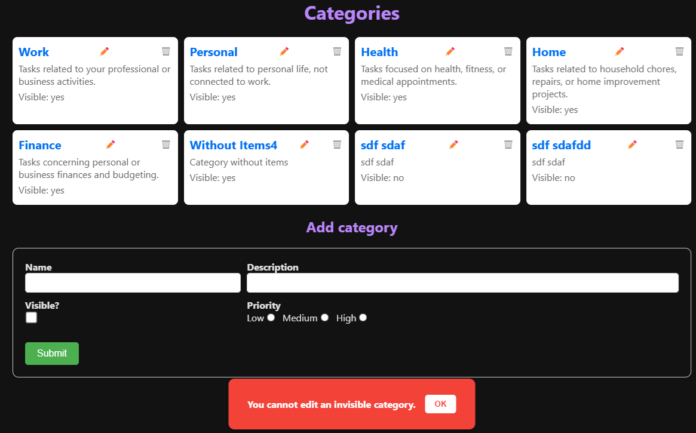

= Globale States, _useContext()_ in React
:source-highlighter: rouge
:app-path: Edit_Form/src/app
ifndef::env-github[:icons: font]
ifdef::env-github[]
:caution-caption: :fire:
:important-caption: :exclamation:
:note-caption: :paperclip:
:tip-caption: :bulb:
:warning-caption: :warning:
endif::[]

[.lead]
_Link zum Programm: link:./State_Provider20250316.zip[State_Provider20250316.zip], im Repo unter 30_TodoApp/State_Provider._

Bis jetzt konnten wir mit _useState()_ und _useReducer()_ States für einzelne Komponenten definieren.
Wir haben mit *Lifting State Up* auch schon eine Technik kennengelernt, wo mehrere Komponenten auf einen State Zugriff haben können:

* Wir definieren den State mit _useState()_ in der _parent component_.
* Wir können den State oder die Set Funktion als _Parameter_ der child component übergeben.
  Dadurch konnte Komponente A den State setzen, und Komponente B zeigt den Inhalt an.

Dies funktioniert, wenn es eine parent component gibt.
Manchmal möchte man jedoch in jeder Komponente der Applikation Zugriff auf bestimmte Informationen haben.
So ist z. B. der angemeldete User oder der Inhalt des Warenkorbes für die gesamte Appkikation interessant.

== _useContext()_ in React

In React gibt es mit _useContext()_ einen vordefinierten Mechanismus für solche Anwendungsfälle.

____
useContext is a React Hook that lets you read and subscribe to context from your component.
____

Wir möchten für unsere Todo App ein zentrales Fehlermanagement und später den aktuell angemeldeten User anzeigen.
Dafür erstellen wir die Datei _src/app/context/TodoAppContext.tsx_

.src/app/context/TodoAppContext.tsx
[source,typescript]
----
import React, { createContext, useContext, useState, ReactNode } from 'react';

type TodoAppStateActions = {
    /**
     * Setzt die Fehlermeldung im globalen State.
     */
    setError: (value: string) => void;

    /**
     * Setzt den aktiven Benutzer im globalen State.
     */
    setActiveUser: (value: string) => void;
};

type TodoAppState = {
    /** Enthält eine mögliche Fehlermeldung. */
    error: string;

    /** Speichert den aktuellen aktiven Benutzer. */
    activeUser: string;
};

type TodoAppContextType = TodoAppState & { actions: TodoAppStateActions };

/** Erstellt einen Context für den globalen Todo-App-Status. */
const TodoAppContext = createContext<TodoAppContextType | undefined>(undefined);
----

Zuerst modellieren wir unseren globalen State als Typescript Type mit dem Namen _TodoAppState_.
Er beinhaltet die Properties _error_ und _activeUser_.
Da wir auch Funktionen bereitstellen möchten, die den State setzen, definieren wir einen type _TodoAppStateActions_.

Mit _createContext()_ bekommen wir ein _context object_, mit dem wir einen _context provider_ erstellen können.

== Der context provider

Der _context provider_ ist eine Komponente, die später in der Datei _layout.tsx_ verwendet wird.
Die Idee ist ähnlich wie bei _lifting state up_.
Wir bauen um alle Komponenten der Applikation eine Komponente "herum".
Deswegen wird _{children}_ verwendet, um die Applikation dort einzubetten.

.src/app/context/TodoAppContext.tsx
[source,tsx]
----
export function TodoAppStateProvider({ children }: { children: ReactNode }) {
    const [state, setState] = useState<TodoAppState>({ error: "", activeUser: "" });

    const setError = (value: string) => setState(prev => ({ ...prev, error: value }));
    const setActiveUser = (value: string) => setState(prev => ({ ...prev, activeUser: value }));

    return (
        <TodoAppContext.Provider value={{ ...state, actions: { setError, setActiveUser } }}>
            {children}
        </TodoAppContext.Provider>
    );
}
----

Beachte, dass wir nicht _export default_, sondern _export_ verwenden.
In der Funktion werden die einzelnen Actions wie _setError()_ und _setActiveUser()_ definiert.
Sie setzen einfach den State so, dass das Property _error_ bzw. _activeUser_ auf den übergebenen Wert gesetzt wird.

Die zurückgegebene Komponente _TodoAppContext.Provider_ hat als Parameter _value_ den gesamten State sowie die definierten Actions.
Natürlich müssen die Typen dem definierten Typ _TodoAppContextType_ entsprechen.

Nun brauchen wir noch eine Funktion _useTodoAppState()_, mit deren Hilfe wir in den einzelnen Komponenten Zugriff auf den globalen State haben.

.src/app/context/TodoAppContext.tsx
[source,tsx]
----
export function useTodoAppState() {
    const context = useContext(TodoAppContext);
    if (!context) {
        throw new Error('useTodoAppState must be used within a TodoAppStateProvider.');
    }
    return context;
}
----

Bachte auch hier, dass wir _export_ und nicht _export default_ verwenden.

== Einbindung in _layout.tsx_

Damit wir in allen Komponenten der App Zugriff auf den State haben, bearbeiten wir die Datei _layout.tsx_ so, dass wir den State Provider über allen Komponenten der Applikation einbauen:

.src/app/layout.tsx
[source,tsx]
----
import Navbar from "@/app/components/Navbar";
import './globals.css'; // Importiere die globale CSS-Datei
import { TodoAppStateProvider } from "./context/TodoAppContext";
import ErrorViewer from "./components/ErrorViewer";

export default function RootLayout({
    children,
}: {
    children: React.ReactNode;
}) {
    return (
        <html lang="en">
            <head>
                <title>To-Do App</title>
            </head>
            <body>
                <TodoAppStateProvider>
                    

                        <Navbar />
                        <main className="content">{children}</main>
                        <ErrorViewer />
                    

                </TodoAppStateProvider>
            </body>
        </html>
    );
}

----

== Lesen des States: Der ErrorViewer

Nun können wir in _src/app/components/ErrorViewer.tsx_ eine Komponente erzeugen, die einen Dialog einblendet, wenn das Property _error_ im State gesetzt wird.
Die Komponente nutzt dabei die Funktion _useTodoAppState()_, die über den entsprechenden Import eingebunden wird.

Mit _todoAppState.error_ kann der gesetzte Fehler ausgelesen werden.
Mit _todoAppState.actions.setError()_ kann der Fehler gesetzt werden.
Nach 5 Sekunden wird der Fehler automatisch ausgeblendet.

.src/app/components/ErrorViewer.tsx
[source,tsx]
----
"use client";

import { useState, useEffect } from "react";
import { useTodoAppState } from "../context/TodoAppContext";
import styles from "./ErrorViewer.module.css";

export default function ErrorViewer() {
    const todoAppState = useTodoAppState();
    const [visible, setVisible] = useState(false);

    useEffect(() => {
        if (todoAppState.error) {
            setVisible(true);

            // Fehlernachricht nach 5 Sekunden automatisch ausblenden
            const timer = setTimeout(() => {
                setVisible(false);
                todoAppState.actions.setError("");
            }, 5000);

            return () => clearTimeout(timer);
        }
    }, [todoAppState.error]);

    return (
        <footer className={`${styles.errorViewer} ${visible ? styles.show : styles.hide}`}>
            

                
{todoAppState.error}

                <button
                    type="button"
                    className={styles.errorButton}
                    onClick={() => {
                        setVisible(false);
                        todoAppState.actions.setError("")
                    }}
                >
                    OK
                </button>
            

        </footer>
    );
}
----

🔗 link:State_Provider/src/app/components/ErrorViewer.module.css[zum CSS in src/app/components/ErrorViewer.module.css]

== Setzen des Fehlers

In der Komponente _CategoryList_ kommt es beim Editieren einer Kategorie, die nicht sichtbar ist, zu einem Fehler.
Diesen wollen wir in unserem zentralen _ErrorViewer_ anzeigen lassen.
Dies ist nun sehr einfach.
Statt eines Dialoges in der Komponente, der prüft, ob _state.dialogType_ auf _error_ gesetzt ist, wird nun der Fehler im zentralen State gesetzt.
Gleich danach setzen wir in unserer Komponente den Fehler wieder zurück, da wir das Quittieren des Fehlers nicht mehr in unserer Komponente passiert.

.src/app/categories/CategoryList.tsx
[source,typescript]
----
useEffect(() => {
if (state.dialogType == "error") {
    todoAppState.actions.setError(state.error);
    dispatcher({ resetState: true });   // OK button to remove the error is in another component.
}
}, [state.dialogType]);
----

== Übung

Lade als Basis für deine Implementierung die Todo App von link:./State_Provider20250316.zip[State_Provider20250316.zip].

Es soll beim Aufrufen der App ein Dialog eingeblendet werden, in dem der User seinen Namen eingeben kann.
Wenn der User seinen Namen eingibt, dann soll dieser Name in der Navbar erscheinen.
Verwende dafür die vorgefertigte Komponente _ModalDialog_ und gehe so vor:

* Erstelle in _components_ eine Komponente _NameInput_.
  Sie zeigt den Dialog an und bietet ein Textfeld für den Usernamen an.
* Baue diese Komponente direkt in die Datei _layout.tsx_ ein.
* Die Komponente soll natürlich nur angezeigt werden, wenn kein Username gespeichert ist.
* Klickt der User auf _Cancel_, so möchte er keinen Usernamen anzeigen.
* Verwende den State _activeUser_ im vordefinierten State Provider in _src/app/context/TodoAppContext.tsx_.
  Ändere wenn nötig die Datentypen, sodass erkannt wird, dass der Benutzer seinen Namen nicht eingeben möchte.
  Ein Vorschlag wäre, in diesem Fall einen Leerstring oder "Guest" zu speichern.
  Wurde der Benutzer noch nicht zur Eingabe aufgefordert, kann z. B. der Wert _null_ sein.
* Wurde ein User mit seinem Namen angemeldet, so soll in der Navbar auch ein Link zur Abmeldung angezeigt werden.
  Dieser Link soll einfach den aktuellen Usernamen löschen und dadurch die _NameInput_ Komponente anzeigen.
* Ist kein User angemeldet, so soll in der Komponente _categoryList_ kein Edit oder Delete Button angezeigt werden.
