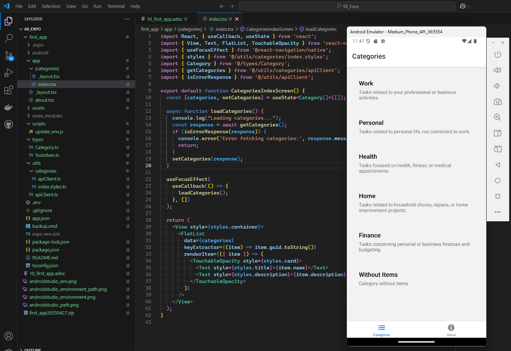

= Die erste Expo App
:source-highlighter: rouge
ifndef::env-github[:icons: font]
ifdef::env-github[]
:caution-caption: :fire:
:important-caption: :exclamation:
:note-caption: :paperclip:
:tip-caption: :bulb:
:warning-caption: :warning:
endif::[]

[.lead]
_Link zum Programm: link:./first_app20250427.zip[first_app20250427.zip], im Repo unter 60_Expo/first_app._

== Installation von OpenJDK 21

Lade - sofern du nicht schon JDK 21 installiert hast - von _https://learn.microsoft.com/de-de/java/openjdk/download#openjdk-21_ das _msi Paket_ für Windows und installiere es. Achte darauf, dass du die Option _Add to PATH_ aktivierst.
In der Konsole sollte nun mit dem Befehl _java --version_ die Version 21 angezeigt werden.

== Installation von Android Studio

Lade von _https://developer.android.com/studio_ die aktuellste Version von Android Studio.
Wähle im Wizard nach dem Start von Android Studio _Custom_ und wähle als Pfad für die Installation _C:\AndroidSdk_.

Nach der Installation setze die Umgebungsvariable _ANDROID_HOME_ auf _C:\AndroidSdk_.
Füge auch das Verzsichnis _C:\AndroidSdk\platform-tools_ zur PATH-Variable hinzu.

Führe nach den beschriebenen Schritten den Befehl _adb devices_ aus und prüfe, ob der Befehl ausgeführt werden kann.

=== Starten des Emulators

Wir benötigen Android Studio nicht für die Entwicklung, sondern nur für den Emulator.
Um diesen zu Testen, starte über das Startmenü Android Studio.
Klicke danach auf _More Actions_ und versuche, den Emulator zu starten.
Falls dies nicht klappt, kannst du über die Einstellungen (_Edit_) unter _Services_ die Einstellung _Google API_ wählen.
In _Additional settings_ kann unter _Emulator Performance_ die Grafikbeschleunigung auf _Software_ gesetzt werden, falls die Grafik Probleme macht.

== Erstellen einer neuen App

Mit dem Befehl _npx create-expo-app@latest_ wird mittels Template eine neue App erstellt.
Mit dem Befehl _npm run android_ wird die App auf dem Emulator gestartet.
Vergiss nicht, mit _npm i_ vorher alle Abhängigkeiten zu installieren.

IMPORTANT: Beim ersten Start kommt die Meldung, ob die Firewall den Zugriff auf Node.js erlauben soll.
Klicke auf _Zugriff zulassen_.
Der Emulator kommuniziert mit dem Host über das Netzwerkinterface, deswegen muss die Firewall den Zugriff erlauben.
Falls du auf _Abbrechen_ klickst, kannst du über _Start_ - _Ausführen_ - _wf.msc_ die Firewallregel mit der Verweigerung wieder löschen.

Nachdem die App gestartet wurde, können wir nun eine Frontend für unser Todo Backend erstellen.

=== Kopieren der Types

In den vorigen Projekten haben wir Interfaces für _Category_ und _TodoItem_ erstellt.
Daher erstellen wir im Ordner _first_app_ einen Ordner _types_ und kopieren die Interfaces aus unserem alten Projekt.

link:./first_app/types/Category.ts[Zur Datei types/Category.ts] +
link:./first_app/types/TodoItem.ts[Zur Datei types/TodoItem.ts]

NOTE: Der Router betrachtet jede Datei im _app_ Ordner als Route.
Daher legen wir diese Dateien _außerhalb_ des _app_ Ordners ab.

=== Erstellen einer .env Datei

Da wir auf das Backend zugreifen wollen, benötigen wir die URL des Backends.
Im Emulator ist die IP-Adresse des Host-Rechners _10.0.2.2_.
Damit wir aber flexibler sind, erstellen wir ein Skript, das die aktuelle IP-Adresse des Host-Rechners ermittelt und in die .env Datei schreibt.
Dafür legen wir in _first_app_ Ordner einen Ordner _scripts_ an und erstellen eine Datei _update_env.js_.

link:./first_app/scripts/update_env.js[Zur Datei scripts/update_env.js]

NOTE: Der Zugriff auf _localhost_ wird im Emulator nicht funktionieren, da _localhost_ auf den Emulator verweist und nicht auf den Host-Rechner.

Damit das Skript bei jedem Start von _npm run android_ ausgeführt wird, fügen wir in der _package.json_ ein Skript _preandroid_ hinzu.

.package.json
[source, javascript]
----
{
  // ....
  "scripts": {
    // ....
    "preandroid": "node scripts/update_env.js",
    "android": "expo run:android",
  }
  // ....
}
----

=== Übernehmen des API Clients

In unseren vorigen Projekten haben wir in der Datei _apiClient.ts_ Hilfsfunktionen erstellt, um mit dem Backend zu kommunizieren.
Dafür installieren wir zuerst mit _npm install axios_ die Bibliothek _axios_.
Danach legen wir in _first_app_ einen Ordner _utils_ an und erstellen dort die Datei _apiClient.ts_.

link:first_app/utils/apiClient.ts[Zur Datei utils/apiClient.ts]

=== Layout und Routing

Expo stellt _file based routing_ zur Verfügung.
Wenn wir im Verzeichnis _app_ Dateien vom Typ _tsx_ erstellen, werden diese als Routen betrachtet.
Um das Grundlayout zu erstellen, legen wir im _app_ Ordner eine Datei _layout.tsx_ an.
Auf _https://docs.expo.dev/develop/file-based-routing/_ findest du eine Beschreibung der Features.

.first_app/app/_layout.tsx
[source,tsx]
----
import { Tabs } from 'expo-router';
import { Ionicons } from '@expo/vector-icons';

export default function RootLayout() {
  return (
    <Tabs>
      <Tabs.Screen 
        name="(categories)" 
        options={{ 
          title: 'Categories',
          tabBarIcon: ({ color, size }) => (
            <Ionicons name="list" color={color} size={size} />
          ),
        }} 
      />
      <Tabs.Screen 
        name="about" 
        options={{ 
          title: 'About',
          tabBarIcon: ({ color, size }) => (
            <Ionicons name="information-circle" color={color} size={size} />
          ),
        }} 
      />
    </Tabs>
  );
}
----

Wir sehen erstmals die Parallelen zu React und Next.js.
Das Layout ist eine Komponente, die mit _export default_ exportiert wird.
Sie wird in TSX geschrieben und verwendet dessen Syntax.

Die Komponente _Tabs_ stellt Expo bereit.
Es wird eine Navigationsleiste mit zwei Tabs erstellt.
Ein Router hat die Aufgabe, den Back Button zu steuern und die Navigation zwischen den Routen zu ermöglichen.
Auf _https://docs.expo.dev/router/introduction/_ findest du die Beschreibung, welche Komponenten der Router bereitstellt.

Der zweite Tab verweist auf den Namen _about_.
Um die Seite _about_ zu erstellen, legen wir im _app_ Ordner eine Datei _about.tsx_ an.

==== Die About Seite

.first_app/app/about.tsx
[source,tsx]
----
import { View, Text, StyleSheet } from 'react-native';

export default function HomeScreen() {
  return (
    <View style={styles.container}>
      <Text>About</Text>
    </View>
  );
}

const styles = StyleSheet.create({
  container: {
    flex: 1,
    justifyContent: 'center',
    alignItems: 'center',
  },
});
----

Auch hier sehen wir vom Grundaufbau die gleiche Struktur wie in React.
Aus dem Paket _react-native_ importieren wir die Komponenten _View_, _Text_ und _StyleSheet_.
Die Dokumentation auf _https://reactnative.dev/docs/components-and-apis_ beschreibt die Komponenten.
Eine View ist ein Container, der andere Komponenten enthalten kann.

Um das Aussehen zu steuern, verwenden wir _StyleSheet_.
Auf _https://reactnative.dev/docs/stylesheet_ wird die Funktionsweise beschrieben.
Es ist eine Abstraktion, ähnlich wie CSS, um das Layout zu steuern.
Das Rendering erfolgt dann über das entsprechende Betriebssystem.
Da unsere App keine Web View ist, wird kein HTML generiert.

____
With React Native, you style your application using JavaScript. All of the core components accept a prop named style. The style names and values usually match how CSS works on the web, except names are written using camel casing, e.g. backgroundColor rather than background-color.
_https://reactnative.dev/docs/style_
____

=== Anzeige der Kategorien

Nun wollen wir die Kategorien aus dem Backend anzeigen.
Dafür starten wir das ASP.NET Core Backend in _30_TodoApp/TodoBackend_ und rufen die URL _http://localhost:5080/swagger/index.html_ auf.

NOTE: Der Server bindet sich an jedes Netzwerkinterface (_0.0.0.0_).
Kontrolliere dies im Startscreen in der Konsole.
Wenn die Meldung der Firewall erscheint, klicke auf _Zugriff zulassen_.
Sonst kann die App nicht auf den Server zugreifen.
Wir verwenden http (nicht https), da ein selbst signiertes Zertifikat in der App nicht akzeptiert wird.
Falls Unauthorized (401) Fehler auftreten, entferne die Datei _appsettings.Development.json_ im Backend.

==== Layout und Gruppen

Nun erstellen wir im _app_ Ordner einen Ordner _(categories)_.
Beachte die Klammern, sie sind Teil des Namens.
Dadurch wird eine _Gruppe_ erstellt.
Eine Gruppe hat ein eigenes Layout, und eignet sich daher für zusammengehörige Routen zwischen denen wir navigieren können.

.first_app/app/(categories)/_layout.tsx
[source,tsx]
----
import { Stack } from 'expo-router';

export default function RootLayout() {
  return (
    <Stack screenOptions={{ headerShown: false }}>
        <Stack.Screen name="index" />
    </Stack>
  );
}
----

Die Komponente _Stack_ stellt eine Navigation bereit, die sich wie ein Stapel verhält.
Wenn wir den Back Button drücken, wird die vorherige Seite angezeigt.

==== Utils für die Kategorien Gruppe

In Next.js haben wir für die API Kommunikation und den Style eigene Dateien erstellt.
Da Expo alle Dateien in _app_ als Routen betrachtet, können wir die Dateien nicht im _app_ Ordner ablegen.
Daher erstellen wir direkt im _first_app_ Ordner einen Ordner _utils_ und erstellen ein Unterverzeichnis _categories_.
Dort werden zwei Dateien erstellt:

.first_app/utils/categories/apiClient.ts
[source,typescript]
----
import { Category, isCategory } from "@/types/Category";
import { axiosInstance, createErrorResponse, ErrorResponse } from "@/utils/apiClient";

export async function getCategories(): Promise<Category[] | ErrorResponse> {
    try {
        const categoriesResponse = await axiosInstance.get<Category[]>("api/categories");
        return categoriesResponse.data.filter(isCategory);
    }
    catch (e) {
        return createErrorResponse(e);
    }
}
----

Damit wir die Style Definitionen nicht in der Indexseite haben, erstellen wir eine Datei _index.styles.ts_.

.first_app/utils/categories/index.styles.ts
[source,typescript]
----
import { StyleSheet } from 'react-native';

export const styles = StyleSheet.create({
  container: {
    flex: 1,
    padding: 16,
  },
  card: {
    backgroundColor: '#f2f2f2',
    padding: 20,
    borderRadius: 12,
    marginBottom: 12,
  },
  title: {
    fontSize: 18,
    fontWeight: '600',
    marginBottom: 4,
  },
  description: {
    fontSize: 14,
    color: '#666',
  },
});
----

==== Die Index Seite für die Kategorien

Nun können wir unsere Indexseite erstellen.
Sie kommuniziert mit dem Backend und zeigt die Kategorien an.

.first_app/app/(categories)/index.tsx
[source,tsx]
----
import React, { useCallback, useState } from 'react';
import { View, Text, FlatList, TouchableOpacity } from 'react-native';
import { useFocusEffect } from '@react-navigation/native';
import { styles } from '@/utils/categories/index.styles';
import { Category } from '@/types/Category';
import { getCategories } from '@/utils/categories/apiClient';
import { isErrorResponse } from '@/utils/apiClient';

export default function CategoriesIndexScreen() {
  const [categories, setCategories] = useState<Category[]>([]);

  async function loadCategories() {
    console.log("Loading categories...");
    const response = await getCategories();
    if (isErrorResponse(response)) {
      console.error('Error fetching categories:', response.message);
      return;
    }
    setCategories(response);
  }

  useFocusEffect(
    useCallback(() => {
      loadCategories();
    }, [])
  );

  return (
    <View style={styles.container}>
      <FlatList
        data={categories}
        keyExtractor={(item) => item.guid.toString()}
        renderItem={({ item }) => (
          <TouchableOpacity style={styles.card}>
            <Text style={styles.title}>{item.name}</Text>
            <Text style={styles.description}>{item.description}</Text>
          </TouchableOpacity>
        )}
      />
    </View>
  );
}
----

Wir verwenden zum Laden den Hook _useFocusEffect_.
Wenn wir _useEffect_ verwenden, wird die Funktion nur einmal beim ersten Rendern aufgerufen.
Navigiert der User über die Tabs von der Seite weg und wieder zurück, werden die Daten nicht erneut geladen.
