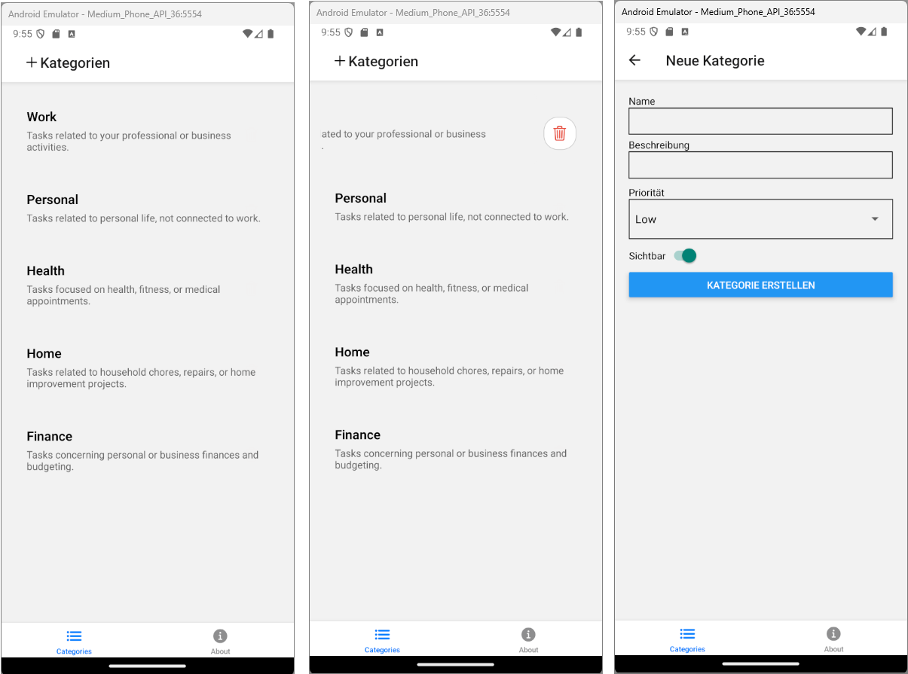

= Hinzufügen und Löschen von Kategorien
:source-highlighter: rouge
ifndef::env-github[:icons: font]
ifdef::env-github[]
:caution-caption: :fire:
:important-caption: :exclamation:
:note-caption: :paperclip:
:tip-caption: :bulb:
:warning-caption: :warning:
endif::[]

[.lead]
_Link zum Programm: link:./add_delete20250511.zip[add_delete20250511.zip], im Repo unter 60_Expo/add_delete._

== Installation von zusätzlichen Paketen

Um einen Delete Button in die Liste der Kategorien zu integrieren und um Eingabeformulare erstellen zu können, benötigen wir einige zusätzliche Pakete.

----
npm install react-native-swipe-list-view
npm install react-hook-form
npm install @react-native-picker/picker
----

== Ergänzen des API Clients

Um eine Kategorie zu löschen, muss ein HTTP DELETE Request an _/api/categories/{guid}_ gesendet werden.
Die Funktion _deleteCategory_ kapselt diesen Aufruf.
Wird ein Fehler vom Server zurückgegeben, wird ein _ErrorResponse_ erstellt.
Dieses Objekt wird dann in der UI weiter verarbeitet und als Fehlermeldung angezeigt.

Um eine neue Kategorie zu erstellen, wird ein HTTP POST Request an _/api/categories_ gesendet.
Die Funktion _addCategory_ kapselt diesen Aufruf.
Das Backend liefert bei einem Bad Request auch ein Objekt mit Validierungsfehlern.
Das _ErrorResponse_ Objekt enthält dann die Validierungsfehler und kann im Formular angezeigt werden.

.utils/categories/apiClient.ts
[source,tsx]
----
import { Category, isCategory } from "@/types/Category";
import { axiosInstance, createErrorResponse, ErrorResponse } from "@/utils/apiClient";

export type NewCategoryFormData = {
  name: string;
  description: string;
  isVisible: boolean;
  priority: "Low" | "Medium" | "High";
};

export async function getCategories(): Promise<Category[] | ErrorResponse> {
    try {
        const categoriesResponse = await axiosInstance.get<Category[]>("api/categories");
        return categoriesResponse.data.filter(isCategory);
    }
    catch (e) {
        return createErrorResponse(e);
    }
}

export async function deleteCategory(guid: string): Promise<undefined | ErrorResponse> {
    try {
        const categoriesResponse = await axiosInstance.delete(`api/categories/${guid}`);
    }
    catch (e) {
        return createErrorResponse(e);
    }
}

export async function addCategory(data: NewCategoryFormData): Promise<undefined | ErrorResponse> {
    try {
        const categoriesResponse = await axiosInstance.post("api/categories", data);
    }
    catch (e) {
        return createErrorResponse(e);
    }    
}
----

== Anpassung der Layouts

Bisher zeigte das oberste Layout einen Header an.
Nun wollen wir die Header in den Gruppen setzen, damit wir auch Symbole und Menüpunkte einfügen können.
Daher ändern wir die Datei _app/_layout.tsx_ wie folgt:

.app/_layout.tsx
[source,tsx]
----
import { Tabs } from 'expo-router';
import { Ionicons } from '@expo/vector-icons';

export default function RootLayout() {
  return (
    <Tabs screenOptions={{ headerShown: false }}>
      <Tabs.Screen 
        name="(categories)" 
        options={{ 
          title: 'Categories',
          tabBarIcon: ({ color, size }) => (
            <Ionicons name="list" color={color} size={size} />
          ),
        }} 
      />
      <Tabs.Screen 
        name="about" 
        options={{ 
          title: 'About',
          tabBarIcon: ({ color, size }) => (
            <Ionicons name="information-circle" color={color} size={size} />
          ),
        }} 
      />
    </Tabs>
  );
}
----

In der Gruppe _categories_ möchten wir eine Seite _create.tsx_ hinzufügen.
Sie bekommt später das das Eingabeformular für neue Kategorien.
Damit wir mit dem Router zur Seite _create_ navigieren können, fügen wir sie als Screen zum Stack hinzu.

.app/(categories)/_layout.tsx
[source,tsx]
----
import { Stack } from 'expo-router';
import { Ionicons } from '@expo/vector-icons';
import { TouchableOpacity } from 'react-native';

export default function CategoriesLayout() {
  return (
    <Stack>
      <Stack.Screen
        name="index"
        options={({ navigation }) => ({
          title: 'Kategorien',
          headerLeft: () => (
            <TouchableOpacity
              onPress={() => navigation.navigate('create')}
              style={{ paddingLeft: 15 }}
            >
              <Ionicons name="add" size={24} color="#000" />
            </TouchableOpacity>
          )
        })}
      />
      <Stack.Screen
        name="create"
        options={{ title: 'Neue Kategorie' }}
      />
    </Stack>
  );
}
----

== Die Indexpage mit der SwipeListView

Wir möchten, dass der User eine Kategorie löschen kann, indem er sie nach links wischt.
Dazu verwenden wir die _SwipeListView_ von _react-native-swipe-list-view_.
Der Parameter _renderHiddenItem_ bestimmt, was angezeigt wird, wenn der User die Zeile nach links wischt.

Damit die Komponente strukturierter ist, deklarieren wir die Handler _deleteCategoryHandler_ und _loadCategories_ als separate Funktionen.
Die Funktion _deleteCategoryHandler_ bekommt das Item und eine Callback-Funktion übergeben, die aufgerufen wird, wenn die Kategorie erfolgreich gelöscht wurde.
Dadurch kann das UI aktualisiert werden, indem es die Kategorien neu lädt.

[source,tsx]
----
import React, { useCallback, useState } from 'react';
import { View, Text, TouchableOpacity, Alert } from 'react-native';
import { Ionicons } from '@expo/vector-icons';
import { useFocusEffect } from '@react-navigation/native';
import { SwipeListView } from 'react-native-swipe-list-view';
import { styles } from '@/utils/categories/index.styles';
import { Category } from '@/types/Category';
import { deleteCategory, getCategories } from '@/utils/categories/apiClient';
import { isErrorResponse } from '@/utils/apiClient';

function deleteCategoryHandler(item: Category, onDeleted: () => void) {
  Alert.alert(
    'Kategorie löschen',
    `Möchtest du "${item.name}" wirklich löschen?`,
    [
      { text: 'Abbrechen', style: 'cancel' },
      {
        text: 'Löschen',
        style: 'destructive',
        onPress: async () => {
          const result = await deleteCategory(item.guid);
          if (isErrorResponse(result)) {
            Alert.alert('Fehler', result.message, [{ text: 'OK' }]);
            return;
          }
          onDeleted();
        },
      },
    ]
  );
}

async function loadCategories(setCategories: React.Dispatch<React.SetStateAction<Category[]>>) {
  const response = await getCategories();
  if (isErrorResponse(response)) {
    console.error('Error fetching categories:', response.message);
    return;
  }
  setCategories(response);
}

export default function CategoriesIndexScreen() {
  const [categories, setCategories] = useState<Category[]>([]);

  useFocusEffect(
    useCallback(() => {
      loadCategories(setCategories);
    }, [])
  );

  return (
    <View style={styles.container}>
      <SwipeListView
        data={categories}
        keyExtractor={(item) => item.guid.toString()}
        renderItem={({ item }) => (
          <View style={styles.card}>
            <Text style={styles.title}>{item.name}</Text>
            <Text style={styles.description}>{item.description}</Text>
          </View>
        )}
        renderHiddenItem={({ item }) => (
          <View
            style={{
              flex: 1,
              justifyContent: 'center',
              alignItems: 'flex-end',
              paddingRight: 20,
              backgroundColor: 'transparent',
            }}
          >
            <TouchableOpacity
              onPress={() => deleteCategoryHandler(item, () => loadCategories(setCategories))}
              style={{
                padding: 10,
                borderRadius: 20,
                borderWidth: 1,
                borderColor: '#ccc',
                backgroundColor: '#fff',
              }}
            >
              <Ionicons name="trash-outline" size={24} color="#e74c3c" />
            </TouchableOpacity>
          </View>
        )}
        rightOpenValue={-75}
      />
    </View>
  );
}
----

== Die Create Page

Die Create Page erstellt mit Hilfe von _react-hook-form_ ein Eingabeformular.
Der Name _hook-form_ kommt von den Methoden, die bei _useForm_ zur Verfügung gestellt werden.
Sie beinhalten Methoden zum Auslesen der Formulardaten, zum Setzen von Fehlern und zum Überprüfen der Validierung.

[source,tsx]
----
import React from 'react';
import { View, Text, TextInput, Switch, Button } from 'react-native';
import { useForm, Controller, UseFormSetError } from 'react-hook-form';
import { addCategory, NewCategoryFormData } from '@/utils/categories/apiClient';
import { isErrorResponse } from '@/utils/apiClient';
import { Router, useRouter } from 'expo-router';
import { Picker } from '@react-native-picker/picker';

async function addCategoryHandler(
    data: NewCategoryFormData, router: Router, setError: UseFormSetError<NewCategoryFormData>) {
  const result = await addCategory(data);
  if (isErrorResponse(result)) {
    if (result.validations) {
      Object.entries(result.validations).forEach(([field, message]) => {
        setError(field as keyof NewCategoryFormData, {
          type: 'server',
          message: message as string,
        });
      });
    } else {
      alert(result.message);
    }
    return;
  }

  router.back();
}

export default function CreateCategoryScreen() {
  const router = useRouter();
  const { control, handleSubmit, setError, getValues, formState: { errors } } = useForm<NewCategoryFormData>({
    defaultValues: {
      name: '',
      description: '',
      isVisible: true,
      priority: 'Low',
    },
  });

  return (
    <View style={{ padding: 20 }}>
      <Text>Name</Text>
      <Controller
        control={control}
        name="name"
        render={({ field: { onChange, value } }) => (
          <>
            <TextInput
              style={{ borderWidth: 1, marginBottom: 5, padding: 8 }}
              onChangeText={onChange}
              value={value}
            />
            {errors.name && (
              <Text style={{ color: 'red', marginBottom: 10 }}>
                {errors.name.message}
              </Text>
            )}
          </>
        )}
      />

      <Text>Beschreibung</Text>
      <Controller
        control={control}
        name="description"
        render={({ field: { onChange, value } }) => (
          <>
          <TextInput
            style={{ borderWidth: 1, marginBottom: 10, padding: 8 }}
            onChangeText={onChange}
            value={value}
          />
            {errors.description && (
              <Text style={{ color: 'red', marginBottom: 10 }}>
                {errors.description.message}
              </Text>
            )}          
          </>
        )}
      />

      <Text>Priorität</Text>
      <Controller
        control={control}
        name="priority"
        render={({ field: { onChange, value } }) => (
          <View style={{ borderWidth: 1, marginBottom: 10 }}>
            <Picker
              selectedValue={value}
              onValueChange={(itemValue) => onChange(itemValue)}
            >
              <Picker.Item label="Low" value="Low" />
              <Picker.Item label="Medium" value="Medium" />
              <Picker.Item label="High" value="High" />
            </Picker>
          </View>
        )}
      />
      <View style={{ flexDirection: 'row', alignItems: 'center', marginBottom: 10 }}>
        <Text>Sichtbar</Text>
        <Controller
          control={control}
          name="isVisible"
          render={({ field: { onChange, value } }) => (
            <Switch value={value} onValueChange={onChange} />
          )}
        />
      </View>

      <Button title="Kategorie erstellen" onPress={handleSubmit(() => addCategoryHandler(getValues(), router, setError))} />
    </View>
  );
}
----
