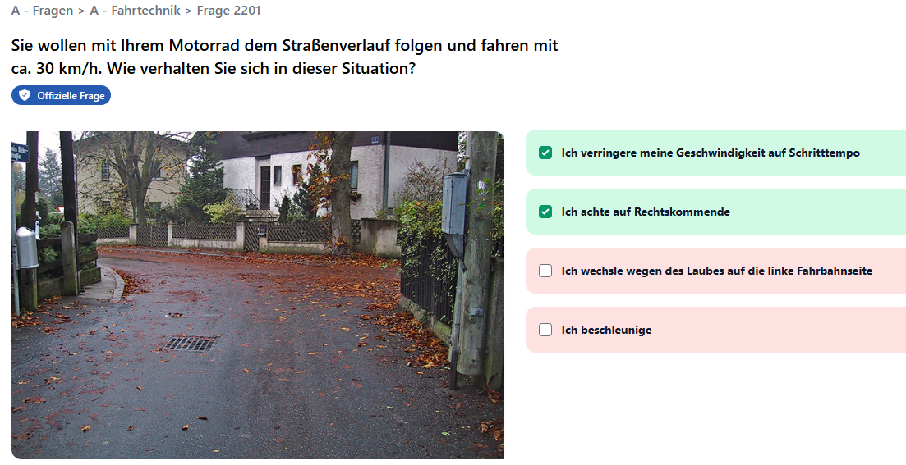

= Backend für Übungen: Führerschein Prüfungsfragen
:source-highlighter: rouge
ifndef::env-github[:icons: font]
ifdef::env-github[]
:caution-caption: :fire:
:important-caption: :exclamation:
:note-caption: :paperclip:
:tip-caption: :bulb:
:warning-caption: :warning:
endif::[]

Der Prüfungskatalog für die theoretische Führerscheinprüfung wird vom Verkehrsministerium entwickelt.
Auf verschiedenen Seiten, wie z. B. https://www.f-online.app/at/fragenkatalog/alle-fragen/ sind die Fragen offen einsehbar.
Die Fragen bestehen aus einem Text und 4 verschiedenen Antwortmöglichkeiten.
Es kann 1, 2, 3 oder alle 4 Antworten richtig sein.
Nur wenn alle richtigen und keine falschen Antwortmöglichkeiten angeklickt wurden, gibt es Punkte.
Die online App auf https://www.f-online.app/at/fragenkatalog/frage/2201/ stellt eine Frage so dar:

== Aufbau des Backends

Im Verzeichnis _90_Exercise/DrivingExamBackend_ befindet sich ein fertiges Backend, das allen Fragen (Stand November 2024) beinhaltet.
Starte das Backend mit der Datei _startServer.cmd_ (Windows) bzw. _start_server.sh_ (macOS).
Auf _http://localhost:5080/swagger/index.html_ erscheint der API Explorer für die verschiedenen Endpunkte.
Die SQLite Datenbank in _src/drivingexam.db_ beinhaltet alle Daten und wird bei jedem Serverstart neu geschrieben.
Dabei werden die Fragen aus _stc/questions.json_ eingelesen.

== Endpunkte für Module

Die theoretische Führerscheinprüfung ist in Module gegliedert.
Je nach Lenkberechtigung muss das Modul Grundwissen und dann das spezifische Modul absolviert werden.
Für Motorrad ist dies das Modul _A spezifisch_, für den PKW ist dies das Modul _B spezifisch_.

Folgende Module sind in der Datenbank enthalten:

[%header,cols="1a,2a,2a",format=tsv]
|===
Number	Guid	Name
1	307E8843-6CCB-98B5-F823-A2618ECDA52C	Grundwissen
2	115111EA-4121-28FE-6DED-6A797309D22E	A spezifisch
3	B5DF5D63-A915-2AA4-EDB2-C35FBE567007	B spezifisch
4	1D7C0A04-B921-01C9-8A55-C3DE023B24EF	C spezifisch
5	30FE7351-EFEE-4017-6C26-236F7E9F6916	D spezifisch
6	6975627D-B48D-AA0D-94DD-2BBFE6C628B2	E spezifisch
7	4B0DD48D-3F58-1519-F33B-B1FB955983EB	F spezifisch
8	9F60ADEC-BBC5-9D62-6654-9C10C35759A5	AM spezifisch
10	A9E271FE-1D91-3EBD-485F-75510211143B	Fahrlehrerausbildung
|===

=== Übersicht der Endpunkte

Die Details wie Payload, etc. kann im API Explorer nachgesehen werden.

[cols="1a,2a,5a"]
|============================================================================================================================================================
| GET    | /api/modules | Liefert die übersicht aller Module.                                                                                                
| POST   | /api/modules | Legt ein neues Modul an.                                                                                                           
| PUT    | /api/modules/(guid) | Ändert den Namen eines Modules.                                                                                                    
| DELETE | /api/modules/(guid) | Löscht ein Modul. Ist der Query Parameter _removeQuestions_ gesetzt, werden auch alle Fragen, die zu diesem Modul gehören, gelöscht. 
|============================================================================================================================================================

== Endpunkte für Themen

Damit nach Themen geübt werden kann, ist jede Frage auch einem Thema zugeordnet.
Hier eine Auswahl an Themen aus der Datenbank:

[%header,cols="1a,2a,2a",format=tsv]
|===
Id	Name	Guid
1	Gefahrenzeichen	39D34059-8965-D1EC-7170-E504A209519C
2	Verbotszeichen	160A34FF-D803-F884-FCB5-E1317081DC19
3	Gebotszeichen, Vorrangzeichen	71426E2C-F8C6-51A4-F116-EB3AE651D43E
4	Hinweiszeichen	EADD5479-6D18-291F-29EA-83C2D86DA788
5	Vorrang	96C9AE8D-062E-CECD-4958-E7550C0D368C
|===

=== Übersicht der Endpunkte

Die Details wie Payload, etc. kann im API Explorer nachgesehen werden.

[cols="1a,2a,5a"]
|===========================================================================================================================================================================================================================================
| GET    | /api/topics                       | Listet alle gespeicherten Themen auf.                                                                                                                                                        
| GET    | /api/topics?assignedModule=(guid) | Liefert alle Themen, zu denen sich Fragen mit der übergebenen Modul GUID befinden. Dadurch können alle relevanten Fragen ausgelesen werden, wenn ein bestimmtes Modul abgeprüft werden soll. 
| POST   | /api/topics                       | Erstellt ein neues Thema.                                                                                                                                                                    
| PUT    | /api/topics/(guid)                | Ändert den Namen eines Themas.                                                                                                                                                               
| DELETE | /api/topics/(guid)                | Löscht ein Thema. Ist der Query Parameter _removeQuestions_ gesetzt, werden auch alle Fragen, die zu diesem Modul gehören, gelöscht.                                                         
|===========================================================================================================================================================================================================================================

== Endpunkte für die Prüfungsfragen

=== GET /api/questions?moduleGuid=(guid)&topicGuid=(guid)

Liefert alle Fragen, die dem übergebenen Modul und dem übergebenen Thema zugeordnet sind.
Die Antwortmöglichkeiten werden im Array _answers_ angegeben.
Welche Antwort korrekt ist, wird nicht übermittelt.
Die zufällige Sortierung muss vom Client erzeugt werden.

[source,json]
----
[
  {
    "guid": "23fd0ce2-d977-ce59-ef22-566646109a54",
    "number": 464,
    "text": "Was zeigt dieses Zeichen an?",
    "points": 1,
    "imageUrl": "https://img.f-online.at/8851.jpg",
    "moduleGuid": "307e8843-6ccb-98b5-f823-a2618ecda52c",
    "topicGuid": "39d34059-8965-d1ec-7170-e504a209519c",
    "answers": [
      {
        "guid": "83b6613f-1f83-743f-8510-372038b99b3f",
        "text": "Es kündigt einen Schutzweg an"
      },
      {
        "guid": "f66fd80e-f114-7fc3-e605-4a4332868b61",
        "text": "Es kündigt eine Radfahrerüberfahrt an"
      },
      {
        "guid": "41c491d5-cd53-c219-cc88-9e67a1399636",
        "text": "Es kündigt eine Fußgängerzone an"
      },
      {
        "guid": "6d581786-a4a1-4e40-9d36-9d7dd5fc42ff",
        "text": "Es zeigt eine Begegnungszone an"
      }
    ]
  }
]
----

=== POST /api/questions/(guid)/checkanswers

Natürlich soll das Backend auch die Richtigkeit der angegebenen Antworten bestimmen.
Dafür wird diese Route mit der GUID der Prüfungsfrage aufgerufen.
Im Payload werden die GUIDs der Antworten, und ob sie angewählt wurden (_isChecked_) übermittelt.

.POST /api/questions/23fd0ce2-d977-ce59-ef22-566646109a54/checkanswers
[source,json]
----
{
  "checkedAnswers": [
    {
      "guid": "83b6613f-1f83-743f-8510-372038b99b3f",
      "isChecked": true
    },
    {
      "guid": "f66fd80e-f114-7fc3-e605-4a4332868b61",
      "isChecked": false
    },
    {
      "guid": "41c491d5-cd53-c219-cc88-9e67a1399636",
      "isChecked": false
    },
    {
      "guid": "6d581786-a4a1-4e40-9d36-9d7dd5fc42ff",
      "isChecked": false
    }            
  ]
}
----

Das Backend antwortet mit einer Übersicht, welche der Antwortmöglichkeiten richtig war.
_true_ bedeutet, dass die Antwort vom Client richtig war, nicht dass diese Checkbox angehakt sein müsste.
Sind alle Antworten richtig, wird im Feld _pointsReached_ der Punktewert der Frage übermittelt.
Bei falschen Antworten ist _pointsReached_ 0.

[source,json]
----
{
  "pointsReachable": 1,
  "pointsReached": 1,
  "checkResult": {
    "83b6613f-1f83-743f-8510-372038b99b3f": true,
    "f66fd80e-f114-7fc3-e605-4a4332868b61": true,
    "41c491d5-cd53-c219-cc88-9e67a1399636": true,
    "6d581786-a4a1-4e40-9d36-9d7dd5fc42ff": true
  }
}
----

=== POST /api/questions

Mit diesem Endpunkt können neue Prüfungsfragen angelegt werden.
Möchten wir z. B. eine Frage im Modul Grundwissen (GUID _307E8843-6CCB-98B5-F823-A2618ECDA52C_) zum Thema Überholen (GUID _FA06D89D-5890-C302-B3DA-154D3003381B_) anlegen, senden wir folgenden Request:

[source,json]
----
{
  "number": 9999,
  "text": "Eine neue Frage zum Thema Überholen.",
  "points": 5,
  "moduleGuid": "307E8843-6CCB-98B5-F823-A2618ECDA52C",
  "topicGuid": "FA06D89D-5890-C302-B3DA-154D3003381B",
  "imageUrl": "https://fastly.picsum.photos/id/724/200/200.jpg?hmac=sUKRpiwXopeRQ36cEVnZgrG3Wd73G8iet9dfVSvmi8k",
  "answers": [
    {
      "text": "Antwortmöglichkeit 1",
      "isCorrect": true
    },
    {
      "text": "Antwortmöglichkeit 2",
      "isCorrect": false
    },
    {
      "text": "Antwortmöglichkeit 3",
      "isCorrect": true
    },
    {
      "text": "Antwortmöglichkeit 4",
      "isCorrect": true
    }
  ]
}
----

Der Server antwortet mit den GUID Werten der neuen Frage und der Antworten:

[source,json]
----
{
  "guid": "4c9e6b65-cbe6-4296-b750-c393428fe520",
  "answers": [
    "16b426e5-e5e2-47f6-b9f4-05981d4222f1",
    "017cd88e-58bc-44a8-b747-90e0a69d3af0",
    "fb8d64d0-84cd-4319-88c5-cb36328415c7",
    "7de93144-df59-494a-b4cc-7c63606a4a6e"
  ]
}
----

== Übungsaufgabe zum Backend "Führerscheinprüfung"

Sie können wählen, ob sie eine Next.js oder eine Expo App erstellen.
Es können alle Tools (Chat GPT, ...) verwendet werden.
Kopieren Sie das Backend von _90_Exercise/DrivingExamBackend_ in Ihren Feature branch.

=== Kriterien für Genügend

* Scaffolding des Projektes
* Eine Liste der Module von _api/Modules_ wird angezeigt.
* Beim Klick auf ein Modul werden die Kategorien (Topics) von _api/Topics?assignedModule=(moduleGuid)_ angezeigt.
* Beim Klick auf ein Topic werden die Fragen des Modules des entsprechenden Topics samt Antwortmöglichkeiten angezeigt.

Es müssen keine Antworten ausgewählt werden.
Es soll parametrisiertes Routing und ein API Client verwendet werden.

=== Kriterien für Befriedigend

Zusätzlich zu den oberen Punkten:

* Soll jede Frage angezeigt und ausgefüllt werden können.
* Ist die Frage falsch beantwortet, werden die falschen Antworten hervorgehoben.
* Mit einem Button gelangt man zur nächsten Frage.

=== Kriterien für Gut

*Entweder*

* Ein Punkt _Prüfungssimulation_ zeigt eine Liste aller Module an.
* Es werden zufällig 20 Fragen aus dem Katalog gewählt.
  Dafür implementieren Sie eine geeignete Route im Backend im _QuestionsController_.
  Beispiel: GET _/api/exam/(moduleGuid)?count=20_ liefert die Liste der Fragen.
* Es soll eine Prüfung vom Client ausgefüllt und bewertet werden.

*oder*

* Es sollen neue Module oder Topics eingefügt werden können.
* Sie können dafür die entsprechenden POST Endpunkte verwenden.
* Validierungsfehler sollen im Client entsprechend angezeigt werden.

=== Kriterien für Sehr gut

* Anpassung des Backends, sodass die Konfiguration unseres Azure AD in _appsettings.Development.json_ hinterlegt wird.
  Dafür kopieren Sie sich den Key _OpenIDConnectSettings_ von https://htlspengergasse-my.sharepoint.com/:u:/g/personal/schletz_spengergasse_at/ESvpeAgFJu5EvqUMis7D0IoBvhSpWSVKI3u1Ig3pEIX-LQ?e=s0oTk1.
* Die Client App wird Auth.js konfiguriert, siehe _https://github.com/Die-Spengergasse/course-wmc-5sem/blob/main/50_Authentication/30_OauthNextjs/README.adoc_.
* Mit einem Azure AD User kann sich in der Client App angemeldet werden.

*Entweder*

* Die Prüfungsergebnisse sollen auf einer Seite "Meine Prüfungen" sichtbar werden.
  Die Ergebnisse können lokal (z. B. im _localStorage_) gespeichert werden.

*oder*

* Nur ein definierter User kann Module oder Topics hinzufügen.
  Passe die Rollenzuweisung im Backend an, der Admin kann auch "hardcoded" eingetragen werden.
